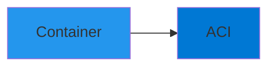
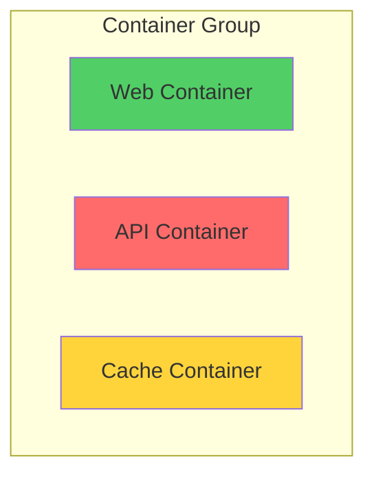
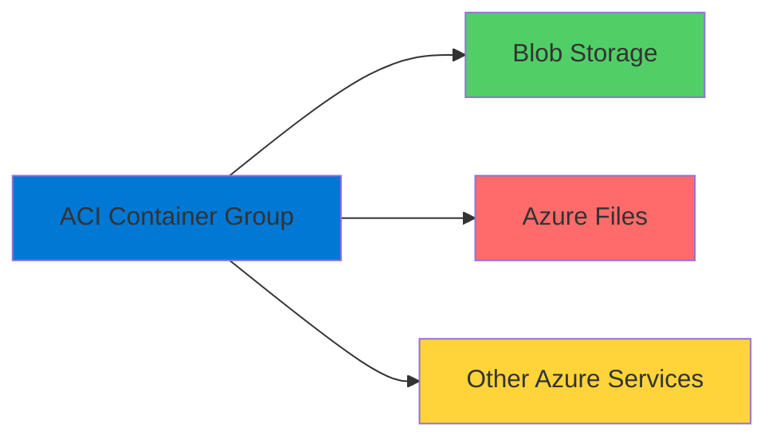
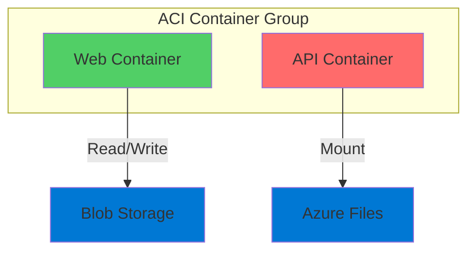
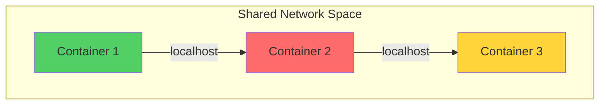
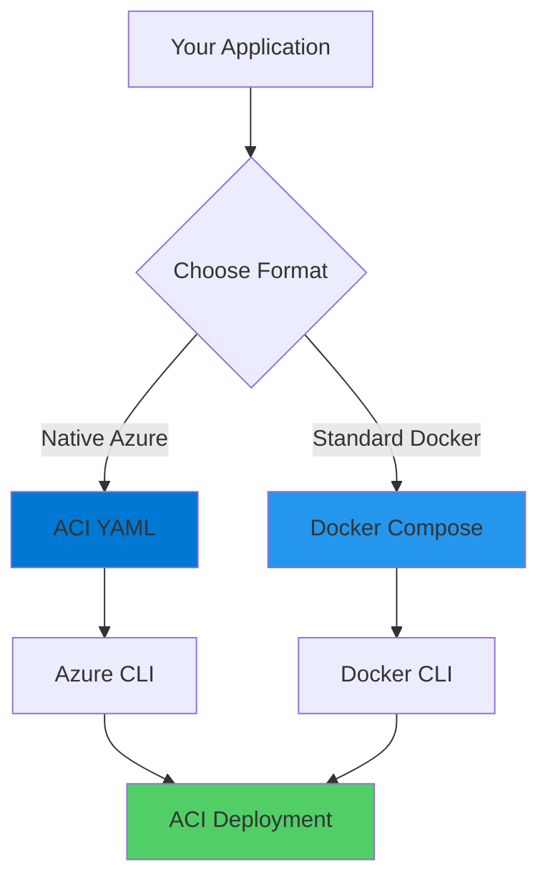

# Distributed Apps on Azure Container Instances

Running Multi-Container Applications

<div class="abs-bottom-10 left-10">
  <carbon-application-web class="text-8xl text-blue-400 opacity-80" />
</div>

---
layout: center
---

# Welcome

<!--
METADATA:
sentence: Let's get started and see how easy it is to run distributed applications on Azure Container Instances.
search_anchor: Let's get started and see
-->
<v-click>

<div class="text-xl mt-8">
Explore distributed applications<br/>on Azure Container Instances
</div>

</v-click>

---
layout: section
---

# Overview

---

# Azure Container Instances

<v-click>

<div class="mt-4">
  <carbon-container-software class="text-6xl text-blue-400" />
</div>

</v-click>

<!--
METADATA:
sentence: Overview Azure Container Instances, or ACI, is the simplest container platform available on Azure.
search_anchor: Overview Azure Container Instances, or
-->
<v-click>

<div class="mt-8 text-lg text-center">
The simplest container platform on Azure
</div>

</v-click>

<!--
METADATA:
sentence: It allows you to run containers without having to manage virtual machines or adopt a higher-level orchestration service.
search_anchor: It allows you to run
-->
<v-click>

<div class="mt-8 flex justify-center gap-8">
  <div class="text-center">
    <carbon-close class="text-4xl text-red-400" />
    <div class="text-sm mt-2">No VMs to manage</div>
  </div>
  <div class="text-center">
    <carbon-close class="text-4xl text-red-400" />
    <div class="text-sm mt-2">No orchestration needed</div>
  </div>
</div>

</v-click>

---

# Single Container

<v-click>

<div class="mt-8">



</div>

</v-click>

<v-click>

<div class="mt-12 text-center text-xl">
↓
</div>

</v-click>

<!--
METADATA:
sentence: Overview Azure Container Instances, or ACI, is the simplest container platform available on Azure.
search_anchor: Overview Azure Container Instances, or
-->
<v-click>

<div class="text-center text-2xl font-bold">
But ACI can do more...
</div>

</v-click>

---

# Multiple Containers

<v-click>

<div class="mt-4">



</div>

</v-click>

<!--
METADATA:
sentence: While you can run single containers, ACI also supports running multiple containers in a group to host distributed applications.
search_anchor: While you can run single
-->
<v-click>

<div class="mt-8 text-center text-xl">
ACI supports container groups for distributed applications
</div>

</v-click>

---
layout: section
---

# What You'll Learn

---

# Two Approaches

<!--
METADATA:
sentence: Second, we'll use the standard Docker Compose specification with the Docker CLI.
search_anchor: Second, we'll use the standard
-->
<v-click>

<div class="mt-8 flex items-center gap-4">
  <div class="text-4xl text-blue-400 font-bold">1</div>
  <div>
    <carbon-logo-microsoft-azure class="text-4xl inline-block text-blue-400" />
    <span class="ml-4 text-xl">Azure YAML + Azure CLI</span>
  </div>
</div>

</v-click>

<!--
METADATA:
sentence: This gives you access to all ACI-specific features and configuration options.
search_anchor: This gives you access to
-->
<v-click>

<div class="ml-12 mt-4 text-sm opacity-70">
Access to all ACI-specific features and configuration
</div>

</v-click>

<!--
METADATA:
sentence: Second, we'll use the standard Docker Compose specification with the Docker CLI.
search_anchor: Second, we'll use the standard
-->
<v-click>

<div class="mt-8 flex items-center gap-4">
  <div class="text-4xl text-purple-400 font-bold">2</div>
  <div>
    <carbon-docker class="text-4xl inline-block text-blue-500" />
    <span class="ml-4 text-xl">Docker Compose + Docker CLI</span>
  </div>
</div>

</v-click>

<!--
METADATA:
sentence: This is particularly useful when you want to use familiar Docker tooling and don't need ACI-specific configurations.
search_anchor: This is particularly useful when
-->
<v-click>

<div class="ml-12 mt-4 text-sm opacity-70">
Familiar Docker tooling without ACI-specific configurations
</div>

</v-click>

---

# Azure YAML Approach

<v-click>

<div class="mt-4">
  <carbon-document class="text-6xl text-blue-400" />
</div>

</v-click>

<v-click>

<div class="mt-8">

```yaml
apiVersion: '2021-10-01'
location: eastus
properties:
  containers:
  - name: web
    properties:
      image: nginx
      resources:
        requests:
          cpu: 1
          memoryInGb: 1
```

</div>

</v-click>

<!--
METADATA:
sentence: This gives you access to all ACI-specific features and configuration options.
search_anchor: This gives you access to
-->
<v-click>

<div class="mt-6 text-center text-sm opacity-70">
Full access to ACI-specific features
</div>

</v-click>

---

# Docker Compose Approach

<v-click>

<div class="mt-4">
  <carbon-docker class="text-6xl text-blue-500" />
</div>

</v-click>

<v-click>

<div class="mt-8">

```yaml
services:
  web:
    image: nginx
    ports:
      - "80:80"
  api:
    image: myapi
```

</div>

</v-click>

<!--
METADATA:
sentence: This is particularly useful when you want to use familiar Docker tooling and don't need ACI-specific configurations.
search_anchor: This is particularly useful when
-->
<v-click>

<div class="mt-6 text-center text-sm opacity-70">
Use familiar Docker tooling
</div>

</v-click>

---
layout: section
---

# Integration with Azure Services

---

# ACI + Azure Services

<!--
METADATA:
sentence: Integration with Azure Services ACI doesn't exist in isolation - it integrates seamlessly with other Azure services.
search_anchor: Integration with Azure Services ACI
-->
<v-click>

<div class="mt-4 text-center text-xl">
ACI doesn't exist in isolation
</div>

</v-click>

<v-click>

<div class="mt-8">



</div>

</v-click>

<!--
METADATA:
sentence: Integration with Azure Services ACI doesn't exist in isolation - it integrates seamlessly with other Azure services.
search_anchor: Integration with Azure Services ACI
-->
<v-click>

<div class="mt-8 text-center text-lg">
Seamless integration with Azure ecosystem
</div>

</v-click>

---

# What Containers Can Do

<!--
METADATA:
sentence: We'll demonstrate this integration by connecting our containerized applications to Azure Storage services, including Blob Storage and Azure Files.
search_anchor: We'll demonstrate this integration by
-->
<v-click>

<div class="mt-6 flex items-center gap-4">
  <carbon-data-blob class="text-4xl text-green-400" />
  <span class="text-lg">Use Azure Blob Storage as persistent data store</span>
</div>

</v-click>

<!--
METADATA:
sentence: Integration with Azure Services ACI doesn't exist in isolation - it integrates seamlessly with other Azure services.
search_anchor: Integration with Azure Services ACI
-->
<v-click>

<div class="mt-6 flex items-center gap-4">
  <carbon-folder class="text-4xl text-blue-400" />
  <span class="text-lg">Mount Azure Files shares as filesystem</span>
</div>

</v-click>

<!--
METADATA:
sentence: Integration with Azure Services ACI doesn't exist in isolation - it integrates seamlessly with other Azure services.
search_anchor: Integration with Azure Services ACI
-->
<v-click>

<div class="mt-6 flex items-center gap-4">
  <carbon-password class="text-4xl text-purple-400" />
  <span class="text-lg">Access Azure services with connection strings</span>
</div>

</v-click>

---

# Storage Integration

<v-click>

<div class="mt-8">



</div>

</v-click>

<!--
METADATA:
sentence: Overview Azure Container Instances, or ACI, is the simplest container platform available on Azure.
search_anchor: Overview Azure Container Instances, or
-->
<v-click>

<div class="mt-8 text-center text-lg">
Containers persist and share data via Azure Storage
</div>

</v-click>

---
layout: section
---

# Key Concepts

---

# Container Groups

<v-click>

<div class="mt-4">
  <carbon-assembly-cluster class="text-6xl text-blue-400" />
</div>

</v-click>

<!--
METADATA:
sentence: While you can run single containers, ACI also supports running multiple containers in a group to host distributed applications.
search_anchor: While you can run single
-->
<v-click>

<div class="mt-8 text-lg text-center">
ACI organizes multiple containers into groups
</div>

</v-click>

<v-click>

<div class="mt-8">



</div>

</v-click>

<!--
METADATA:
sentence: Second, we'll use the standard Docker Compose specification with the Docker CLI.
search_anchor: Second, we'll use the standard
-->
<v-click>

<div class="mt-8 text-center text-lg opacity-70">
Containers communicate over localhost
</div>

</v-click>

---

# Resource Specification

<v-click>

<div class="mt-4">
  <carbon-chip class="text-6xl text-orange-400" />
</div>

</v-click>

<!--
METADATA:
sentence: Resource Specification: Unlike Docker Desktop, ACI requires you to specify CPU and memory requirements upfront so Azure can provision the appropriate compute resources.
search_anchor: Resource Specification: Unlike Docker Desktop
-->
<v-click>

<div class="mt-8 flex justify-center gap-16">
  <div class="text-center">
    <carbon-docker class="text-6xl text-gray-400" />
    <div class="text-lg mt-4">Docker Desktop</div>
    <div class="text-sm mt-2 opacity-70">Dynamic resources</div>
  </div>
  <div class="text-4xl opacity-50">≠</div>
  <div class="text-center">
    <carbon-logo-microsoft-azure class="text-6xl text-blue-400" />
    <div class="text-lg mt-4">ACI</div>
    <div class="text-sm mt-2 opacity-70">Specify upfront</div>
  </div>
</div>

</v-click>

<!--
METADATA:
sentence: Resource Specification: Unlike Docker Desktop, ACI requires you to specify CPU and memory requirements upfront so Azure can provision the appropriate compute resources.
search_anchor: Resource Specification: Unlike Docker Desktop
-->
<v-click>

<div class="mt-8 text-center text-lg">
ACI requires CPU and memory specifications
</div>

</v-click>

<!--
METADATA:
sentence: Resource Specification: Unlike Docker Desktop, ACI requires you to specify CPU and memory requirements upfront so Azure can provision the appropriate compute resources.
search_anchor: Resource Specification: Unlike Docker Desktop
-->
<v-click>

<div class="mt-4 text-center text-sm opacity-60">
Azure provisions appropriate compute resources
</div>

</v-click>

---

# Deployment Models

<v-click>

<div class="mt-6">



</div>

</v-click>

<!--
METADATA:
sentence: This gives you access to all ACI-specific features and configuration options.
search_anchor: This gives you access to
-->
<v-click>

<div class="mt-8 text-center text-lg">
Different formats, same destination
</div>

</v-click>

---

# When to Use Each

<!--
METADATA:
sentence: This gives you access to all ACI-specific features and configuration options.
search_anchor: This gives you access to
-->
<v-click>

<div class="mt-8">
  <div class="text-xl font-bold text-blue-400">Azure YAML</div>
  <div class="mt-2 text-sm opacity-70">Need ACI-specific features and configurations</div>
</div>

</v-click>

<!--
METADATA:
sentence: This is particularly useful when you want to use familiar Docker tooling and don't need ACI-specific configurations.
search_anchor: This is particularly useful when
-->
<v-click>

<div class="mt-8">
  <div class="text-xl font-bold text-purple-400">Docker Compose</div>
  <div class="mt-2 text-sm opacity-70">Want familiar Docker tooling and portability</div>
</div>

</v-click>

<!--
METADATA:
sentence: Let's get started and see how easy it is to run distributed applications on Azure Container Instances.
search_anchor: Let's get started and see
-->
<v-click>

<div class="mt-12 text-center text-lg">
Both are valid approaches
</div>

</v-click>

---

# Container Updates

<v-click>

<div class="mt-4">
  <carbon-renew class="text-6xl text-green-400" />
</div>

</v-click>

<!--
METADATA:
sentence: Container Updates: We'll explore how ACI handles configuration changes and what happens under the hood when you update a running container.
search_anchor: Container Updates: We'll explore how
-->
<v-click>

<div class="mt-8 text-xl text-center">
What happens when you update configuration?
</div>

</v-click>

<v-click>

<div class="mt-12">


</div>

</v-click>

<!--
METADATA:
sentence: Container Updates: We'll explore how ACI handles configuration changes and what happens under the hood when you update a running container.
search_anchor: Container Updates: We'll explore how
-->
<v-click>

<div class="mt-8 text-center text-lg opacity-70">
ACI handles configuration changes under the hood
</div>

</v-click>

---
layout: center
class: text-center
---

<div>

<v-click>

<carbon-play-outline class="text-8xl text-green-400 inline-block" />

</v-click>

<!--
METADATA:
sentence: Let's get started and see how easy it is to run distributed applications on Azure Container Instances.
search_anchor: Let's get started and see
-->
<v-click>

<div class="text-4xl mt-8 font-bold">
Let's Get Started!
</div>

</v-click>

<!--
METADATA:
sentence: Let's get started and see how easy it is to run distributed applications on Azure Container Instances.
search_anchor: Let's get started and see
-->
<v-click>

<div class="text-xl mt-6 opacity-70">
See how easy it is to run distributed applications on ACI
</div>

</v-click>

</div>
