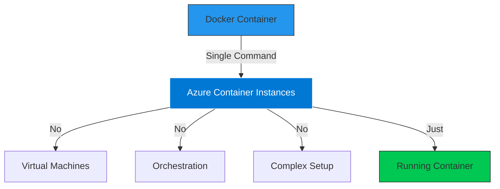

# What is ACI?

```mermaid
graph TB
    Container[Docker Container] -->|Single Command| ACI[Azure Container Instances]

    ACI -->|No| VM[Virtual Machines]
    ACI -->|No| Cluster[Orchestration]
    ACI -->|No| Config[Complex Setup]

    ACI -->|Just| Run[Running Container]

    style Container fill:#2496ed,stroke:#333
    style ACI fill:#0078d4,stroke:#fff,color:#fff
    style Run fill:#00c853,stroke:#333
```

  
Fastest way to run containers in Azure

