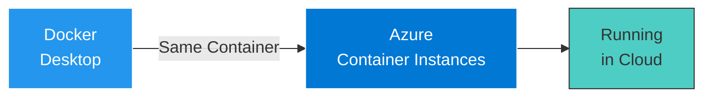

# What is Azure Container Instances?

Managed container service - no VMs, no orchestration

```mermaid
graph LR
    Local[Docker<br/>Desktop] -->|Same Container| ACI[Azure<br/>Container Instances]
    ACI --> Run[Running<br/>in Cloud]

    style Local fill:#2496ed,stroke:#fff,color:#fff
    style ACI fill:#0078d4,stroke:#fff,color:#fff
    style Run fill:#4ecdc4,stroke:#333
```

Single command: from laptop to cloud

No servers to provision • No clusters to configure

