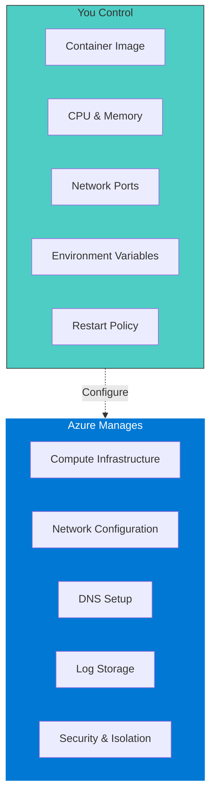

# Architecture Overview

What Azure manages vs. what you control

```mermaid
graph TB
    subgraph Azure["Azure Manages"]
        Compute[Compute Infrastructure]
        Network[Network Configuration]
        DNS[DNS Setup]
        Logs[Log Storage]
        Security[Security & Isolation]
    end

    subgraph You["You Control"]
        Image[Container Image]
        Resources[CPU & Memory]
        Ports[Network Ports]
        Env[Environment Variables]
        Policy[Restart Policy]
    end

    You -.->|Configure| Azure

    style Azure fill:#0078d4,stroke:#fff,color:#fff
    style You fill:#4ecdc4,stroke:#333
```
