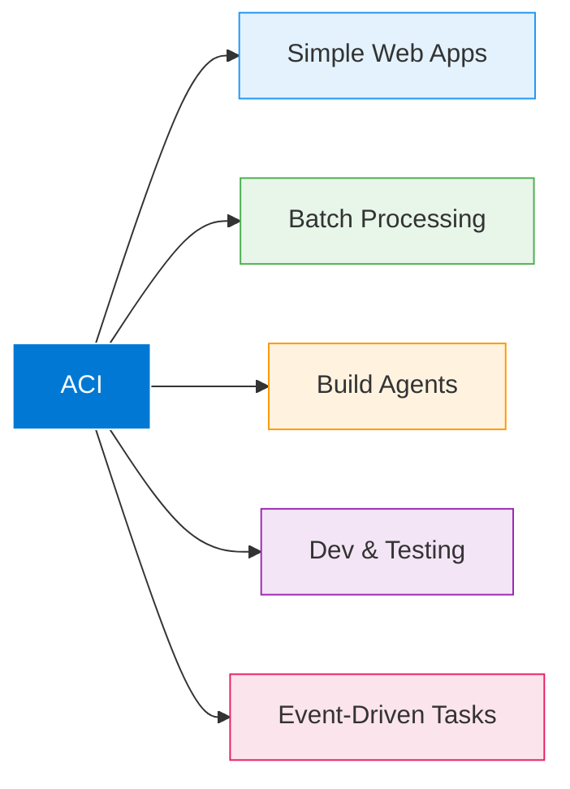

# Use Cases

```mermaid
graph LR
    ACI[ACI] --> Web[Simple Web Apps]
    ACI --> Batch[Batch Processing]
    ACI --> Build[Build Agents]
    ACI --> Dev[Dev & Testing]
    ACI --> Event[Event-Driven Tasks]

    style ACI fill:#0078d4,stroke:#fff,color:#fff
    style Web fill:#e3f2fd,stroke:#2196f3
    style Batch fill:#e8f5e9,stroke:#4caf50
    style Build fill:#fff3e0,stroke:#ff9800
    style Dev fill:#f3e5f5,stroke:#9c27b0
    style Event fill:#fce4ec,stroke:#e91e63
```

- Single container apps
- Task automation
- CI/CD environments
- Quick experiments

