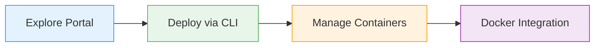

# What You'll Learn

<iconify-icon icon="logos:docker-icon" style="font-size: 3rem;" />
<iconify-icon icon="mdi:arrow-right" style="font-size: 2rem; margin: 0 1rem;" />
<iconify-icon icon="mdi:microsoft-azure" style="font-size: 3rem; color: #0078d4;" />

Linux and Windows containers supported

