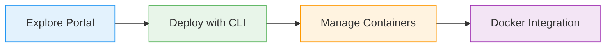

# What You'll Learn

Lab activities

<iconify-icon icon="mdi:check-circle" class="text-green-500" /> Explore ACI capabilities in Portal

<iconify-icon icon="mdi:check-circle" class="text-green-500" /> Deploy with `az container` commands

<iconify-icon icon="mdi:check-circle" class="text-green-500" /> View logs and monitor status

<iconify-icon icon="mdi:check-circle" class="text-green-500" /> Use Docker CLI integration

<iconify-icon icon="mdi:check-circle" class="text-green-500" /> Work with Linux and Windows containers

