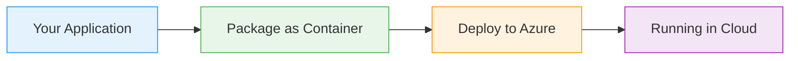
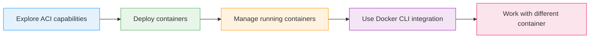
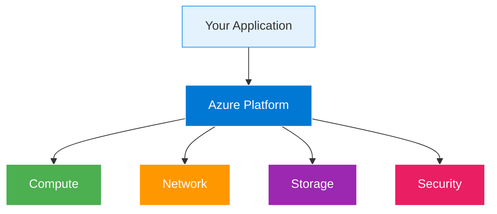

# Azure Container Instances

  <iconify-icon icon="logos:docker-icon" style="font-size: 4rem;" />

---

---
layout: center
class: text-center
---

# Welcome

Welcome to the Azure Container Instances lab

  <iconify-icon icon="carbon:rocket" style="font-size: 3rem; color: #0078d4;" />

---

---
layout: center
---

# What is Azure Container Instances?

Azure Container Instances, or ACI, is a managed container service that lets you run Docker containers in Azure without managing any virtual machines o...

---

---
layout: two-cols
---

# Key Benefits

<iconify-icon icon="mdi:check-circle" class="text-green-500" /> Portability: Your Docker containers run the same way everywhere. If it works in Docker Deskto

<iconify-icon icon="mdi:check-circle" class="text-green-500" /> Simplicity: Unlike Azure Kubernetes Service or Azure App Service, ACI has minimal configurat

<iconify-icon icon="mdi:check-circle" class="text-green-500" /> Speed: ACI containers start in seconds. This makes it perfect for burst workloads, task

<iconify-icon icon="mdi:check-circle" class="text-green-500" /> Cost-effectiveness: You pay per second for exactly what you use. No idle virtual machines consuming 

::right::

  <iconify-icon icon="carbon:chart-line-smooth" style="font-size: 8rem; color: #4caf50;" />

---

---
layout: center
---

# When to Use ACI

<iconify-icon icon="mdi:web" /> Simple web applications: Single container apps that don't need complex orchestration

<iconify-icon icon="mdi:cog" /> Batch processing: Run tasks on-demand and tear them down when complete

<iconify-icon icon="mdi:code-braces" /> Build agents: Temporary CI/CD build environments

<iconify-icon icon="mdi:test-tube" /> Development and testing: Quick environment spin-up without infrastructure overhead

<iconify-icon icon="mdi:lightning-bolt" /> Event-driven applications: Combined with Azure Functions or Logic Apps for responsive w

---

---
layout: center
---

# What We'll Cover

---

---
layout: two-cols
---

# Architecture Overview

::right::

<h3>Azure Manages</h3>
<ul>
<li>The underlying compute infrastructure</li><li>Network configuration and DNS</li><li>Storage for container logs</li>
</ul>

<h3>You Control</h3>
<ul>
<li>The container image to run</li><li>CPU and memory allocation</li><li>Network ports to expose</li>
</ul>

---

---
layout: center
---

# Key Concepts

<h3 class="text-xl font-bold">Container Registry</h3>

Where your container images are stored. This could be Docker Hub (public), Azure Container Registry 

<h3 class="text-xl font-bold">DNS Name Label</h3>

ACI provides automatic DNS naming. You can assign a friendly DNS prefix and ACI creates a full domai

<h3 class="text-xl font-bold">Resource Allocation</h3>

You specify exactly how much CPU and memory your container needs, with granular control from fractio

<h3 class="text-xl font-bold">Networking</h3>

Containers can expose ports to the internet or remain private. ACI handles all the underlying networ

---

---
layout: center
class: text-center
---

# Prerequisites

<iconify-icon icon="mdi:checkbox-marked-circle" class="text-blue-500" /> Azure CLI installed and configured

<iconify-icon icon="mdi:checkbox-marked-circle" class="text-blue-500" /> Docker Desktop installed (for Docker integration exercises)

<iconify-icon icon="mdi:checkbox-marked-circle" class="text-blue-500" /> An active Azure subscription

<iconify-icon icon="mdi:checkbox-marked-circle" class="text-blue-500" /> Basic familiarity with Docker and containers

  <iconify-icon icon="carbon:rocket" style="font-size: 3rem; color: #0078d4;" />

