# Azure Container Instances

Simplest Way to Run Containers in Azure

  <carbon-container-software class="text-8xl text-blue-400 opacity-80" />

---
layout: center
---

# Welcome to Azure Container Instances

<!--
METADATA:
sentence: In this session, we'll explore one of Azure's simplest and most efficient ways to run containerized applications in the cloud.
search_anchor: this session, we'll explore one
-->
<v-click>

Explore one of Azure's simplest and most efficient ways to run containerized applications in the cloud

</v-click>

---
layout: two-cols
---

# What is ACI?

<v-click>

  <carbon-container-software class="text-6xl text-blue-400" />

</v-click>

<!--
METADATA:
sentence: What is Azure Container Instances?
search_anchor: What is Azure Container Instances
-->
<v-click>

Managed container service

</v-click>

<!--
METADATA:
sentence: Speed: ACI containers start in seconds.
search_anchor: Speed: ACI containers start in
-->
<v-click>

Run Docker containers in Azure

</v-click>

::right::

<v-click>

</v-click>

<!--
METADATA:
sentence: No idle virtual machines consuming your budget.
search_anchor: No idle virtual machines consuming
-->
<v-click>

No VMs • No orchestration

</v-click>

---
layout: center
---

<v-click>

<carbon-docker class="text-8xl inline-block text-blue-500" />

</v-click>

<v-click>

<carbon-arrow-right class="text-6xl inline-block mx-8" />

</v-click>

<v-click>

<carbon-command-line class="text-6xl inline-block text-gray-500" />

</v-click>

<v-click>

<carbon-arrow-right class="text-6xl inline-block mx-8" />

</v-click>

<v-click>

<carbon-cloud class="text-8xl inline-block text-blue-400" />

</v-click>

<!--
METADATA:
sentence: With ACI, you can take that exact same container and run it in Azure with just a single command.
search_anchor: ACI, you can take that
-->
<v-click>

From local Docker to Azure with a single command

</v-click>

<!--
METADATA:
sentence: No servers to provision, no clusters to configure - just your application running in the cloud.
search_anchor: No servers to provision, no
-->
<v-click>

No servers • No clusters • Just your application

</v-click>

---
layout: section
---

# Key Benefits

---

# Portability

<v-click>

  <carbon-copy-link class="text-6xl text-green-400" />

</v-click>

<v-click>

</v-click>

<!--
METADATA:
sentence: If it works in Docker Desktop, it works in ACI.
search_anchor: If it works in Docker
-->
<v-click>

If it works in Docker Desktop, it works in ACI

</v-click>

<!--
METADATA:
sentence: This is the fundamental promise of containerization.
search_anchor: This is the fundamental promise
-->
<v-click>

The fundamental promise of containerization

</v-click>

---

# Simplicity

<v-click>

  <carbon-checkmark-outline class="text-6xl text-blue-400" />

</v-click>

<!--
METADATA:
sentence: Simplicity: Unlike Azure Kubernetes Service or Azure App Service, ACI has minimal configuration.
search_anchor: Simplicity: Unlike Azure Kubernetes Service
-->
<v-click>

Minimal configuration required:

</v-click>

<!--
METADATA:
sentence: What is Azure Container Instances?
search_anchor: What is Azure Container Instances
-->
<v-click>

  <carbon-image class="text-3xl" />
  Container image

</v-click>

<!--
METADATA:
sentence: You specify an image, some compute resources, and you're running.
search_anchor: You specify an image, some
-->
<v-click>

  <carbon-chip class="text-3xl" />
  Compute resources

</v-click>

<!--
METADATA:
sentence: It's the fastest and simplest way to run a container in Azure.
search_anchor: It's the fastest and simplest
-->
<v-click>

  <carbon-play class="text-3xl text-green-500" />
  Ready to run

</v-click>

<!--
METADATA:
sentence: Simplicity: Unlike Azure Kubernetes Service or Azure App Service, ACI has minimal configuration.
search_anchor: Simplicity: Unlike Azure Kubernetes Service
-->
<v-click>

Unlike AKS or App Service - no complex setup

</v-click>

---

# Speed

<v-click>

  <carbon-meter-alt class="text-6xl text-purple-400" />

</v-click>

<!--
METADATA:
sentence: Speed: ACI containers start in seconds.
search_anchor: Speed: ACI containers start in
-->
<v-click>

Containers start in seconds

</v-click>

<!--
METADATA:
sentence: Cost-effectiveness: You pay per second for exactly what you use.
search_anchor: Cost-effectiveness: You pay per second
-->
<v-click>

Perfect for:

</v-click>

<!--
METADATA:
sentence: This makes it perfect for burst workloads, task automation, or development and testing scenarios.
search_anchor: This makes it perfect for
-->
<v-click>

  <carbon-flash class="text-3xl text-yellow-400" />
  Burst workloads

</v-click>

<!--
METADATA:
sentence: This makes it perfect for burst workloads, task automation, or development and testing scenarios.
search_anchor: This makes it perfect for
-->
<v-click>

  <carbon-task class="text-3xl text-blue-400" />
  Task automation

</v-click>

<!--
METADATA:
sentence: This makes it perfect for burst workloads, task automation, or development and testing scenarios.
search_anchor: This makes it perfect for
-->
<v-click>

  <carbon-code class="text-3xl text-green-400" />
  Development & testing

</v-click>

---

# Cost-effectiveness

<v-click>

  <carbon-piggy-bank class="text-6xl text-green-400" />

</v-click>

<!--
METADATA:
sentence: Cost-effectiveness: You pay per second for exactly what you use.
search_anchor: Cost-effectiveness: You pay per second
-->
<v-click>

Pay per second for exactly what you use

```mermaid
graph TD
    A[Traditional VMs] -->|Always Running| B[💰 Constant Cost]
    C[ACI] -->|On-Demand| D[💚 Only When Used]
    style A fill:#ff6b6b
    style C fill:#51cf66
```

</v-click>

<v-click>

</v-click>

<!--
METADATA:
sentence: No idle virtual machines consuming your budget.
search_anchor: No idle virtual machines consuming
-->
<v-click>

No idle virtual machines consuming your budget

</v-click>

---
layout: section
---

# When to Use ACI

---

# ACI Use Cases

<!--
METADATA:
sentence: DNS Name Label: ACI provides automatic DNS naming.
search_anchor: DNS Name Label: ACI provides
-->
<v-click>

  <carbon-application-web class="text-4xl text-blue-400" />
  Simple web applications

</v-click>

<!--
METADATA:
sentence: DNS Name Label: ACI provides automatic DNS naming.
search_anchor: DNS Name Label: ACI provides
-->
<v-click>

  <carbon-batch-job class="text-4xl text-purple-400" />
  Batch processing

</v-click>

<!--
METADATA:
sentence: Speed: ACI containers start in seconds.
search_anchor: Speed: ACI containers start in
-->
<v-click>

  <carbon-assembly-cluster class="text-4xl text-green-400" />
  Build agents (CI/CD)

</v-click>

<!--
METADATA:
sentence: This makes it perfect for burst workloads, task automation, or development and testing scenarios.
search_anchor: This makes it perfect for
-->
<v-click>

  <carbon-script class="text-4xl text-orange-400" />
  Development and testing

</v-click>

<!--
METADATA:
sentence: Speed: ACI containers start in seconds.
search_anchor: Speed: ACI containers start in
-->
<v-click>

  <carbon-events class="text-4xl text-red-400" />
  Event-driven applications

</v-click>

<!--
METADATA:
sentence: Speed: ACI containers start in seconds.
search_anchor: Speed: ACI containers start in
-->
<v-click>

Single containers without complex orchestration needs

</v-click>

---
layout: section
---

# What We'll Cover

---

# Lab Objectives

<!--
METADATA:
sentence: Speed: ACI containers start in seconds.
search_anchor: Speed: ACI containers start in
-->
<v-click>

  
1

  

    <carbon-analytics class="text-3xl inline-block" />
    Explore ACI capabilities through Azure Portal
  

</v-click>

<!--
METADATA:
sentence: What is Azure Container Instances?
search_anchor: What is Azure Container Instances
-->
<v-click>

  
2

  

    <carbon-deploy class="text-3xl inline-block" />
    Deploy containers using Azure CLI
  

</v-click>

<!--
METADATA:
sentence: Speed: ACI containers start in seconds.
search_anchor: Speed: ACI containers start in
-->
<v-click>

  
3

  

    <carbon-dashboard class="text-3xl inline-block" />
    Manage running containers
  

</v-click>

<!--
METADATA:
sentence: If it works in Docker Desktop, it works in ACI.
search_anchor: If it works in Docker
-->
<v-click>

  
4

  

    <carbon-docker class="text-3xl inline-block" />
    Use Docker CLI integration
  

</v-click>

<!--
METADATA:
sentence: Speed: ACI containers start in seconds.
search_anchor: Speed: ACI containers start in
-->
<v-click>

  
5

  

    <carbon-compare class="text-3xl inline-block" />
    Work with Linux and Windows containers
  

</v-click>

---
layout: section
---

# Architecture Overview

---

# What Azure Handles

<v-click>

  <carbon-cloud-services class="text-6xl text-blue-400" />

</v-click>

<!--
METADATA:
sentence: What is Azure Container Instances?
search_anchor: What is Azure Container Instances
-->
<v-click>

  <carbon-chip class="text-3xl" />
  Compute infrastructure

</v-click>

<!--
METADATA:
sentence: DNS Name Label: ACI provides automatic DNS naming.
search_anchor: DNS Name Label: ACI provides
-->
<v-click>

  <carbon-network-3 class="text-3xl" />
  Network configuration and DNS

</v-click>

<!--
METADATA:
sentence: What is Azure Container Instances?
search_anchor: What is Azure Container Instances
-->
<v-click>

  <carbon-document class="text-3xl" />
  Storage for container logs

</v-click>

<!--
METADATA:
sentence: It's the fastest and simplest way to run a container in Azure.
search_anchor: It's the fastest and simplest
-->
<v-click>

  <carbon-security class="text-3xl" />
  Security and isolation

</v-click>

---

# What You Control

<v-click>

  <carbon-settings-adjust class="text-6xl text-green-400" />

</v-click>

<!--
METADATA:
sentence: What is Azure Container Instances?
search_anchor: What is Azure Container Instances
-->
<v-click>

  <carbon-image class="text-3xl" />
  Container image to run

</v-click>

<!--
METADATA:
sentence: Resource Allocation: You specify exactly how much CPU and memory your container needs, with granular control from fractional CPUs to multiple cores.
search_anchor: Resource Allocation: You specify exactly
-->
<v-click>

  <carbon-chip class="text-3xl" />
  CPU and memory allocation

</v-click>

<!--
METADATA:
sentence: Networking: Containers can expose ports to the internet or remain private.
search_anchor: Networking: Containers can expose ports
-->
<v-click>

  <carbon-port-output class="text-3xl" />
  Network ports to expose

</v-click>

<!--
METADATA:
sentence: You specify an image, some compute resources, and you're running.
search_anchor: You specify an image, some
-->
<v-click>

  <carbon-data-1 class="text-3xl" />
  Environment variables and configuration

</v-click>

<!--
METADATA:
sentence: You specify an image, some compute resources, and you're running.
search_anchor: You specify an image, some
-->
<v-click>

  <carbon-renew class="text-3xl" />
  Restart policies and lifecycle

</v-click>

---
layout: two-cols
---

# Architecture

<v-click>

</v-click>

::right::

<v-click>

</v-click>

---
layout: section
---

# Key Concepts

---

# Container Registry

<v-click>

  <carbon-catalog class="text-6xl text-blue-400" />

</v-click>

<!--
METADATA:
sentence: What is Azure Container Instances?
search_anchor: What is Azure Container Instances
-->
<v-click>

Where your container images are stored

</v-click>

<v-click>

</v-click>

---

# DNS Name Label

<v-click>

  <carbon-network-3 class="text-6xl text-purple-400" />

</v-click>

<!--
METADATA:
sentence: DNS Name Label: ACI provides automatic DNS naming.
search_anchor: DNS Name Label: ACI provides
-->
<v-click>

ACI provides automatic DNS naming

</v-click>

<v-click>

</v-click>

<!--
METADATA:
sentence: You can assign a friendly DNS prefix and ACI creates a full domain name for accessing your container.
search_anchor: You can assign a friendly
-->
<v-click>

Assign a friendly DNS prefix → ACI creates full domain name

</v-click>

---

# Resource Allocation

<v-click>

  <carbon-chip class="text-6xl text-orange-400" />

</v-click>

<!--
METADATA:
sentence: Resource Allocation: You specify exactly how much CPU and memory your container needs, with granular control from fractional CPUs to multiple cores.
search_anchor: Resource Allocation: You specify exactly
-->
<v-click>

Specify exactly how much CPU and memory you need

</v-click>

<!--
METADATA:
sentence: Speed: ACI containers start in seconds.
search_anchor: Speed: ACI containers start in
-->
<v-click>

  

    
0.5

    
CPU Cores

  

  
→

  

    
4

    
CPU Cores

  

</v-click>

<!--
METADATA:
sentence: Resource Allocation: You specify exactly how much CPU and memory your container needs, with granular control from fractional CPUs to multiple cores.
search_anchor: Resource Allocation: You specify exactly
-->
<v-click>

Granular control: fractional CPUs to multiple cores

</v-click>

---

# Networking

<v-click>

  <carbon-network-4 class="text-6xl text-blue-400" />

</v-click>

<v-click>

</v-click>

<!--
METADATA:
sentence: Networking: Containers can expose ports to the internet or remain private.
search_anchor: Networking: Containers can expose ports
-->
<v-click>

Expose ports to internet or keep private

</v-click>

<!--
METADATA:
sentence: ACI handles all the underlying networking complexity.
search_anchor: ACI handles all the underlying
-->
<v-click>

ACI handles all underlying networking complexity

</v-click>

---
layout: section
---

# Prerequisites

---

# Before You Start

<!--
METADATA:
sentence: What is Azure Container Instances?
search_anchor: What is Azure Container Instances
-->
<v-click>

  <carbon-command-line class="text-4xl text-blue-400" />
  Azure CLI installed and configured

</v-click>

<!--
METADATA:
sentence: If it works in Docker Desktop, it works in ACI.
search_anchor: If it works in Docker
-->
<v-click>

  <carbon-docker class="text-4xl text-blue-500" />
  Docker Desktop installed

</v-click>

<!--
METADATA:
sentence: What is Azure Container Instances?
search_anchor: What is Azure Container Instances
-->
<v-click>

  <carbon-cloud-service-management class="text-4xl text-green-400" />
  Active Azure subscription

</v-click>

<!--
METADATA:
sentence: Key Benefits Portability: Your Docker containers run the same way everywhere.
search_anchor: Key Benefits Portability: Your Docker
-->
<v-click>

  <carbon-book class="text-4xl text-purple-400" />
  Basic familiarity with Docker and containers

</v-click>

---
layout: center
class: text-center
---

<v-click>

<carbon-play-outline class="text-8xl text-green-400 inline-block" />

</v-click>

<!--
METADATA:
sentence: Speed: ACI containers start in seconds.
search_anchor: Speed: ACI containers start in
-->
<v-click>

Let's Get Started!

</v-click>

<!--
METADATA:
sentence: It's the fastest and simplest way to run a container in Azure.
search_anchor: It's the fastest and simplest
-->
<v-click>

See how easy it is to run containers in Azure

</v-click>

