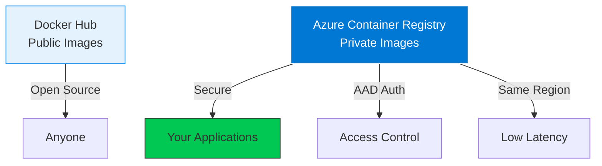

# Why Private Registry?

Public vs Private:

- Security control
- Regional deployment
- Azure integration
- Compliance requirements

::right::

```mermaid
graph TB
    Public[Docker Hub<br/>Public Images] -->|Open Source| Anyone
    Private[Azure Container Registry<br/>Private Images] -->|Secure| YourApps[Your Applications]

    Private -->|AAD Auth| Control[Access Control]
    Private -->|Same Region| Fast[Low Latency]

    style Public fill:#e3f2fd,stroke:#2196f3
    style Private fill:#0078d4,stroke:#fff,color:#fff
    style YourApps fill:#00c853,stroke:#333
```
