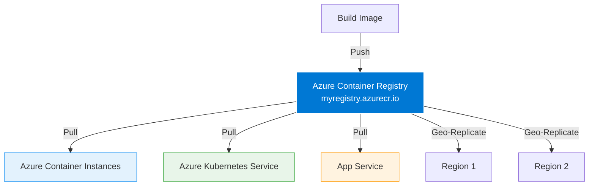

# ACR Architecture

```mermaid
graph TB
    Build[Build Image] -->|Push| ACR[Azure Container Registry<br/>myregistry.azurecr.io]

    ACR -->|Pull| ACI[Azure Container Instances]
    ACR -->|Pull| AKS[Azure Kubernetes Service]
    ACR -->|Pull| AppSvc[App Service]

    ACR -->|Geo-Replicate| R1[Region 1]
    ACR -->|Geo-Replicate| R2[Region 2]

    style ACR fill:#0078d4,stroke:#fff,color:#fff
    style ACI fill:#e3f2fd,stroke:#2196f3
    style AKS fill:#e8f5e9,stroke:#4caf50
    style AppSvc fill:#fff3e0,stroke:#ff9800
```
