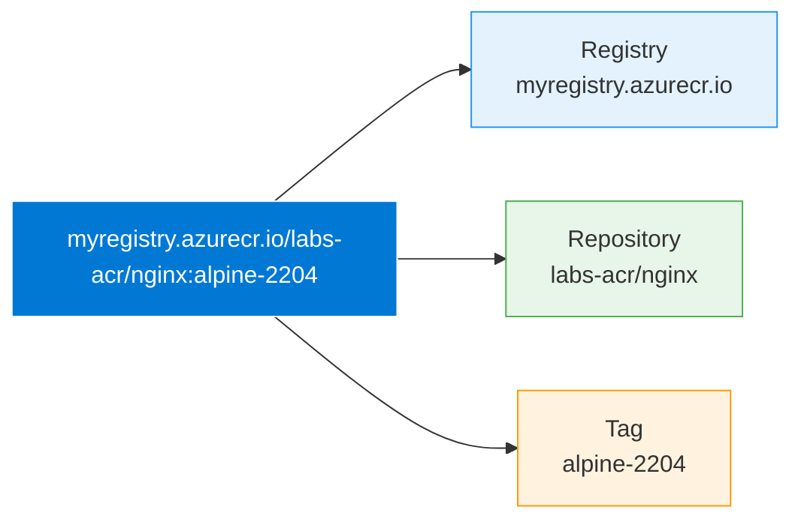

# Image Name Structure

```mermaid
graph LR
    Full["myregistry.azurecr.io/labs-acr/nginx:alpine-2204"]

    Full --> Registry[Registry<br/>myregistry.azurecr.io]
    Full --> Repo[Repository<br/>labs-acr/nginx]
    Full --> Tag[Tag<br/>alpine-2204]

    style Full fill:#0078d4,stroke:#fff,color:#fff
    style Registry fill:#e3f2fd,stroke:#2196f3
    style Repo fill:#e8f5e9,stroke:#4caf50
    style Tag fill:#fff3e0,stroke:#ff9800
```

- Globally unique name
- Lowercase letters & numbers
- Becomes your DNS endpoint

