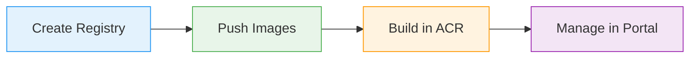

# What You'll Learn

```mermaid
graph LR
    A[Create Registry] --> B[Push Images]
    B --> C[Build in ACR]
    C --> D[Manage in Portal]

    style A fill:#e3f2fd,stroke:#2196f3
    style B fill:#e8f5e9,stroke:#4caf50
    style C fill:#fff3e0,stroke:#ff9800
    style D fill:#f3e5f5,stroke:#9c27b0
```

- Azure Portal exploration
- Azure CLI operations
- Docker integration
- Custom image builds

