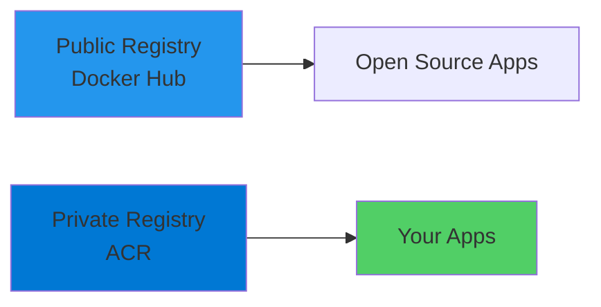
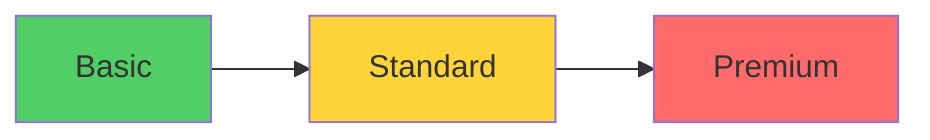
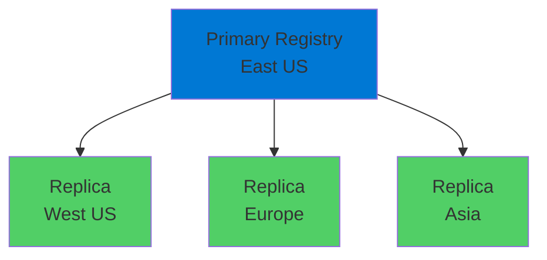
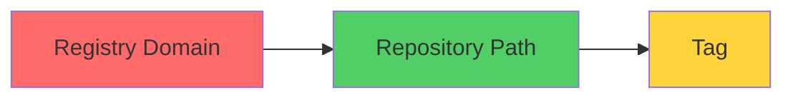
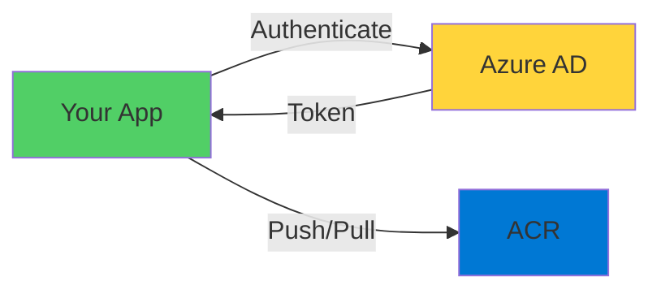

# Azure Container Registry

Private Container Registry for Azure

  <carbon-catalog class="text-8xl text-blue-400 opacity-80" />

---
layout: section
---

# What is Azure Container Registry?

---

# Azure Container Registry (ACR)

<v-click>

  <carbon-catalog class="text-6xl text-blue-400" />

</v-click>

<!--
METADATA:
sentence: Azure Container Registry, or ACR, is Azure's private container registry service.
search_anchor: Azure Container Registry, or ACR
-->
<v-click>

Azure's private container registry service

</v-click>

<v-click>

</v-click>

<!--
METADATA:
sentence: ACR provides this capability with full Azure integration.
search_anchor: ACR provides this capability with
-->
<v-click>

Secure, private registries with full Azure integration

</v-click>

---
layout: section
---

# Why Use a Private Registry?

---

# Public vs Private

<!--
METADATA:
sentence: Why Use a Private Registry?
search_anchor: Why Use a Private Registry
-->
<v-click>

  

    <carbon-open-panel-filled-right class="text-6xl text-blue-500" />
    
Docker Hub

    
Public

  

  

    <carbon-locked class="text-6xl text-green-400" />
    
ACR

    
Private

  

</v-click>

<!--
METADATA:
sentence: While open source applications are commonly published to public registries like Docker Hub, organizations need secure, private registries for their own applications.
search_anchor: While open source applications are
-->
<v-click>

Docker Hub: Excellent for open source

</v-click>

<!--
METADATA:
sentence: ACR provides this capability with full Azure integration.
search_anchor: ACR provides this capability with
-->
<v-click>

ACR: Essential for production applications

</v-click>

---

# What You Need for Production

<!--
METADATA:
sentence: Azure Container Registry, or ACR, is Azure's private container registry service.
search_anchor: Azure Container Registry, or ACR
-->
<v-click>

  <carbon-locked class="text-4xl text-red-400" />
  

    
Security and access control

    
Keep proprietary images private

  

</v-click>

<!--
METADATA:
sentence: Azure Container Registry, or ACR, is Azure's private container registry service.
search_anchor: Azure Container Registry, or ACR
-->
<v-click>

  <carbon-location class="text-4xl text-blue-400" />
  

    
Regional deployment

    
Store images near compute for faster pulls

  

</v-click>

<!--
METADATA:
sentence: Azure Container Registry - Introduction What is Azure Container Registry?
search_anchor: Azure Container Registry - Introduction
-->
<v-click>

  <carbon-logo-microsoft-azure class="text-4xl text-green-400" />
  

    
Azure integration

    
Azure AD authentication and RBAC

  

</v-click>

<!--
METADATA:
sentence: Azure Container Registry, or ACR, is Azure's private container registry service.
search_anchor: Azure Container Registry, or ACR
-->
<v-click>

  <carbon-certificate class="text-4xl text-purple-400" />
  

    
Compliance

    
Meet organizational storage requirements

  

</v-click>

---
layout: section
---

# Key Features of ACR

---

# SKU Tiers

<v-click>

</v-click>

<!--
METADATA:
sentence: ACR provides this capability with full Azure integration.
search_anchor: ACR provides this capability with
-->
<v-click>

Multiple SKU tiers with different features

</v-click>

<!--
METADATA:
sentence: Azure Container Registry - Introduction What is Azure Container Registry?
search_anchor: Azure Container Registry - Introduction
-->
<v-click>

  

    
Basic

    
Cost-effective

  

  

    
Standard

    
Production

  

  

    
Premium

    
Enterprise

  

</v-click>

---

# Premium Features

<!--
METADATA:
sentence: Azure Container Registry - Introduction What is Azure Container Registry?
search_anchor: Azure Container Registry - Introduction
-->
<v-click>

  <carbon-location-company class="text-4xl text-blue-400" />
  Geo-replication across Azure regions

</v-click>

<!--
METADATA:
sentence: ACR provides this capability with full Azure integration.
search_anchor: ACR provides this capability with
-->
<v-click>

  <carbon-network-3 class="text-4xl text-green-400" />
  Private networking with Azure Private Link

</v-click>

<!--
METADATA:
sentence: Why Use a Private Registry?
search_anchor: Why Use a Private Registry
-->
<v-click>

  <carbon-security class="text-4xl text-purple-400" />
  Customer-managed encryption keys

</v-click>

<!--
METADATA:
sentence: Why Use a Private Registry?
search_anchor: Why Use a Private Registry
-->
<v-click>

Premium SKU only

</v-click>

---

# Core Features

<!--
METADATA:
sentence: Azure Container Registry, or ACR, is Azure's private container registry service.
search_anchor: Azure Container Registry, or ACR
-->
<v-click>

  <carbon-certificate-check class="text-4xl text-green-400" />
  Content trust - Sign and verify images

</v-click>

<!--
METADATA:
sentence: Azure Container Registry, or ACR, is Azure's private container registry service.
search_anchor: Azure Container Registry, or ACR
-->
<v-click>

  <carbon-webhook class="text-4xl text-blue-400" />
  Webhooks for automation triggers

</v-click>

<!--
METADATA:
sentence: ACR provides this capability with full Azure integration.
search_anchor: ACR provides this capability with
-->
<v-click>

  <carbon-integration class="text-4xl text-purple-400" />
  Seamless integration with Azure services

</v-click>

<!--
METADATA:
sentence: ACR provides this capability with full Azure integration.
search_anchor: ACR provides this capability with
-->
<v-click>

Works with ACI, AKS, and more

</v-click>

---

# Geo-replication

<v-click>

</v-click>

<!--
METADATA:
sentence: ACR provides this capability with full Azure integration.
search_anchor: ACR provides this capability with
-->
<v-click>

Replicate across multiple Azure regions

</v-click>

<!--
METADATA:
sentence: Azure Container Registry, or ACR, is Azure's private container registry service.
search_anchor: Azure Container Registry, or ACR
-->
<v-click>

Faster pulls, lower latency worldwide

</v-click>

---
layout: section
---

# Registry Naming and DNS

---

# Registry Name Becomes DNS

<v-click>

</v-click>

<!--
METADATA:
sentence: Azure Container Registry - Introduction What is Azure Container Registry?
search_anchor: Azure Container Registry - Introduction
-->
<v-click>

  
Registry name: mycompanyregistry

</v-click>

<!--
METADATA:
sentence: Why Use a Private Registry?
search_anchor: Why Use a Private Registry
-->
<v-click>

  
Login server: mycompanyregistry.azurecr.io

</v-click>

---

# Naming Rules

<v-click>

  <carbon-information class="text-6xl text-blue-400" />

</v-click>

<!--
METADATA:
sentence: Why Use a Private Registry?
search_anchor: Why Use a Private Registry
-->
<v-click>

Registry name must be:

</v-click>

<!--
METADATA:
sentence: Why Use a Private Registry?
search_anchor: Why Use a Private Registry
-->
<v-click>

  

    <carbon-globe class="text-4xl text-green-400" />
    
Globally unique

  

  

    <carbon-text-lowercase class="text-4xl text-blue-400" />
    
Lowercase only

  

  

    <carbon-data-1 class="text-4xl text-purple-400" />
    
Letters & numbers

  

</v-click>

---
layout: section
---

# Understanding Container Registry Concepts

---

# Container Registries

<v-click>

  <carbon-catalog class="text-6xl text-blue-400" />

</v-click>

<!--
METADATA:
sentence: Understanding Container Registry Concepts Before diving into the exercises, it's important to understand a few key concepts: Container Registries are services that host container images.
search_anchor: Understanding Container Registry Concepts Before
-->
<v-click>

Services that host container images

</v-click>

<!--
METADATA:
sentence: ACR provides this capability with full Azure integration.
search_anchor: ACR provides this capability with
-->
<v-click>

  

    <carbon-data-storage class="text-3xl text-green-400" />
    Storage for images
  

  

    <carbon-api class="text-3xl text-blue-400" />
    Push/pull API
  

  

    <carbon-password class="text-3xl text-purple-400" />
    Authentication
  

  

    <carbon-security class="text-3xl text-red-400" />
    Image scanning
  

</v-click>

---

# Docker Image Names

<!--
METADATA:
sentence: Azure Container Registry, or ACR, is Azure's private container registry service.
search_anchor: Azure Container Registry, or ACR
-->
<v-click>

  <code class="text-lg">myregistry.azurecr.io/labs-acr/nginx:alpine-2204</code>

</v-click>

<v-click>

</v-click>

<!--
METADATA:
sentence: Azure Container Registry - Introduction What is Azure Container Registry?
search_anchor: Azure Container Registry - Introduction
-->
<v-click>

  

    
myregistry.azurecr.io

    
Registry domain

  

  

    
labs-acr/nginx

    
Repository path

  

  

    
alpine-2204

    
Tag/version

  

</v-click>

---

# Image Name Examples

<!--
METADATA:
sentence: While open source applications are commonly published to public registries like Docker Hub, organizations need secure, private registries for their own applications.
search_anchor: While open source applications are
-->
<v-click>

  
docker.io/nginx:latest

  
Public Docker Hub image

</v-click>

<!--
METADATA:
sentence: ACR provides this capability with full Azure integration.
search_anchor: ACR provides this capability with
-->
<v-click>

  
myregistry.azurecr.io/webapp:v1.2

  
ACR with version tag

</v-click>

<!--
METADATA:
sentence: Azure Container Registry, or ACR, is Azure's private container registry service.
search_anchor: Azure Container Registry, or ACR
-->
<v-click>

  
myregistry.azurecr.io/team/api:latest

  
ACR with repository path

</v-click>

---

# Authentication Methods

<!--
METADATA:
sentence: Azure Container Registry - Introduction What is Azure Container Registry?
search_anchor: Azure Container Registry - Introduction
-->
<v-click>

  <carbon-user-avatar class="text-4xl text-blue-400" />
  

    
Azure AD identity

    
For development

  

</v-click>

<!--
METADATA:
sentence: Why Use a Private Registry?
search_anchor: Why Use a Private Registry
-->
<v-click>

  <carbon-deployment-pattern class="text-4xl text-green-400" />
  

    
Service principals

    
For CI/CD pipelines

  

</v-click>

<!--
METADATA:
sentence: While open source applications are commonly published to public registries like Docker Hub, organizations need secure, private registries for their own applications.
search_anchor: While open source applications are
-->
<v-click>

  <carbon-user-admin class="text-4xl text-orange-400" />
  

    
Admin account

    
For testing (not production)

  

</v-click>

<!--
METADATA:
sentence: ACR provides this capability with full Azure integration.
search_anchor: ACR provides this capability with
-->
<v-click>

  <carbon-ibm-cloud-identity-trustcenter class="text-4xl text-purple-400" />
  

    
Managed identities

    
For Azure services

  

</v-click>

---

# Authentication Flow

<v-click>

</v-click>

<!--
METADATA:
sentence: Azure Container Registry, or ACR, is Azure's private container registry service.
search_anchor: Azure Container Registry, or ACR
-->
<v-click>

Leverage Azure AD for secure access

</v-click>

---
layout: section
---

# What You'll Learn

---

# Lab Objectives

<!--
METADATA:
sentence: Azure Container Registry - Introduction What is Azure Container Registry?
search_anchor: Azure Container Registry - Introduction
-->
<v-click>

  
1

  

    <carbon-portal class="text-3xl inline-block" />
    Portal exploration - SKU options and configuration
  

</v-click>

<!--
METADATA:
sentence: Azure Container Registry - Introduction What is Azure Container Registry?
search_anchor: Azure Container Registry - Introduction
-->
<v-click>

  
2

  

    <carbon-command-line class="text-3xl inline-block" />
    CLI creation - Create registry with Azure CLI
  

</v-click>

<!--
METADATA:
sentence: While open source applications are commonly published to public registries like Docker Hub, organizations need secure, private registries for their own applications.
search_anchor: While open source applications are
-->
<v-click>

  
3

  

    <carbon-data-backup class="text-3xl inline-block" />
    Image management - Pull from Docker Hub, push to ACR
  

</v-click>

<!--
METADATA:
sentence: While open source applications are commonly published to public registries like Docker Hub, organizations need secure, private registries for their own applications.
search_anchor: While open source applications are
-->
<v-click>

  
4

  

    <carbon-build-tool class="text-3xl inline-block" />
    Custom builds - Build and store your own images
  

</v-click>

<!--
METADATA:
sentence: Azure Container Registry - Introduction What is Azure Container Registry?
search_anchor: Azure Container Registry - Introduction
-->
<v-click>

  
5

  

    <carbon-dashboard class="text-3xl inline-block" />
    Portal management - Browse and manage images
  

</v-click>

---
layout: center
class: text-center
---

<v-click>

<carbon-catalog class="text-8xl text-blue-400 inline-block" />

</v-click>

<!--
METADATA:
sentence: Why Use a Private Registry?
search_anchor: Why Use a Private Registry
-->
<v-click>

Ready to Build Your Private Registry!

</v-click>

<!--
METADATA:
sentence: Azure Container Registry - Introduction What is Azure Container Registry?
search_anchor: Azure Container Registry - Introduction
-->
<v-click>

Create and manage your own container registry in Azure

</v-click>

