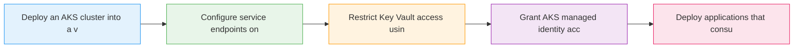

# Securing AKS Apps with Key Vault and Virtual Networks

  <iconify-icon icon="logos:kubernetes" style="font-size: 4rem;" />

---

---
layout: center
class: text-center
---

# Welcome

Welcome to this lab on securing Azure Kubernetes Service applications with Key Vault and Virtual Networks

  <iconify-icon icon="carbon:rocket" style="font-size: 3rem; color: #0078d4;" />

---

---
layout: center
---

# Concept Overview

When running applications in AKS, security should be a primary concern. While AKS provides a managed Kubernetes environment, it's our responsibility to secure the resources our applications use - thin

---

---
layout: center
---

# Azure Network Provider for AKS

By default, AKS can use kubenet networking, where Pods get IP addresses from a separate address space. However, Azure also supports the Azure CNI - Container Network Interface - which allows AKS clust

---

---
layout: center
---

# Service Endpoints and Network Security

Many Azure services support virtual network service endpoints. This includes Key Vault and Storage Accounts. Service endpoints allow you to secure these services to only accept traffic from specific s

---

---
layout: center
---

# Managed Identities for Authentication

Authentication is handled through Azure Managed Identities. We've seen this pattern before in other labs, but it's especially powerful in AKS. The AKS KeyVault add-on creates a managed identity that c

---

---
layout: center
---

# The Lab Scenario

In today's lab, we'll deploy a sample application called Asset Manager to AKS. This application uses Azure Blob Storage to persist data. The connection string for the storage account contains sensitiv

---

---
layout: two-cols
---

# Security Benefits

<iconify-icon icon="mdi:check-circle" class="text-green-500" /> This architecture provides multiple layers of security:

<iconify-icon icon="mdi:check-circle" class="text-green-500" /> Network isolation: Resources are only accessible from specific subnets
Identity-based access: No credentials stored in code or environment variables
Principle of least privilege: Each component has only the permissions it needs
Defense in depth: Multiple security controls protecting the same resources

::right::

  <iconify-icon icon="carbon:chart-line-smooth" style="font-size: 8rem; color: #4caf50;" />

---

---
layout: center
---

# What You'll Learn

