# Securing AKS Apps

Key Vault and Virtual Networks

  <carbon-security class="text-8xl text-red-400 opacity-80" />

---
layout: center
---

# Welcome

<v-click>

Securing Azure Kubernetes Service applications with Key Vault and Virtual Networks

</v-click>

<v-click>

Defense-in-depth security patterns

</v-click>

---
layout: section
---

# Concept Overview

---

# Security in AKS

<v-click>

  <carbon-security class="text-6xl text-red-400" />

</v-click>

<v-click>

Security should be a primary concern

</v-click>

<v-click>

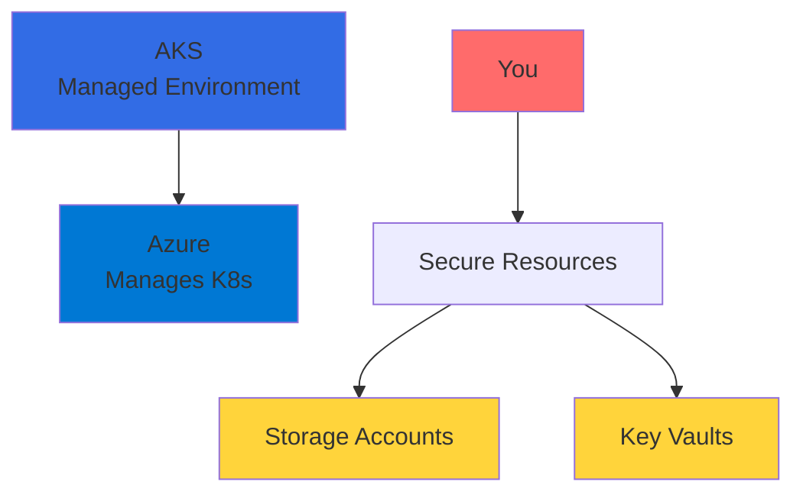

</v-click>

<v-click>

Your responsibility: Secure sensitive resources

</v-click>

---

# Key Concepts

<v-click>

We'll work with several key concepts today

</v-click>

<v-click>

  

    <carbon-network-3 class="text-5xl text-blue-400" />
    
Azure CNI Networking

  

  

    <carbon-network-overlay class="text-5xl text-green-400" />
    
Service Endpoints

  

  

    <carbon-user-identification class="text-5xl text-purple-400" />
    
Managed Identities

  

  

    <carbon-locked class="text-5xl text-red-400" />
    
Network Security

  

</v-click>

---
layout: section
---

# Azure Network Provider for AKS

---

# Default: kubenet

<v-click>

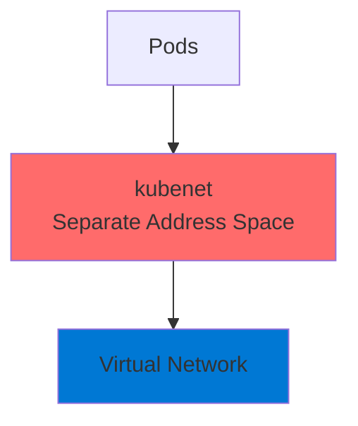

</v-click>

<v-click>

Pods get IP addresses from separate address space

</v-click>

---

# Azure CNI

<v-click>

  <carbon-network-3 class="text-6xl text-green-400" />

</v-click>

<v-click>

Container Network Interface

</v-click>

<v-click>

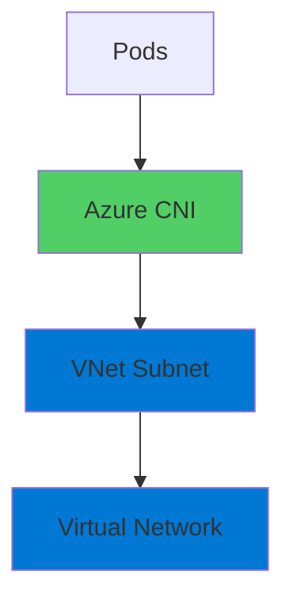

</v-click>

<v-click>

AKS clusters run inside Azure Virtual Networks

</v-click>

---

# The Power of Azure CNI

<v-click>

Each Pod gets IP address directly from VNet subnet

</v-click>

<v-click>

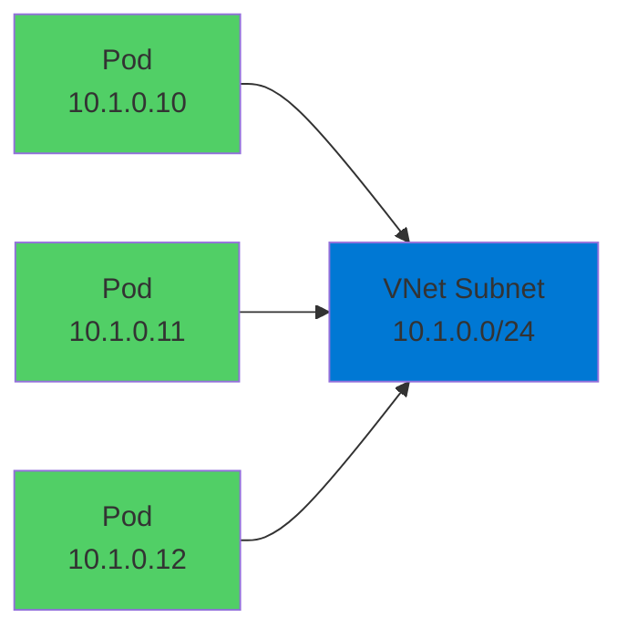

</v-click>

<v-click>

Pods are first-class citizens in Azure network infrastructure

</v-click>

---

# Benefits

<v-click>

  <carbon-network-3 class="text-4xl text-blue-400" />
  Communicate directly with other Azure resources

</v-click>

<v-click>

  <carbon-security class="text-4xl text-red-400" />
  Resources can identify Pods by subnet

</v-click>

<v-click>

  <carbon-locked class="text-4xl text-purple-400" />
  Restrict access based on Pod subnet

</v-click>

<v-click>

Powerful security capabilities

</v-click>

---
layout: section
---

# Service Endpoints and Network Security

---

# Virtual Network Service Endpoints

<v-click>

  <carbon-network-overlay class="text-6xl text-blue-400" />

</v-click>

<v-click>

Many Azure services support service endpoints

</v-click>

<v-click>

  

    <carbon-locked class="text-5xl text-purple-400" />
    
Key Vault

  

  

    <carbon-data-storage class="text-5xl text-green-400" />
    
Storage Accounts

  

</v-click>

<v-click>

And many more Azure services

</v-click>

---

# What Service Endpoints Do

<v-click>

Secure services to specific subnets

</v-click>

<v-click>

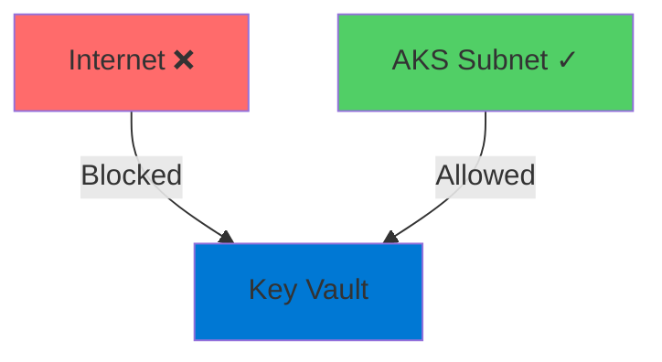

</v-click>

<v-click>

Only accept traffic from specific subnets

</v-click>

---

# Reducing Attack Surface

<v-click>

Before:

</v-click>

<v-click>

Key Vault accessible from entire Internet 
(even with authentication)

</v-click>

<v-click>

↓

</v-click>

<v-click>

After:

</v-click>

<v-click>

Key Vault only accepts connections from AKS subnet

</v-click>

<v-click>

Dramatically reduced attack surface

</v-click>

---
layout: section
---

# Managed Identities for Authentication

---

# Azure Managed Identities

<v-click>

  <carbon-user-identification class="text-6xl text-purple-400" />

</v-click>

<v-click>

Authentication handled through managed identities

</v-click>

<v-click>

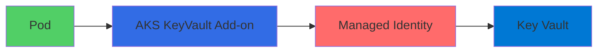

</v-click>

<v-click>

Especially powerful in AKS

</v-click>

---

# The Benefits

<v-click>

  <carbon-close class="text-4xl text-red-400" />
  No credentials in application code

</v-click>

<v-click>

  <carbon-logo-microsoft-azure class="text-4xl text-blue-400" />
  Identity managed by Azure

</v-click>

<v-click>

  <carbon-renew class="text-4xl text-green-400" />
  Rotated automatically

</v-click>

<v-click>

  <carbon-user-access class="text-4xl text-purple-400" />
  Granted specific permissions via RBAC

</v-click>

---
layout: section
---

# The Lab Scenario

---

# Asset Manager Application

<v-click>

Deploy Asset Manager app to AKS

</v-click>

<v-click>

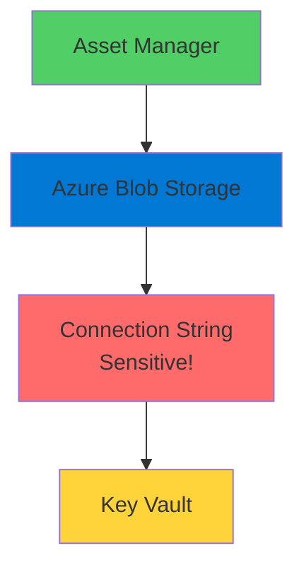

</v-click>

<v-click>

Uses Blob Storage for data persistence

</v-click>

<v-click>

Connection string stored in Key Vault

</v-click>

---

# Security Architecture - Layer 1

<v-click>

  
1

  

    <carbon-network-3 class="text-3xl inline-block" />
    AKS cluster runs inside dedicated VNet
  

</v-click>

<v-click>

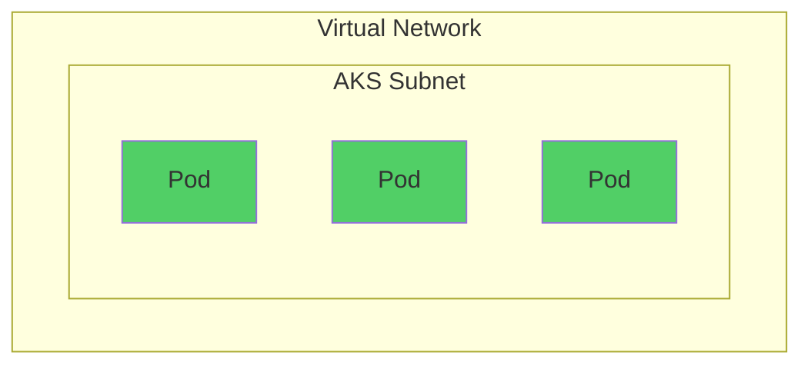

</v-click>

<v-click>

Using Azure CNI networking

</v-click>

<v-click>

All Pods have IP addresses from subnet

</v-click>

---

# Security Architecture - Layer 2

<v-click>

  
2

  

    <carbon-locked class="text-3xl inline-block" />
    Key Vault locked to AKS subnet only
  

</v-click>

<v-click>

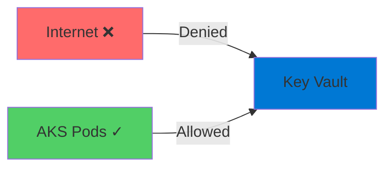

</v-click>

<v-click>

Firewall rules deny all except AKS subnet

</v-click>

---

# Security Architecture - Layer 3

<v-click>

  
3

  

    <carbon-data-storage class="text-3xl inline-block" />
    Storage Account locked to AKS subnet
  

</v-click>

<v-click>

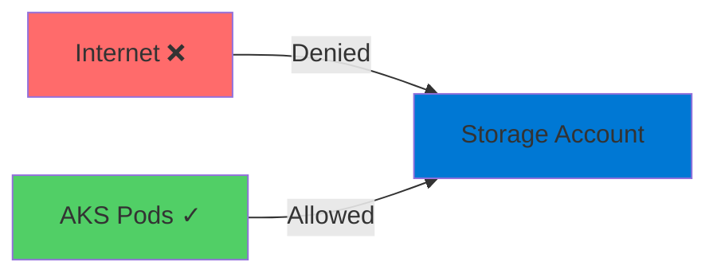

</v-click>

<v-click>

Only AKS Pods can access stored data

</v-click>

---

# Security Architecture - Layer 4

<v-click>

  
4

  

    <carbon-folder class="text-3xl inline-block" />
    Secrets mounted as Pod filesystem volumes
  

</v-click>

<v-click>

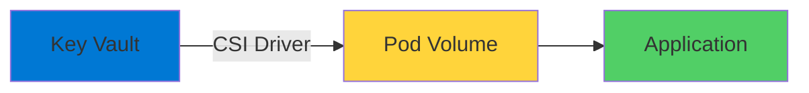

</v-click>

<v-click>

AKS KeyVault Secrets Provider add-on

</v-click>

<v-click>

Seamlessly available to application

</v-click>

---
layout: section
---

# Security Benefits

---

# Multiple Layers of Security

<v-click>

  <carbon-network-3 class="text-4xl text-blue-400" />
  

    
Network isolation

    
Resources only accessible from specific subnets

  

</v-click>

<v-click>

  <carbon-user-identification class="text-4xl text-green-400" />
  

    
Identity-based access

    
No credentials in code or environment variables

  

</v-click>

<v-click>

  <carbon-security class="text-4xl text-purple-400" />
  

    
Principle of least privilege

    
Each component has only needed permissions

  

</v-click>

<v-click>

  <carbon-shield class="text-4xl text-red-400" />
  

    
Defense in depth

    
Multiple security controls protecting same resources

  

</v-click>

---
layout: section
---

# What You'll Learn

---

# Lab Objectives

<v-click>

  <carbon-network-3 class="text-3xl text-blue-400 mt-1" />
  Deploy AKS cluster into VNet using Azure CNI

</v-click>

<v-click>

  <carbon-network-overlay class="text-3xl text-green-400 mt-1" />
  Configure service endpoints for Key Vault and Storage

</v-click>

<v-click>

  <carbon-locked class="text-3xl text-purple-400 mt-1" />
  Restrict Key Vault access using network rules

</v-click>

<v-click>

  <carbon-user-access class="text-3xl text-orange-400 mt-1" />
  Grant AKS managed identity access to Key Vault secrets

</v-click>

<v-click>

  <carbon-deploy class="text-3xl text-red-400 mt-1" />
  Deploy apps consuming Key Vault secrets as mounted volumes

</v-click>

<v-click>

  <carbon-data-storage class="text-3xl text-blue-500 mt-1" />
  Secure Storage Accounts with VNet firewall rules

</v-click>

---

# Production Pattern

<v-click>

Critical pattern for production AKS deployments

</v-click>

<v-click>

  

    <carbon-security class="text-6xl text-red-400" />
    
Security

  

  

    <carbon-certificate class="text-6xl text-green-400" />
    
Compliance

  

</v-click>

<v-click>

Where security and compliance are requirements

</v-click>

---
layout: center
class: text-center
---

<v-click>

<carbon-play-outline class="text-8xl text-green-400 inline-block" />

</v-click>

<v-click>

Let's Get Started!

</v-click>

<v-click>

Setting up our secure infrastructure

</v-click>

