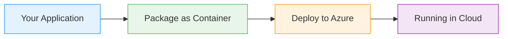

# AKS Ingress and Application Gateway

  <iconify-icon icon="logos:kubernetes" style="font-size: 4rem;" />

---

---
layout: center
class: text-center
---

# Welcome

Welcome to this lab on Ingress and Application Gateway in Azure Kubernetes Service

  <iconify-icon icon="carbon:rocket" style="font-size: 3rem; color: #0078d4;" />

---

---
layout: center
---

# The Challenge

When you start running applications on Kubernetes, you quickly face a networking challenge. While you can route traffic using LoadBalancer Services that give you public IP addresses, this approach doe

---

---
layout: center
---

# The Solution

Instead of multiple IP addresses, you want a single entry point that routes incoming traffic based on HTTP domain names. This means a single Kubernetes cluster can serve multiple domains - like myapp.

---

---
layout: center
---

# What is Azure Application Gateway?

Azure Application Gateway is a web traffic load balancer that enables you to manage traffic to your web applications. It's more than just a standard l...

---

---
layout: center
---

# Application Gateway Ingress Controller

When you combine Application Gateway with AKS, the Application Gateway acts as an ingress controller. This means it automatically configures itself based on the Kubernetes Ingress resources you create

---

---
layout: center
---

# Lab Overview

In this lab, you'll:
1. Create an Azure Application Gateway with proper networking setup
2. Deploy an AKS cluster integrated with the Application Gateway
3. Use the AGIC add-on to connect them togethe

