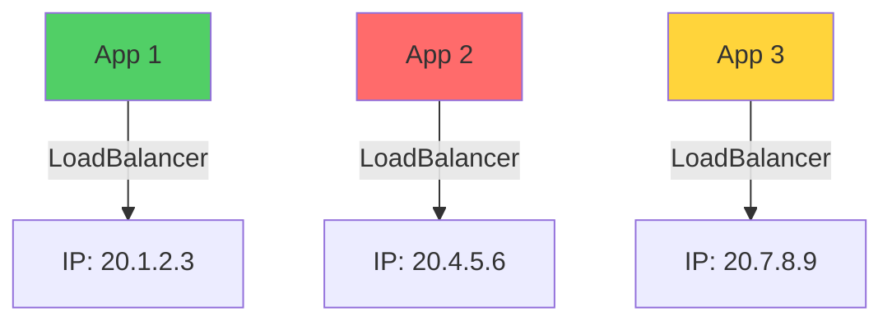
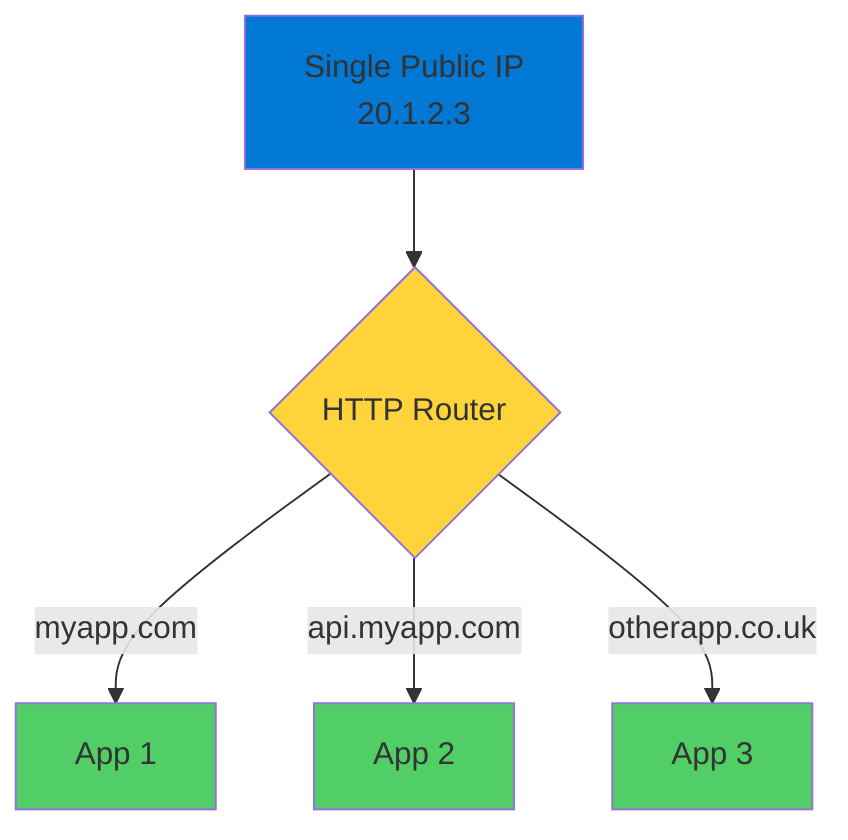
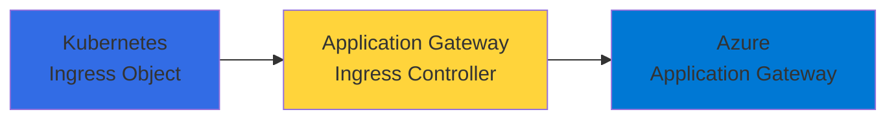
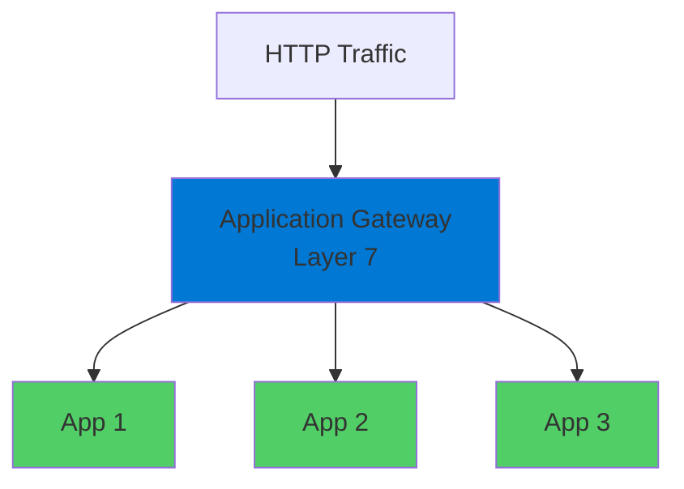
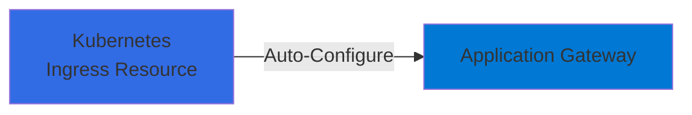
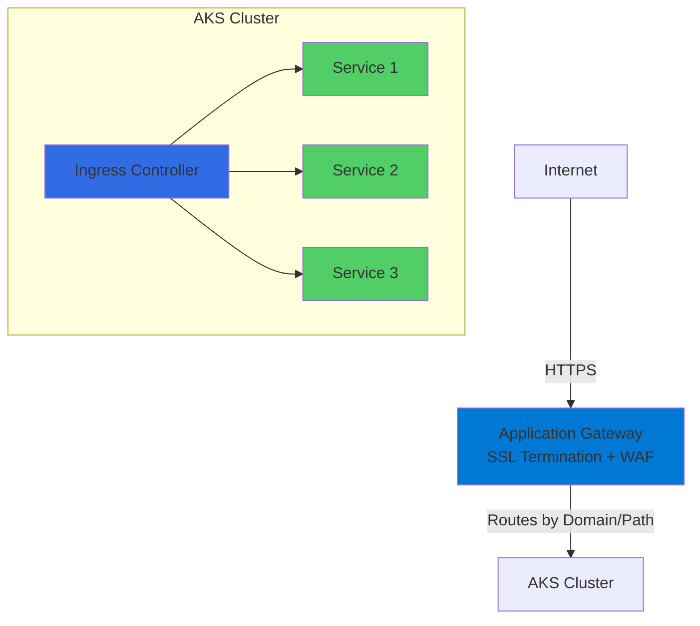

# AKS Ingress and Application Gateway

Efficient Traffic Routing for Kubernetes

<div class="abs-bottom-10 left-10">
  <carbon-network-4 class="text-8xl text-blue-400 opacity-80" />
</div>

---
layout: center
---

# Welcome

<v-click>

<div class="text-xl mt-8">
Explore Ingress and Application Gateway<br/>in Azure Kubernetes Service
</div>

</v-click>

---
layout: section
---

# The Challenge

---

# Running Apps on Kubernetes

<v-click>

<div class="mt-8 text-center text-xl">
You quickly face a networking challenge
</div>

</v-click>

<v-click>

<div class="mt-12">



</div>

</v-click>

<v-click>

<div class="mt-8 text-center text-lg text-red-400">
Do you really want to manage lots of random IP addresses?
</div>

</v-click>

---

# The Problem

<v-click>

<div class="mt-4">
  <carbon-warning class="text-8xl text-red-400" />
</div>

</v-click>

<v-click>

<div class="mt-8 text-center text-xl">
LoadBalancer Services give public IP addresses
</div>

</v-click>

<v-click>

<div class="mt-8 text-center text-2xl text-red-400">
But this doesn't scale well
</div>

</v-click>

<v-click>

<div class="mt-12 text-center text-lg opacity-70">
Multiple applications = Multiple IPs to manage
</div>

</v-click>

---
layout: section
---

# The Solution

---

# Single Entry Point

<v-click>

<div class="mt-8 text-center text-xl">
Instead of multiple IP addresses...
</div>

</v-click>

<v-click>

<div class="mt-12">



</div>

</v-click>

<v-click>

<div class="mt-8 text-center text-xl text-green-400">
Route traffic based on HTTP domain names
</div>

</v-click>

---

# The Power of Ingress

<v-click>

<div class="mt-8 text-center text-2xl">
Single Kubernetes cluster serves multiple domains
</div>

</v-click>

<v-click>

<div class="mt-12 flex justify-center gap-8">
  <div class="text-center">
    <carbon-application-web class="text-5xl text-blue-400" />
    <div class="text-sm mt-3 font-mono">myapp.com</div>
  </div>
  <div class="text-center">
    <carbon-api class="text-5xl text-green-400" />
    <div class="text-sm mt-3 font-mono">api.myapp.com</div>
  </div>
  <div class="text-center">
    <carbon-application class="text-5xl text-purple-400" />
    <div class="text-sm mt-3 font-mono">otherapp.co.uk</div>
  </div>
</div>

</v-click>

<v-click>

<div class="mt-12 text-center text-xl">
All from one public IP in your DNS service
</div>

</v-click>

---

# Kubernetes Ingress

<v-click>

<div class="mt-4">
  <carbon-kubernetes class="text-6xl text-blue-400" />
</div>

</v-click>

<v-click>

<div class="mt-8 text-xl text-center">
Kubernetes supports this with Ingress objects
</div>

</v-click>

<v-click>

<div class="mt-12">



</div>

</v-click>

<v-click>

<div class="mt-8 text-center text-lg opacity-70">
Integrates beautifully with Azure Application Gateway
</div>

</v-click>

---
layout: section
---

# What is Azure Application Gateway?

---

# Application Gateway

<v-click>

<div class="mt-4">
  <carbon-network-4 class="text-6xl text-blue-400" />
</div>

</v-click>

<v-click>

<div class="mt-8 text-xl text-center">
Web traffic load balancer
</div>

</v-click>

<v-click>

<div class="mt-8 text-center text-lg">
More than just a standard load balancer
</div>

</v-click>

<v-click>

<div class="mt-8">



</div>

</v-click>

<v-click>

<div class="mt-8 text-center text-lg opacity-70">
Operates at the application layer
</div>

</v-click>

---

# Key Features

<v-click>

<div class="mt-6 flex items-center gap-4">
  <carbon-layers class="text-4xl text-blue-400" />
  <span class="text-lg">Layer 7 load balancing</span>
</div>

</v-click>

<v-click>

<div class="mt-6 flex items-center gap-4">
  <carbon-network-3 class="text-4xl text-green-400" />
  <span class="text-lg">URL-based routing</span>
</div>

</v-click>

<v-click>

<div class="mt-6 flex items-center gap-4">
  <carbon-locked class="text-4xl text-purple-400" />
  <span class="text-lg">SSL termination</span>
</div>

</v-click>

<v-click>

<div class="mt-6 flex items-center gap-4">
  <carbon-security class="text-4xl text-red-400" />
  <span class="text-lg">Web Application Firewall capabilities</span>
</div>

</v-click>

<v-click>

<div class="mt-6 flex items-center gap-4">
  <carbon-scale class="text-4xl text-orange-400" />
  <span class="text-lg">Auto-scaling support</span>
</div>

</v-click>

---

# Routing Decisions

<v-click>

<div class="mt-8 text-center text-xl">
Make routing decisions based on HTTP request attributes
</div>

</v-click>

<v-click>

<div class="mt-12">

```mermaid
graph TB
    Request[HTTP Request] --> Check{Check Attributes}
    Check -->|Host Header| Route1[myapp.com → Service 1]
    Check -->|URL Path| Route2[/api → Service 2]
    Check -->|Both| Route3[app.com/admin → Service 3]
    style Request fill:#ffd43b
    style Check fill:#ff6b6b
    style Route1 fill:#51cf66
    style Route2 fill:#51cf66
    style Route3 fill:#51cf66
```

</div>

</v-click>

---
layout: section
---

# Application Gateway Ingress Controller

---

# AGIC

<v-click>

<div class="mt-4">
  <carbon-integration class="text-6xl text-purple-400" />
</div>

</v-click>

<v-click>

<div class="mt-8 text-xl text-center">
Application Gateway + AKS
</div>

</v-click>

<v-click>

<div class="mt-8 text-center text-lg">
Application Gateway acts as ingress controller
</div>

</v-click>

<v-click>

<div class="mt-12">



</div>

</v-click>

<v-click>

<div class="mt-8 text-center text-lg text-green-400">
Automatically configures based on Kubernetes Ingress resources
</div>

</v-click>

---

# The Magic

<v-click>

<div class="mt-8">

```yaml
apiVersion: networking.k8s.io/v1
kind: Ingress
metadata:
  name: myapp-ingress
spec:
  rules:
  - host: myapp.com
    http:
      paths:
      - path: /
        backend:
          service:
            name: myapp-service
```

</v-click>

<v-click>

<div class="mt-8 text-center text-2xl text-green-400">
↓ No manual configuration needed! ↓
</div>

</v-click>

<v-click>

<div class="mt-6 text-center text-xl">
Everything managed through Kubernetes manifests
</div>

</v-click>

---
layout: section
---

# Lab Overview

---

# What You'll Do

<v-click>

<div class="mt-6 flex items-start gap-4">
  <div class="text-3xl text-blue-400 mt-1">1</div>
  <div>
    <carbon-add class="text-3xl inline-block" />
    <span class="ml-3 text-lg">Create Application Gateway with networking setup</span>
  </div>
</div>

</v-click>

<v-click>

<div class="mt-6 flex items-start gap-4">
  <div class="text-3xl text-blue-400 mt-1">2</div>
  <div>
    <carbon-kubernetes class="text-3xl inline-block" />
    <span class="ml-3 text-lg">Deploy AKS cluster integrated with App Gateway</span>
  </div>
</div>

</v-click>

<v-click>

<div class="mt-6 flex items-start gap-4">
  <div class="text-3xl text-blue-400 mt-1">3</div>
  <div>
    <carbon-integration class="text-3xl inline-block" />
    <span class="ml-3 text-lg">Use AGIC add-on to connect them together</span>
  </div>
</div>

</v-click>

<v-click>

<div class="mt-6 flex items-start gap-4">
  <div class="text-3xl text-blue-400 mt-1">4</div>
  <div>
    <carbon-deploy class="text-3xl inline-block" />
    <span class="ml-3 text-lg">Deploy app and expose through Ingress resource</span>
  </div>
</div>

</v-click>

<v-click>

<div class="mt-6 flex items-start gap-4">
  <div class="text-3xl text-blue-400 mt-1">5</div>
  <div>
    <carbon-search class="text-3xl inline-block" />
    <span class="ml-3 text-lg">Explore routing in the Azure Portal</span>
  </div>
</div>

</v-click>

---

# Production-Grade Pattern

<v-click>

<div class="mt-8">



</div>

</v-click>

<v-click>

<div class="mt-8 text-center text-xl">
Scalable, reliable, public-facing applications
</div>

</v-click>

---
layout: center
class: text-center
---

<div>

<v-click>

<carbon-play-outline class="text-8xl text-green-400 inline-block" />

</v-click>

<v-click>

<div class="text-4xl mt-8 font-bold">
Let's Get Started!
</div>

</v-click>

<v-click>

<div class="text-xl mt-6 opacity-70">
Build production-grade ingress for Kubernetes
</div>

</v-click>

</div>
