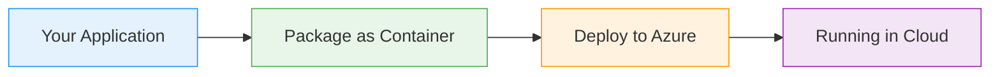

# AKS with KeyVault Secret Storage

  <iconify-icon icon="logos:kubernetes" style="font-size: 4rem;" />

---

---
layout: center
class: text-center
---

# Welcome

Welcome to this lab on integrating Azure Kubernetes Service with Azure Key Vault for secure secret storage

  <iconify-icon icon="carbon:rocket" style="font-size: 3rem; color: #0078d4;" />

---

---
layout: center
---

# What is the Container Storage Interface?

Kubernetes has a powerful, pluggable storage architecture called the Container Storage Interface, or CSI. This architecture allows different types of ...

---

---
layout: center
---

# KeyVault as a Storage Provider

Azure Kubernetes Service includes an add-on that enables Azure Key Vault as a storage provider through the Secrets Store CSI Driver. This is a game-changer for security and configuration management.

---

---
layout: center
---

# Why This Matters

Traditional approaches to secrets management in Kubernetes involve storing secrets as Kubernetes Secret objects. While these are base64 encoded, they're still stored in the cluster's etcd database.

---

---
layout: center
---

# What We'll Cover

<iconify-icon icon="mdi:check-circle" class="text-blue-500" /> on enabled

---

---
layout: center
---

# Use Cases

<iconify-icon icon="mdi:web" /> Share secrets across multiple clusters or applications

<iconify-icon icon="mdi:cog" /> Comply with security requirements that mandate centralized secret storage

<iconify-icon icon="mdi:code-braces" /> Rotate secrets without redeploying your applications

<iconify-icon icon="mdi:test-tube" /> Audit all access to sensitive configuration data

