# AKS with Key Vault

Secure Secret Storage using CSI Driver

  <carbon-locked class="text-8xl text-blue-400 opacity-80" />

---
layout: center
---

# Welcome

<!--
METADATA:
sentence: AKS with KeyVault Secret Storage - Introduction Opening Welcome to this lab on integrating Azure Kubernetes Service with Azure Key Vault for secure secret storage.
search_anchor: AKS with KeyVault Secret Storage
-->
<v-click>

Integrating Azure Kubernetes Service with Azure Key Vault for secure secret storage

</v-click>

---
layout: section
---

# Container Storage Interface

---

# What is CSI?

<v-click>

  <carbon-data-storage class="text-6xl text-blue-400" />

</v-click>

<!--
METADATA:
sentence: What is the Container Storage Interface?
search_anchor: What is the Container Storage
-->
<v-click>

Container Storage Interface

</v-click>

<!--
METADATA:
sentence: Kubernetes has a powerful, pluggable storage architecture called the Container Storage Interface, or CSI.
search_anchor: Kubernetes has a powerful, pluggable
-->
<v-click>

Kubernetes' pluggable storage architecture

</v-click>

<v-click>

</v-click>

---

# CSI Flexibility

<!--
METADATA:
sentence: This architecture allows different types of storage systems to be connected to a Kubernetes cluster and made available as volumes inside your Pod containers.
search_anchor: This architecture allows different types
-->
<v-click>

Different storage systems connect to Kubernetes

</v-click>

<v-click>

</v-click>

<!--
METADATA:
sentence: This architecture allows different types of storage systems to be connected to a Kubernetes cluster and made available as volumes inside your Pod containers.
search_anchor: This architecture allows different types
-->
<v-click>

Made available as volumes inside Pod containers

</v-click>

---
layout: section
---

# KeyVault as a Storage Provider

---

# The Game-Changer

<v-click>

  <carbon-security class="text-6xl text-purple-400" />

</v-click>

<!--
METADATA:
sentence: KeyVault as a Storage Provider Azure Kubernetes Service includes an add-on that enables Azure Key Vault as a storage provider through the Secrets Store CSI Driver.
search_anchor: KeyVault as a Storage Provider
-->
<v-click>

Azure Key Vault as a storage provider

</v-click>

<v-click>

</v-click>

<!--
METADATA:
sentence: The beauty of CSI is its flexibility.
search_anchor: beauty of CSI is its
-->
<v-click>

Through the Secrets Store CSI Driver

</v-click>

---

# What You Can Do

<!--
METADATA:
sentence: This is a game-changer for security and configuration management.
search_anchor: This is a game-changer for
-->
<v-click>

  <carbon-document class="text-4xl text-blue-400" />
  Store sensitive configuration files in Key Vault

</v-click>

<!--
METADATA:
sentence: What is the Container Storage Interface?
search_anchor: What is the Container Storage
-->
<v-click>

  <carbon-folder class="text-4xl text-green-400" />
  Mount them as volumes in container folders

</v-click>

<!--
METADATA:
sentence: The beauty of CSI is its flexibility.
search_anchor: beauty of CSI is its
-->
<v-click>

  <carbon-locked class="text-4xl text-red-400" />
  Keep data secure outside of Kubernetes

</v-click>

<!--
METADATA:
sentence: This is a game-changer for security and configuration management.
search_anchor: This is a game-changer for
-->
<v-click>

Game-changer for security and configuration management

</v-click>

---
layout: section
---

# Why This Matters

---

# Traditional Approach

<v-click>

</v-click>

<!--
METADATA:
sentence: While these are base64 encoded, they're still stored in the cluster's etcd database.
search_anchor: While these are base64 encoded
-->
<v-click>

Secrets are base64 encoded

</v-click>

<!--
METADATA:
sentence: While these are base64 encoded, they're still stored in the cluster's etcd database.
search_anchor: While these are base64 encoded
-->
<v-click>

But still stored in the cluster's etcd database

</v-click>

---

# Key Vault CSI Approach

<v-click>

</v-click>

<!--
METADATA:
sentence: In this session, we'll explore how to leverage the Container Storage Interface to mount Key Vault secrets directly into your Kubernetes pods.
search_anchor: this session, we'll explore how
-->
<v-click>

Secrets remain in Azure Key Vault

</v-click>

<!--
METADATA:
sentence: In this session, we'll explore how to leverage the Container Storage Interface to mount Key Vault secrets directly into your Kubernetes pods.
search_anchor: this session, we'll explore how
-->
<v-click>

Never exist as Kubernetes objects in your cluster

</v-click>

---

# Key Vault Security Features

<!--
METADATA:
sentence: This is a game-changer for security and configuration management.
search_anchor: This is a game-changer for
-->
<v-click>

  <carbon-chip class="text-4xl text-purple-400" />
  Hardware security module protection

</v-click>

<!--
METADATA:
sentence: The beauty of CSI is its flexibility.
search_anchor: beauty of CSI is its
-->
<v-click>

  <carbon-document-tasks class="text-4xl text-blue-400" />
  Audit logging

</v-click>

<!--
METADATA:
sentence: What is the Container Storage Interface?
search_anchor: What is the Container Storage
-->
<v-click>

  <carbon-user-access class="text-4xl text-green-400" />
  Azure RBAC integration

</v-click>

<!--
METADATA:
sentence: This is a game-changer for security and configuration management.
search_anchor: This is a game-changer for
-->
<v-click>

  <carbon-data-center class="text-4xl text-orange-400" />
  Centralized secret management across clusters

</v-click>

---

# Secret Materialization

```mermaid
graph LR
    KV[Key Vault<br/>Encrypted Storage] -->|Mount| Memory[Pod Memory<br/>Runtime Only]
    Memory -->|Never Stored| NoK8s[❌ Kubernetes]
    style KV fill:#0078d4
    style Memory fill:#51cf66
    style NoK8s fill:#ff6b6b
```

<v-click>

</v-click>

<!--
METADATA:
sentence: While these are base64 encoded, they're still stored in the cluster's etcd database.
search_anchor: While these are base64 encoded
-->
<v-click>

Secrets materialized in memory only

</v-click>

<!--
METADATA:
sentence: It's not limited to traditional block storage or file systems.
search_anchor: It's not limited to traditional
-->
<v-click>

When mounted into pod's filesystem

</v-click>

---
layout: section
---

# What We'll Cover

---

# Lab Objectives

<!--
METADATA:
sentence: KeyVault as a Storage Provider Azure Kubernetes Service includes an add-on that enables Azure Key Vault as a storage provider through the Secrets Store CSI Driver.
search_anchor: KeyVault as a Storage Provider
-->
<v-click>

  
1

  

    <carbon-add class="text-3xl inline-block" />
    Create AKS cluster with Key Vault add-on enabled
  

</v-click>

<!--
METADATA:
sentence: What is the Container Storage Interface?
search_anchor: What is the Container Storage
-->
<v-click>

  
2

  

    <carbon-user-identification class="text-3xl inline-block" />
    Configure managed identity permissions
  

</v-click>

<!--
METADATA:
sentence: This is a game-changer for security and configuration management.
search_anchor: This is a game-changer for
-->
<v-click>

  
3

  

    <carbon-security class="text-3xl inline-block" />
    Create and configure Key Vault
  

</v-click>

<!--
METADATA:
sentence: This is a game-changer for security and configuration management.
search_anchor: This is a game-changer for
-->
<v-click>

  
4

  

    <carbon-document-add class="text-3xl inline-block" />
    Define SecretProviderClass for volume mounts
  

</v-click>

<!--
METADATA:
sentence: KeyVault as a Storage Provider Azure Kubernetes Service includes an add-on that enables Azure Key Vault as a storage provider through the Secrets Store CSI Driver.
search_anchor: KeyVault as a Storage Provider
-->
<v-click>

  
5

  

    <carbon-deploy class="text-3xl inline-block" />
    Deploy app that consumes secrets as files
  

</v-click>

---
layout: section
---

# Use Cases

---

# When to Use This Pattern

<!--
METADATA:
sentence: While these are base64 encoded, they're still stored in the cluster's etcd database.
search_anchor: While these are base64 encoded
-->
<v-click>

  <carbon-share class="text-4xl text-blue-400" />
  Share secrets across multiple clusters or applications

</v-click>

<!--
METADATA:
sentence: What is the Container Storage Interface?
search_anchor: What is the Container Storage
-->
<v-click>

  <carbon-certificate-check class="text-4xl text-green-400" />
  Comply with centralized secret storage requirements
</v-click>

<!--
METADATA:
sentence: While these are base64 encoded, they're still stored in the cluster's etcd database.
search_anchor: While these are base64 encoded
-->
<v-click>

  <carbon-renew class="text-4xl text-purple-400" />
  Rotate secrets without redeploying applications

</v-click>

<!--
METADATA:
sentence: This is a game-changer for security and configuration management.
search_anchor: This is a game-changer for
-->
<v-click>

  <carbon-document-view class="text-4xl text-orange-400" />
  Audit all access to sensitive configuration data

</v-click>

---

# Architecture Overview

<v-click>

</v-click>

<!--
METADATA:
sentence: It's not limited to traditional block storage or file systems.
search_anchor: It's not limited to traditional
-->
<v-click>

Secrets flow from Key Vault to Pod filesystem

</v-click>

<!--
METADATA:
sentence: KeyVault as a Storage Provider Azure Kubernetes Service includes an add-on that enables Azure Key Vault as a storage provider through the Secrets Store CSI Driver.
search_anchor: KeyVault as a Storage Provider
-->
<v-click>

Managed identity handles authentication automatically

</v-click>

---
layout: center
class: text-center
---

<v-click>

<carbon-play-outline class="text-8xl text-green-400 inline-block" />

</v-click>

<!--
METADATA:
sentence: What is the Container Storage Interface?
search_anchor: What is the Container Storage
-->
<v-click>

Let's Get Started!

</v-click>

<!--
METADATA:
sentence: KeyVault as a Storage Provider Azure Kubernetes Service includes an add-on that enables Azure Key Vault as a storage provider through the Secrets Store CSI Driver.
search_anchor: KeyVault as a Storage Provider
-->
<v-click>

Hands-on exercises with Key Vault CSI Driver

</v-click>

