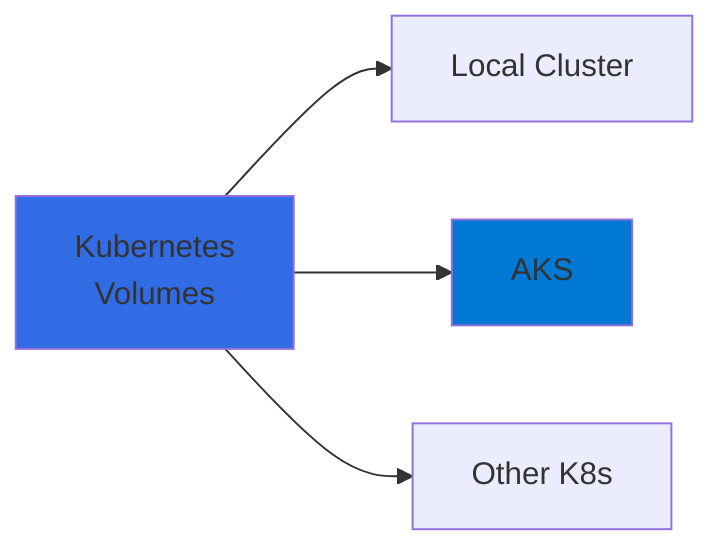
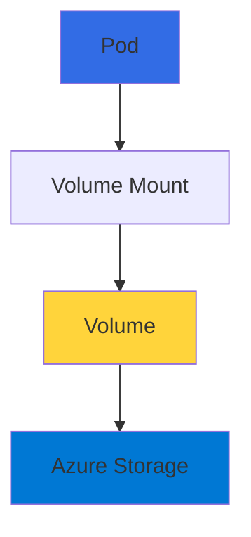
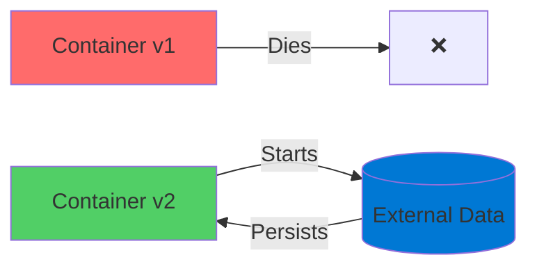
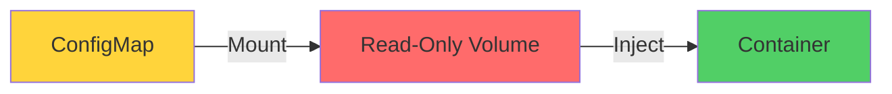
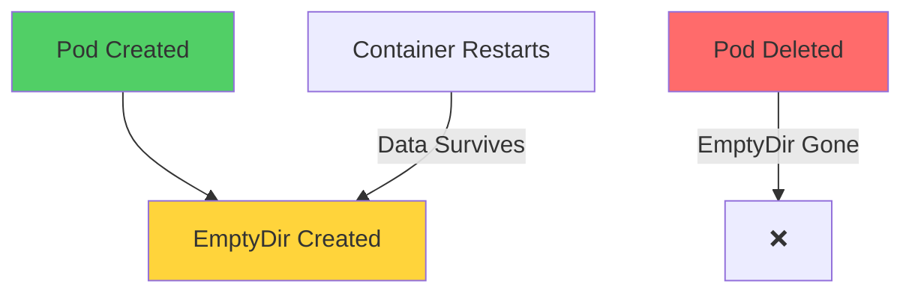
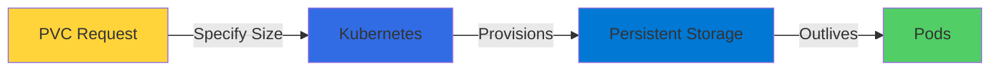
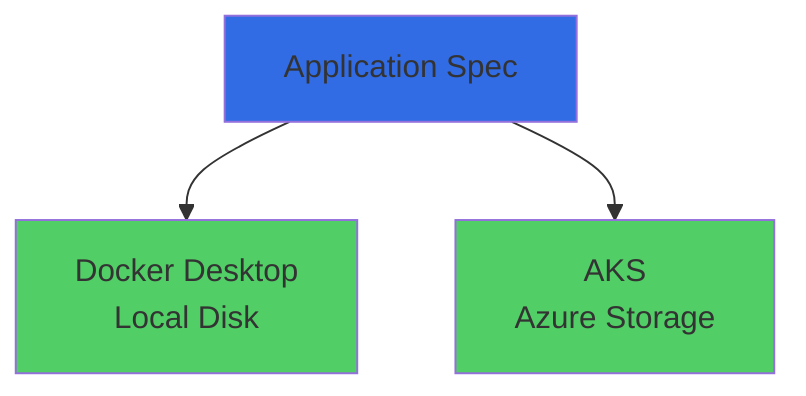

# Kubernetes Storage

Managing Persistent Data in AKS

<div class="abs-bottom-10 left-10">
  <carbon-data-storage class="text-8xl text-blue-400 opacity-80" />
</div>

---
layout: center
---

# Welcome

<!--
METADATA:
sentence: In this session, we'll explore how to manage persistent storage for your containerized applications running in AKS.
search_anchor: this session, we'll explore how
-->
<v-click>

<div class="text-xl mt-8">
Explore persistent storage<br/>for containerized applications in AKS
</div>

</v-click>

---
layout: section
---

# What We'll Cover

---

# Kubernetes Storage Abstractions

<v-click>

<div class="mt-4">
  <carbon-data-storage class="text-6xl text-blue-400" />
</div>

</v-click>

<!--
METADATA:
sentence: What We'll Cover Kubernetes provides multiple abstractions to help you model your applications in a generic way that works across all clusters.
search_anchor: What We'll Cover Kubernetes provides
-->
<v-click>

<div class="mt-8 text-xl text-center">
Kubernetes provides abstractions for generic storage
</div>

</v-click>

<!--
METADATA:
sentence: What We'll Cover Kubernetes provides multiple abstractions to help you model your applications in a generic way that works across all clusters.
search_anchor: What We'll Cover Kubernetes provides
-->
<v-click>

<div class="mt-12 text-lg text-center">
Works across all clusters
</div>

</v-click>

<v-click>

<div class="mt-8">



</v-click>

---

# Volumes

<!--
METADATA:
sentence: When it comes to storage, Kubernetes uses volumes - these are storage units that you can mount into your application Pods.
search_anchor: When it comes to storage
-->
<v-click>

<div class="mt-8 text-xl text-center">
Storage units mounted into application Pods
</div>

</v-click>

<v-click>

<div class="mt-12">



</div>

</v-click>

<!--
METADATA:
sentence: The key concept here is that storage mounts appear as part of the container filesystem, but they're actually stored outside of the container.
search_anchor: key concept here is that
-->
<v-click>

<div class="mt-8 text-center text-lg opacity-70">
Appears as part of container filesystem
</div>

</v-click>

<!--
METADATA:
sentence: Second, you can store application state outside of the container.
search_anchor: Second, you can store application
-->
<v-click>

<div class="mt-4 text-center text-lg opacity-70">
Actually stored outside the container
</div>

</v-click>

---

# The Power of External Storage

<!--
METADATA:
sentence: In AKS, this is backed by standard Azure resources like managed disks and file shares.
search_anchor: AKS, this is backed by
-->
<v-click>

<div class="mt-8 text-center text-xl">
In AKS: Backed by Azure resources
</div>

</v-click>

<!--
METADATA:
sentence: In AKS, this is backed by standard Azure resources like managed disks and file shares.
search_anchor: AKS, this is backed by
-->
<v-click>

<div class="mt-12 flex justify-center gap-12">
  <div class="text-center">
    <carbon-data-1 class="text-6xl text-blue-400" />
    <div class="text-sm mt-3">Managed Disks</div>
  </div>
  <div class="text-center">
    <carbon-folder class="text-6xl text-green-400" />
    <div class="text-sm mt-3">File Shares</div>
  </div>
</div>

</v-click>

---

# Two Important Capabilities

<!--
METADATA:
sentence: This is perfect for managing application configuration without rebuilding your container images.
search_anchor: This is perfect for managing
-->
<v-click>

<div class="mt-8 flex items-start gap-4">
  <div class="text-4xl text-blue-400 mt-1">1</div>
  <div>
    <carbon-document class="text-4xl inline-block" />
    <div class="mt-2 text-lg">Push configuration settings as read-only files</div>
    <div class="mt-1 text-sm opacity-70">Manage config without rebuilding images</div>
  </div>
</div>

</v-click>

<!--
METADATA:
sentence: Second, you can store application state outside of the container.
search_anchor: Second, you can store application
-->
<v-click>

<div class="mt-8 flex items-start gap-4">
  <div class="text-4xl text-green-400 mt-1">2</div>
  <div>
    <carbon-save class="text-4xl inline-block" />
    <div class="mt-2 text-lg">Store application state outside container</div>
    <div class="mt-1 text-sm opacity-70">Critical for ephemeral containers</div>
  </div>
</div>

</v-click>

---

# Why External Storage Matters

<v-click>

<div class="mt-8">



</div>

</v-click>

<!--
METADATA:
sentence: This is critical because containers are ephemeral - they can be replaced at any time.
search_anchor: This is critical because containers
-->
<v-click>

<div class="mt-12 text-center text-xl text-red-400">
Containers are ephemeral - can be replaced anytime
</div>

</v-click>

<!--
METADATA:
sentence: Second, you can store application state outside of the container.
search_anchor: Second, you can store application
-->
<v-click>

<div class="mt-6 text-center text-xl text-green-400">
External storage ensures state persists
</div>

</v-click>

---
layout: section
---

# Storage Concepts in Kubernetes

---

# Volumes and Volume Mounts

<v-click>

<div class="mt-4">
  <carbon-data-storage class="text-6xl text-blue-400" />
</div>

</v-click>

<!--
METADATA:
sentence: Storage Concepts in Kubernetes We'll be working with several storage concepts in this lab: Volumes and Volume Mounts - These are the basic building blocks.
search_anchor: Storage Concepts in Kubernetes We'll
-->
<v-click>

<div class="mt-8 text-xl text-center">
Basic building blocks
</div>

</v-click>

<v-click>

<div class="mt-12">

```mermaid
graph TB
    Pod[Pod Level] --> Volume[Volume Definition]
    Container[Container] --> Mount[Volume Mount]
    Mount -->|Connects to| Volume
    Volume -->|Path:| Path[/data]
    style Pod fill:#326ce5
    style Volume fill:#ffd43b
    style Mount fill:#51cf66
```

</div>

</v-click>

<!--
METADATA:
sentence: A volume is defined at the Pod level, and volume mounts connect those volumes to specific paths inside your containers.
search_anchor: volume is defined at the
-->
<v-click>

<div class="mt-8 text-center text-lg opacity-70">
Volume defined at Pod level, mounted to container paths
</div>

</v-click>

---

# ConfigMaps as Volumes

<v-click>

<div class="mt-4">
  <carbon-document class="text-6xl text-green-400" />
</div>

</v-click>

<!--
METADATA:
sentence: ConfigMaps as Volumes - You can mount ConfigMaps as read-only volumes to inject configuration files into your containers.
search_anchor: ConfigMaps as Volumes - You
-->
<v-click>

<div class="mt-8 text-xl text-center">
Mount ConfigMaps as read-only volumes
</div>

</v-click>

<v-click>

<div class="mt-12">



</div>

</v-click>

<!--
METADATA:
sentence: ConfigMaps as Volumes - You can mount ConfigMaps as read-only volumes to inject configuration files into your containers.
search_anchor: ConfigMaps as Volumes - You
-->
<v-click>

<div class="mt-8 text-center text-lg">
Inject configuration files into containers
</div>

</v-click>

<!--
METADATA:
sentence: This is a clean way to separate configuration from your container images.
search_anchor: This is a clean way
-->
<v-click>

<div class="mt-4 text-center text-sm opacity-70">
Clean separation of configuration from images
</div>

</v-click>

---

# EmptyDir Volumes

<v-click>

<div class="mt-4">
  <carbon-folder class="text-6xl text-purple-400" />
</div>

</v-click>

<!--
METADATA:
sentence: EmptyDir Volumes - These provide temporary storage that has the lifecycle of the Pod.
search_anchor: EmptyDir Volumes - These provide
-->
<v-click>

<div class="mt-8 text-xl text-center">
Temporary storage with Pod lifecycle
</div>

</v-click>

<v-click>

<div class="mt-12">



</div>

</v-click>

<!--
METADATA:
sentence: If your container restarts, the data survives.
search_anchor: If your container restarts, the
-->
<v-click>

<div class="mt-8 text-center text-lg opacity-70">
Survives container restarts, not Pod deletion
</div>

</v-click>

---

# PersistentVolumeClaims

<v-click>

<div class="mt-4">
  <carbon-data-1 class="text-6xl text-blue-400" />
</div>

</v-click>

<!--
METADATA:
sentence: PersistentVolumeClaims - These are requests for persistent storage that outlives individual Pods.
search_anchor: PersistentVolumeClaims - These are requests
-->
<v-click>

<div class="mt-8 text-xl text-center">
Requests for persistent storage
</div>

</v-click>

<v-click>

<div class="mt-12">



</div>

</v-click>

<!--
METADATA:
sentence: PersistentVolumeClaims - These are requests for persistent storage that outlives individual Pods.
search_anchor: PersistentVolumeClaims - These are requests
-->
<v-click>

<div class="mt-8 text-center text-lg">
Storage outlives individual Pods
</div>

</v-click>

<!--
METADATA:
sentence: You specify how much storage you need, and Kubernetes provisions it for you based on available storage classes.
search_anchor: You specify how much storage
-->
<v-click>

<div class="mt-4 text-center text-sm opacity-70">
Kubernetes provisions based on storage classes
</div>

</v-click>

---
layout: section
---

# The Demo Application

---

# .NET 6.0 Background Worker

<v-click>

<div class="mt-4">
  <carbon-application class="text-6xl text-green-400" />
</div>

</v-click>

<!--
METADATA:
sentence: Second, you can store application state outside of the container.
search_anchor: Second, you can store application
-->
<v-click>

<div class="mt-8 text-lg">
Simple application that:
</div>

</v-click>

<!--
METADATA:
sentence: This app reads configuration from files and writes data to various locations.
search_anchor: This app reads configuration from
-->
<v-click>

<div class="mt-6 flex items-center gap-4">
  <carbon-document class="text-3xl text-blue-400" />
  <span>Reads configuration from files</span>
</div>

</v-click>

<!--
METADATA:
sentence: This app reads configuration from files and writes data to various locations.
search_anchor: This app reads configuration from
-->
<v-click>

<div class="mt-4 flex items-center gap-4">
  <carbon-save class="text-3xl text-green-400" />
  <span>Writes data to various locations</span>
</div>

</v-click>

<!--
METADATA:
sentence: It's perfect for demonstrating different storage patterns because we can easily see what happens to the data as we manipulate Pods and volumes.
search_anchor: It's perfect for demonstrating different
-->
<v-click>

<div class="mt-12 text-center text-xl">
Perfect for demonstrating storage patterns
</div>

</v-click>

---

# Application Write Locations

<!--
METADATA:
sentence: The application writes to two locations - a cache file and a database file.
search_anchor: application writes to two locations
-->
<v-click>

<div class="mt-8 flex justify-center gap-16">
  <div class="text-center">
    <carbon-document-blank class="text-6xl text-orange-400" />
    <div class="text-lg mt-4">Cache File</div>
  </div>
  <div class="text-center">
    <carbon-data-base class="text-6xl text-blue-400" />
    <div class="text-lg mt-4">Database File</div>
  </div>
</div>

</v-click>

<!--
METADATA:
sentence: By applying different volume types to these locations, we'll see exactly how each storage type behaves.
search_anchor: By applying different volume types
-->
<v-click>

<div class="mt-12 text-center text-xl">
Apply different volume types to each location
</div>

</v-click>

<!--
METADATA:
sentence: By applying different volume types to these locations, we'll see exactly how each storage type behaves.
search_anchor: By applying different volume types
-->
<v-click>

<div class="mt-6 text-center text-lg opacity-70">
See exactly how each storage type behaves
</div>

</v-click>

---
layout: section
---

# Environment Setup

---

# Two Environments

<!--
METADATA:
sentence: Environment Setup We'll start by working with a local Kubernetes cluster running in Docker Desktop.
search_anchor: Environment Setup We'll start by
-->
<v-click>

<div class="mt-8 flex justify-center gap-12">
  <div class="text-center">
    <carbon-docker class="text-6xl text-blue-500" />
    <div class="text-lg mt-4">Docker Desktop</div>
    <div class="text-sm mt-2 opacity-70">Local K8s</div>
  </div>
  <div class="text-4xl opacity-50">→</div>
  <div class="text-center">
    <carbon-logo-microsoft-azure class="text-6xl text-blue-400" />
    <div class="text-lg mt-4">AKS</div>
    <div class="text-sm mt-2 opacity-70">Cloud Production</div>
  </div>
</div>

</v-click>

<!--
METADATA:
sentence: This gives us a fast iteration cycle for learning the concepts.
search_anchor: This gives us a fast
-->
<v-click>

<div class="mt-12 text-center text-xl">
Start local for fast iteration
</div>

</v-click>

<!--
METADATA:
sentence: Then we'll move to an Azure Kubernetes Service cluster to see how the same specifications work in a production cloud environment.
search_anchor: Then we'll move to an
-->
<v-click>

<div class="mt-6 text-center text-xl">
Move to AKS for production patterns
</div>

</v-click>

---

# The Beauty of Kubernetes

<v-click>

<div class="mt-8">



</div>

</v-click>

<!--
METADATA:
sentence: One of the beautiful things about Kubernetes is that our application specifications will work identically in both environments.
search_anchor: One of the beautiful things
-->
<v-click>

<div class="mt-12 text-center text-2xl text-green-400">
Same specifications work identically
</div>

</v-click>

<!--
METADATA:
sentence: By applying different volume types to these locations, we'll see exactly how each storage type behaves.
search_anchor: By applying different volume types
-->
<v-click>

<div class="mt-6 text-center text-lg">
Different implementations underneath
</div>

</v-click>

<!--
METADATA:
sentence: The underlying storage implementation differs - local disk versus Azure storage services - but our application doesn't need to know or care about those differences.
search_anchor: underlying storage implementation differs -
-->
<v-click>

<div class="mt-4 text-center text-sm opacity-70">
Application doesn't know or care
</div>

</v-click>

---

# Storage Implementation

<!--
METADATA:
sentence: The underlying storage implementation differs - local disk versus Azure storage services - but our application doesn't need to know or care about those differences.
search_anchor: underlying storage implementation differs -
-->
<v-click>

<div class="mt-8 flex justify-center gap-16">
  <div class="text-center">
    <div class="text-xl font-bold text-blue-500">Docker Desktop</div>
    <div class="mt-4">
      <carbon-data-1 class="text-5xl" />
      <div class="text-sm mt-2">Local Disk</div>
    </div>
  </div>
  <div class="text-4xl opacity-50">≠</div>
  <div class="text-center">
    <div class="text-xl font-bold text-blue-400">AKS</div>
    <div class="mt-4">
      <carbon-cloud-services class="text-5xl" />
      <div class="text-sm mt-2">Azure Storage</div>
    </div>
  </div>
</div>

</v-click>

<!--
METADATA:
sentence: Second, you can store application state outside of the container.
search_anchor: Second, you can store application
-->
<v-click>

<div class="mt-12 text-center text-xl">
But our application specs remain the same!
</div>

</v-click>

---
layout: center
class: text-center
---

<div>

<v-click>

<carbon-play-outline class="text-8xl text-green-400 inline-block" />

</v-click>

<!--
METADATA:
sentence: Let's get started by setting up our environment and deploying our first version of the application.
search_anchor: Let's get started by setting
-->
<v-click>

<div class="text-4xl mt-8 font-bold">
Let's Get Started!
</div>

</v-click>

<!--
METADATA:
sentence: Let's get started by setting up our environment and deploying our first version of the application.
search_anchor: Let's get started by setting
-->
<v-click>

<div class="text-xl mt-6 opacity-70">
Setting up environment and deploying our application
</div>

</v-click>

</div>
