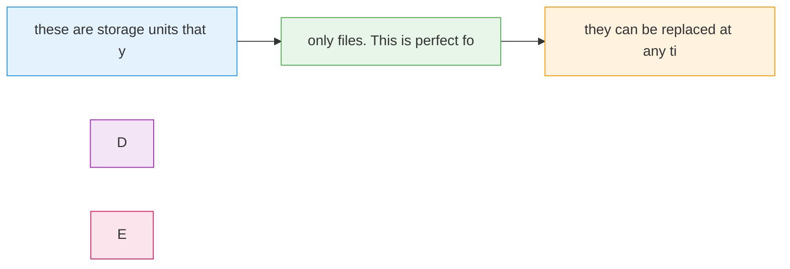

# Kubernetes Storage

  <iconify-icon icon="logos:kubernetes" style="font-size: 4rem;" />

---

---
layout: center
---

# Kubernetes Storage - Introduction

Welcome to this lab on Kubernetes Storage in Azure Kubernetes Service. In this session, we'll explore how to manage persistent storage for your containerized applications running in AKS.

---

---
layout: center
---

# What We'll Cover

---

---
layout: center
---

# Storage Concepts in Kubernetes

We'll be working with several storage concepts in this lab:

---

---
layout: center
---

# The Demo Application

For this lab, we'll be using a simple .NET 6.0 background worker application. This app reads configuration from files and writes data to various locations. It's perfect for demonstrating different sto

---

---
layout: center
---

# Environment Setup

We'll start by working with a local Kubernetes cluster running in Docker Desktop. This gives us a fast iteration cycle for learning the concepts. Then we'll move to an Azure Kubernetes Service cluster

