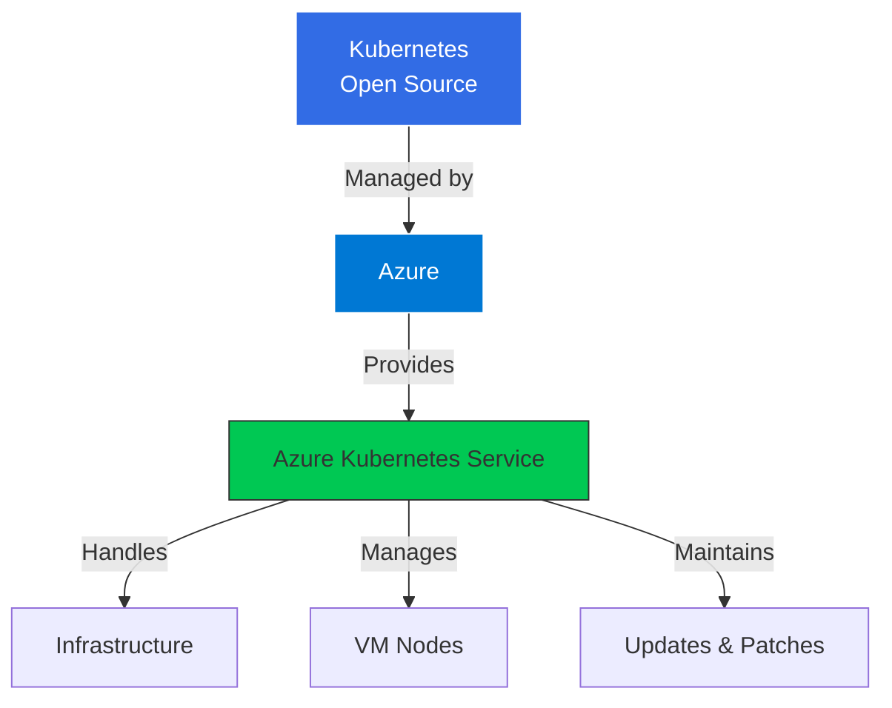

# What is AKS?

```mermaid
graph TB
    K8s[Kubernetes<br/>Open Source] -->|Managed by| Azure[Azure]
    Azure -->|Provides| AKS[Azure Kubernetes Service]

    AKS -->|Handles| Infra[Infrastructure]
    AKS -->|Manages| Nodes[VM Nodes]
    AKS -->|Maintains| Updates[Updates & Patches]

    style K8s fill:#326ce5,stroke:#fff,color:#fff
    style Azure fill:#0078d4,stroke:#fff,color:#fff
    style AKS fill:#00c853,stroke:#333
```

  
Full Kubernetes power without infrastructure overhead

