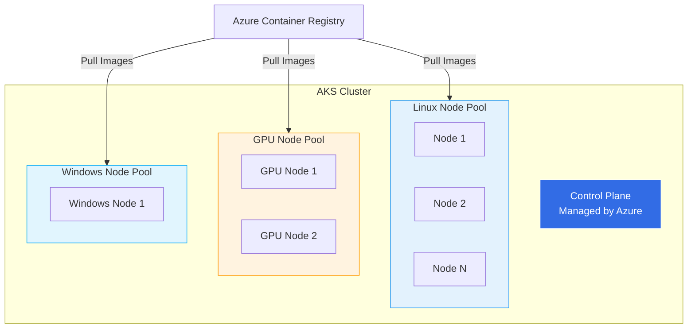

# AKS Architecture

```mermaid
graph TB
    subgraph AKS["AKS Cluster"]
        CP[Control Plane<br/>Managed by Azure]

        subgraph NP1["Linux Node Pool"]
            N1[Node 1]
            N2[Node 2]
            N3[Node N]
        end

        subgraph NP2["GPU Node Pool"]
            G1[GPU Node 1]
            G2[GPU Node 2]
        end

        subgraph NP3["Windows Node Pool"]
            W1[Windows Node 1]
        end
    end

    ACR[Azure Container Registry] -->|Pull Images| NP1
    ACR -->|Pull Images| NP2
    ACR -->|Pull Images| NP3

    style CP fill:#326ce5,stroke:#fff,color:#fff
    style NP1 fill:#e3f2fd,stroke:#2196f3
    style NP2 fill:#fff3e0,stroke:#ff9800
    style NP3 fill:#e1f5fe,stroke:#03a9f4
```
