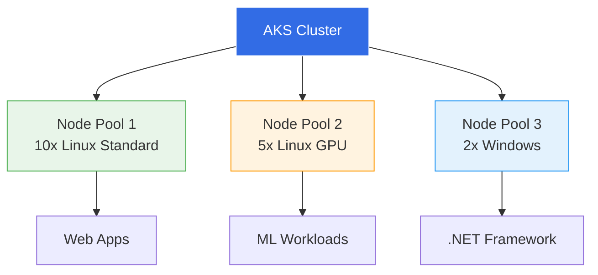

# Node Pool Flexibility

```mermaid
graph TB
    Cluster[AKS Cluster] --> Pool1["Node Pool 1<br/>10x Linux Standard"]
    Cluster --> Pool2["Node Pool 2<br/>5x Linux GPU"]
    Cluster --> Pool3["Node Pool 3<br/>2x Windows"]

    Pool1 --> App1[Web Apps]
    Pool2 --> App2[ML Workloads]
    Pool3 --> App3[.NET Framework]

    style Cluster fill:#326ce5,stroke:#fff,color:#fff
    style Pool1 fill:#e8f5e9,stroke:#4caf50
    style Pool2 fill:#fff3e0,stroke:#ff9800
    style Pool3 fill:#e3f2fd,stroke:#2196f3
```

- Different VM sizes
- Mixed OS support
- Workload optimization
- Cost efficiency

