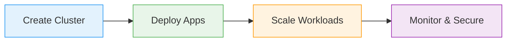

# What You'll Learn

```mermaid
graph LR
    A[Create Cluster] --> B[Deploy Apps]
    B --> C[Scale Workloads]
    C --> D[Monitor & Secure]

    style A fill:#e3f2fd,stroke:#2196f3
    style B fill:#e8f5e9,stroke:#4caf50
    style C fill:#fff3e0,stroke:#ff9800
    style D fill:#f3e5f5,stroke:#9c27b0
```

<iconify-icon icon="logos:kubernetes" style="font-size: 3rem;" />

Standard Kubernetes tools work seamlessly

YAML specs are portable

