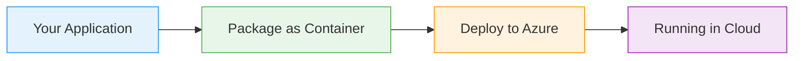

# Azure Kubernetes Service

  <iconify-icon icon="logos:kubernetes" style="font-size: 4rem;" />

---

---
layout: center
class: text-center
---

# Welcome

Welcome to this lesson on Azure Kubernetes Service, or AKS

  <iconify-icon icon="carbon:rocket" style="font-size: 3rem; color: #0078d4;" />

---

---
layout: center
---

# What is AKS?

Kubernetes is an open-source platform for managing containerized applications. While Kubernetes itself is open-source, many vendors provide their own ...

---

---
layout: center
---

# Why Use AKS?

AKS simplifies many complex tasks that would otherwise require significant expertise and effort:

---

---
layout: center
---

# Key Features to Explore

Let's look at what you can configure when creating an AKS cluster:

---

---
layout: center
---

# Production Considerations

Now, it's important to understand that production-grade AKS deployments can get quite complicated. You'll need to consider networking, security policies, monitoring, and high availability. However, fo

---

---
layout: center
---

# What's Next

In this lesson, we'll walk through creating an AKS cluster, deploying a sample application, and exploring how Kubernetes works in the Azure environment. You'll use the same Kubernetes tools and YAML s

