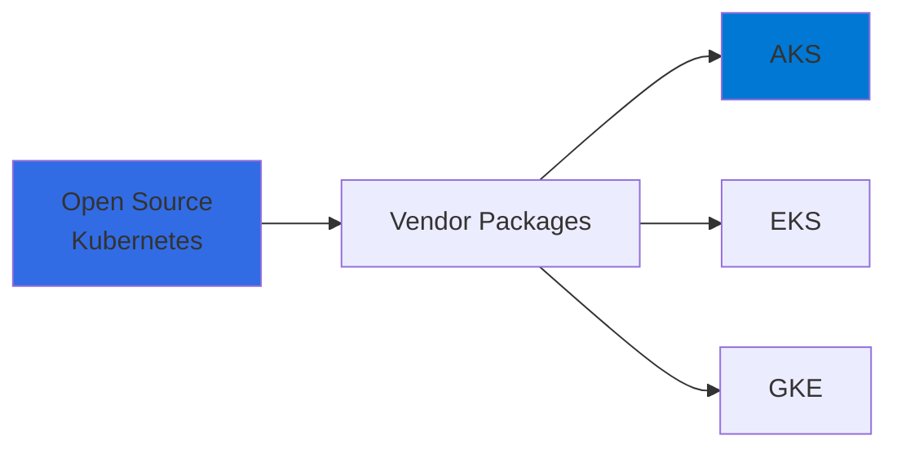
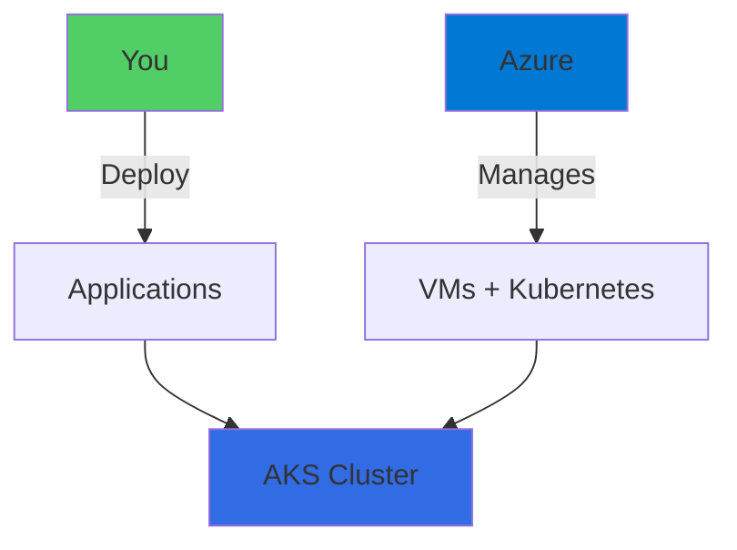
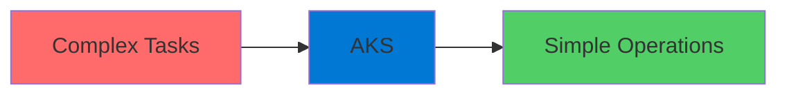
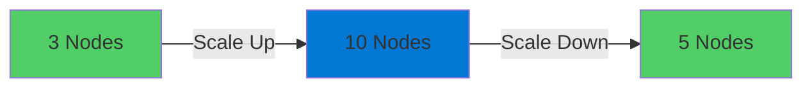
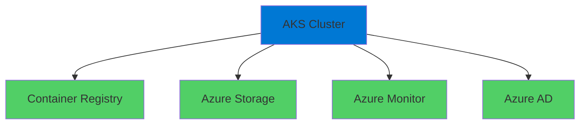
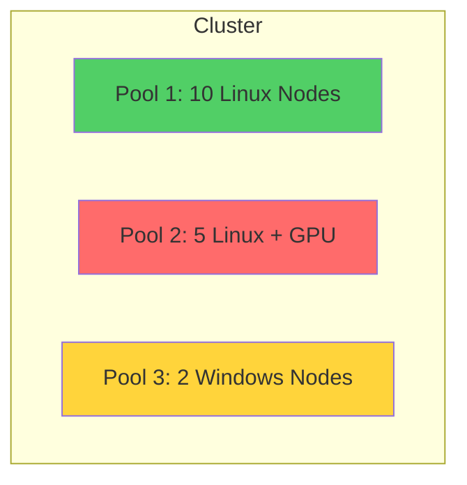
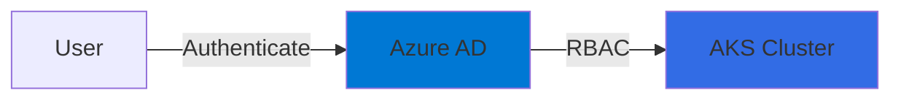
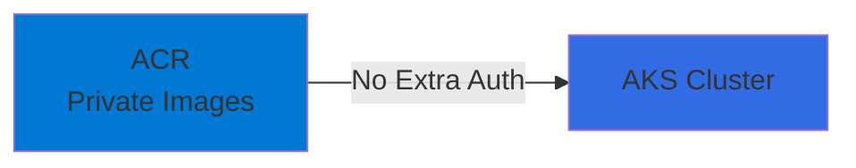
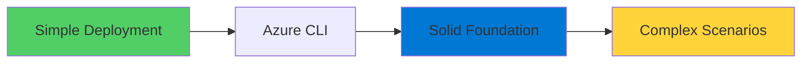
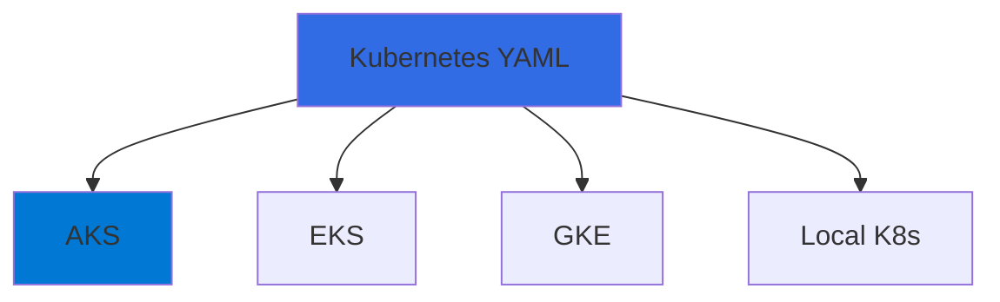

# Azure Kubernetes Service

Managed Kubernetes on Azure

  <carbon-kubernetes class="text-8xl text-blue-400 opacity-80" />

---
layout: center
---

# Welcome to AKS

<!--
METADATA:
sentence: In this video, we'll explore one of Azure's most powerful container orchestration services.
search_anchor: this video, we'll explore one
-->
<v-click>

Explore one of Azure's most powerful container orchestration services

</v-click>

---
layout: section
---

# What is AKS?

---

# Kubernetes

<v-click>

  <carbon-kubernetes class="text-8xl text-blue-400" />

</v-click>

<!--
METADATA:
sentence: Kubernetes is an open-source platform for managing containerized applications.
search_anchor: Kubernetes is an open-source platform
-->
<v-click>

Open-source platform for managing containerized applications

</v-click>

<v-click>

</v-click>

---

# Azure Kubernetes Service (AKS)

<v-click>

  <carbon-logo-microsoft-azure class="text-6xl text-blue-400" />

</v-click>

<!--
METADATA:
sentence: Azure Kubernetes Service, or AKS, is Microsoft's managed Kubernetes offering.
search_anchor: Azure Kubernetes Service, or AKS
-->
<v-click>

Microsoft's managed Kubernetes offering

</v-click>

<!--
METADATA:
sentence: With AKS, you get all the power of Kubernetes without the overhead of managing the infrastructure.
search_anchor: AKS, you get all the
-->
<v-click>

  

    <carbon-checkmark-filled class="text-5xl text-green-400" />
    
Full Kubernetes Power

  

  

    <carbon-close-filled class="text-5xl text-red-400" />
    
No Infrastructure Overhead

  

</v-click>

---

# How AKS Works

<!--
METADATA:
sentence: You create an AKS cluster and deploy your applications using the standard Kubernetes model.
search_anchor: You create an AKS cluster
-->
<v-click>

You create cluster and deploy applications

</v-click>

<v-click>

</v-click>

<!--
METADATA:
sentence: Behind the scenes, Azure handles the heavy lifting - provisioning virtual machines for your cluster nodes, installing and configuring Kubernetes, and maintaining the entire infrastructure.
search_anchor: Behind the scenes, Azure handles
-->
<v-click>

Azure handles provisioning, configuring, and maintaining infrastructure

</v-click>

---

# Behind the Scenes

<!--
METADATA:
sentence: Behind the scenes, Azure handles the heavy lifting - provisioning virtual machines for your cluster nodes, installing and configuring Kubernetes, and maintaining the entire infrastructure.
search_anchor: Behind the scenes, Azure handles
-->
<v-click>

  <carbon-virtual-machine class="text-4xl text-blue-400" />
  Provisioning virtual machines for cluster nodes

</v-click>

<!--
METADATA:
sentence: You create an AKS cluster and deploy your applications using the standard Kubernetes model.
search_anchor: You create an AKS cluster
-->
<v-click>

  <carbon-installation class="text-4xl text-green-400" />
  Installing and configuring Kubernetes

</v-click>

<!--
METADATA:
sentence: With AKS, you get all the power of Kubernetes without the overhead of managing the infrastructure.
search_anchor: AKS, you get all the
-->
<v-click>

  <carbon-tools class="text-4xl text-purple-400" />
  Maintaining the entire infrastructure

</v-click>

<!--
METADATA:
sentence: Node pools are groups of nodes that share the same configuration.
search_anchor: Node pools are groups of
-->
<v-click>

Azure does the heavy lifting

</v-click>

---
layout: section
---

# Why Use AKS?

---

# Simplifying Complex Tasks

<!--
METADATA:
sentence: AKS simplifies many complex tasks that would otherwise require significant expertise and effort: First, scaling your cluster.
search_anchor: AKS simplifies many complex tasks
-->
<v-click>

AKS simplifies tasks that require significant expertise and effort

</v-click>

<v-click>

</v-click>

---

# Benefit 1: Scaling

<v-click>

  <carbon-scale class="text-6xl text-green-400" />

</v-click>

<!--
METADATA:
sentence: This will give you a solid foundation before tackling more complex scenarios.
search_anchor: This will give you a
-->
<v-click>

Need more capacity?

</v-click>

<v-click>

</v-click>

<!--
METADATA:
sentence: AKS makes it easy to add or remove nodes as your workload changes.
search_anchor: AKS makes it easy to
-->
<v-click>

Easy to add or remove nodes as workload changes

</v-click>

---

# Benefit 2: Upgrades

<v-click>

  <carbon-upgrade class="text-6xl text-purple-400" />

</v-click>

<!--
METADATA:
sentence: Keeping Kubernetes up to date can be challenging, but AKS streamlines the upgrade process.
search_anchor: Keeping Kubernetes up to date
-->
<v-click>

Keeping Kubernetes up to date

</v-click>

<!--
METADATA:
sentence: Keeping Kubernetes up to date can be challenging, but AKS streamlines the upgrade process.
search_anchor: Keeping Kubernetes up to date
-->
<v-click>

  

    <carbon-warning class="text-6xl text-red-400" />
    
Manual K8s

    
Complex & risky

  

  

    <carbon-checkmark-outline class="text-6xl text-green-400" />
    
AKS

    
Streamlined process

  

</v-click>

---

# Benefit 3: Integration

<v-click>

  <carbon-integration class="text-6xl text-blue-400" />

</v-click>

<v-click>

</v-click>

<!--
METADATA:
sentence: Container Registry Integration: AKS can be integrated with Azure Container Registry, or ACR.
search_anchor: Container Registry Integration: AKS can
-->
<v-click>

Seamless integration with Azure services

</v-click>

<!--
METADATA:
sentence: AKS integrates seamlessly with other Azure services, creating a cohesive cloud ecosystem for your applications.
search_anchor: AKS integrates seamlessly with other
-->
<v-click>

Creating a cohesive cloud ecosystem

</v-click>

---
layout: section
---

# Key Features to Explore

---

# Node Configuration

<v-click>

  <carbon-virtual-machine class="text-6xl text-blue-400" />

</v-click>

<!--
METADATA:
sentence: Node pools are groups of nodes that share the same configuration.
search_anchor: Node pools are groups of
-->
<v-click>

Specify the number of nodes

</v-click>

<!--
METADATA:
sentence: Node Pools: This is a powerful feature.
search_anchor: Node Pools: This is a
-->
<v-click>

  

    
3

    
Nodes

  

  
×

  

    
D4s_v3

    
VM Size

  

</v-click>

<!--
METADATA:
sentence: AKS makes it easy to add or remove nodes as your workload changes.
search_anchor: AKS makes it easy to
-->
<v-click>

Choose VM size that matches your workload

</v-click>

---

# Presets

<v-click>

  <carbon-settings-adjust class="text-6xl text-green-400" />

</v-click>

<!--
METADATA:
sentence: Presets: Azure provides preset configurations to help you get started quickly with common scenarios.
search_anchor: Presets: Azure provides preset configurations
-->
<v-click>

Azure provides preset configurations

</v-click>

<!--
METADATA:
sentence: Presets: Azure provides preset configurations to help you get started quickly with common scenarios.
search_anchor: Presets: Azure provides preset configurations
-->
<v-click>

  

    <carbon-code class="text-4xl text-blue-400" />
    
Development

  

  

    <carbon-enterprise class="text-4xl text-purple-400" />
    
Production

  

  

    <carbon-data-enrichment class="text-4xl text-orange-400" />
    
Batch Processing

  

</v-click>

<!--
METADATA:
sentence: Let's get started with hands-on exercises.
search_anchor: Let's get started with hands-on
-->
<v-click>

Get started quickly with common scenarios

</v-click>

---

# Node Pools

<v-click>

  <carbon-deployment-pattern class="text-6xl text-purple-400" />

</v-click>

<!--
METADATA:
sentence: Node pools are groups of nodes that share the same configuration.
search_anchor: Node pools are groups of
-->
<v-click>

Groups of nodes with same configuration

</v-click>

<v-click>

</v-click>

<!--
METADATA:
sentence: This gives you tremendous flexibility in how you run different types of workloads.
search_anchor: This gives you tremendous flexibility
-->
<v-click>

Tremendous flexibility for different workload types

</v-click>

---

# Node Pool Example

<!--
METADATA:
sentence: AKS makes it easy to add or remove nodes as your workload changes.
search_anchor: AKS makes it easy to
-->
<v-click>

  

    <carbon-linux-alt class="text-2xl text-white" />
  

  

    
Pool 1: 10 Linux nodes

    
General workloads

  

</v-click>

<!--
METADATA:
sentence: For example, you might have ten Linux nodes in one pool, five Linux servers with GPUs in another pool, and two Windows servers in a third pool - all within the same cluster.
search_anchor: example, you might have ten
-->
<v-click>

  

    <carbon-chip class="text-2xl text-white" />
  

  

    
Pool 2: 5 Linux nodes with GPUs

    
ML/AI workloads

  

</v-click>

<!--
METADATA:
sentence: AKS makes it easy to add or remove nodes as your workload changes.
search_anchor: AKS makes it easy to
-->
<v-click>

  

    <carbon-logo-windows class="text-2xl text-white" />
  

  

    
Pool 3: 2 Windows nodes

    
.NET workloads

  

</v-click>

<!--
METADATA:
sentence: Node pools are groups of nodes that share the same configuration.
search_anchor: Node pools are groups of
-->
<v-click>

All within the same cluster!

</v-click>

---

# Security

<v-click>

  <carbon-security class="text-6xl text-red-400" />

</v-click>

<!--
METADATA:
sentence: Security: AKS clusters can be secured using standard Kubernetes Role-Based Access Control, or RBAC, which integrates directly with Azure Active Directory accounts.
search_anchor: Security: AKS clusters can be
-->
<v-click>

Kubernetes Role-Based Access Control (RBAC)

</v-click>

<v-click>

</v-click>

<!--
METADATA:
sentence: Security: AKS clusters can be secured using standard Kubernetes Role-Based Access Control, or RBAC, which integrates directly with Azure Active Directory accounts.
search_anchor: Security: AKS clusters can be
-->
<v-click>

Integrates directly with Azure Active Directory

</v-click>

---

# Container Registry Integration

<v-click>

  <carbon-catalog class="text-6xl text-blue-400" />

</v-click>

<!--
METADATA:
sentence: Container Registry Integration: AKS can be integrated with Azure Container Registry, or ACR.
search_anchor: Container Registry Integration: AKS can
-->
<v-click>

AKS integrates with Azure Container Registry (ACR)

</v-click>

<v-click>

</v-click>

<!--
METADATA:
sentence: This means you can run containers from private ACR images without any extra authentication configuration.
search_anchor: This means you can run
-->
<v-click>

Run private containers without extra authentication

</v-click>

---
layout: section
---

# Production Considerations

---

# Production-Grade AKS

<v-click>

  <carbon-enterprise class="text-6xl text-purple-400" />

</v-click>

<!--
METADATA:
sentence: Production Considerations Now, it's important to understand that production-grade AKS deployments can get quite complicated.
search_anchor: Production Considerations Now, it's important
-->
<v-click>

Production deployments can get quite complicated

</v-click>

<!--
METADATA:
sentence: You'll need to consider networking, security policies, monitoring, and high availability.
search_anchor: You'll need to consider networking
-->
<v-click>

  

    <carbon-network-3 class="text-3xl text-blue-400" />
    Networking
  

  

    <carbon-security class="text-3xl text-red-400" />
    Security policies
  

  

    <carbon-chart-line class="text-3xl text-green-400" />
    Monitoring
  

  

    <carbon-availability class="text-3xl text-purple-400" />
    High availability
  

</v-click>

---

# Our Approach

<!--
METADATA:
sentence: However, for learning purposes, we'll start with a simple deployment using the Azure CLI.
search_anchor: However, for learning purposes, we'll
-->
<v-click>

For learning purposes...

</v-click>

<v-click>

</v-click>

<!--
METADATA:
sentence: This will give you a solid foundation before tackling more complex scenarios.
search_anchor: This will give you a
-->
<v-click>

Start simple, build solid foundation

</v-click>

<!--
METADATA:
sentence: This will give you a solid foundation before tackling more complex scenarios.
search_anchor: This will give you a
-->
<v-click>

Then tackle more complex scenarios

</v-click>

---
layout: section
---

# What's Next

---

# In This Lesson

<!--
METADATA:
sentence: You create an AKS cluster and deploy your applications using the standard Kubernetes model.
search_anchor: You create an AKS cluster
-->
<v-click>

  <carbon-add class="text-4xl text-blue-400" />
  Creating an AKS cluster

</v-click>

<!--
METADATA:
sentence: Node Pools: This is a powerful feature.
search_anchor: Node Pools: This is a
-->
<v-click>

  <carbon-deploy class="text-4xl text-green-400" />
  Deploying a sample application

</v-click>

<!--
METADATA:
sentence: Azure Kubernetes Service, or AKS, is Microsoft's managed Kubernetes offering.
search_anchor: Azure Kubernetes Service, or AKS
-->
<v-click>

  <carbon-search class="text-4xl text-purple-400" />
  Exploring how Kubernetes works in Azure

</v-click>

---

# Kubernetes Portability

<v-click>

</v-click>

<!--
METADATA:
sentence: You'll use the same Kubernetes tools and YAML specifications that work on any Kubernetes cluster, demonstrating the portability and consistency that makes Kubernetes so powerful.
search_anchor: You'll use the same Kubernetes
-->
<v-click>

Same tools and YAML specifications

</v-click>

<!--
METADATA:
sentence: You'll use the same Kubernetes tools and YAML specifications that work on any Kubernetes cluster, demonstrating the portability and consistency that makes Kubernetes so powerful.
search_anchor: You'll use the same Kubernetes
-->
<v-click>

Work on any Kubernetes cluster

</v-click>

<!--
METADATA:
sentence: You'll use the same Kubernetes tools and YAML specifications that work on any Kubernetes cluster, demonstrating the portability and consistency that makes Kubernetes so powerful.
search_anchor: You'll use the same Kubernetes
-->
<v-click>

Portability and consistency that makes Kubernetes powerful

</v-click>

---
layout: center
class: text-center
---

<v-click>

<carbon-play-outline class="text-8xl text-green-400 inline-block" />

</v-click>

<!--
METADATA:
sentence: Let's get started with hands-on exercises.
search_anchor: Let's get started with hands-on
-->
<v-click>

Let's Get Started!

</v-click>

<!--
METADATA:
sentence: Let's get started with hands-on exercises.
search_anchor: Let's get started with hands-on
-->
<v-click>

Hands-on exercises with Azure Kubernetes Service

</v-click>

