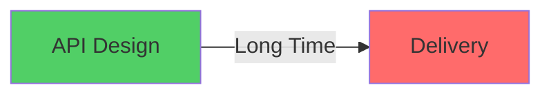
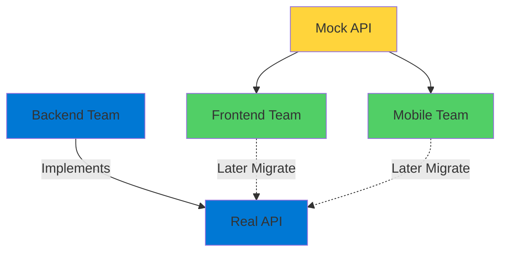
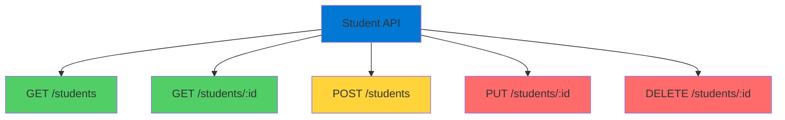
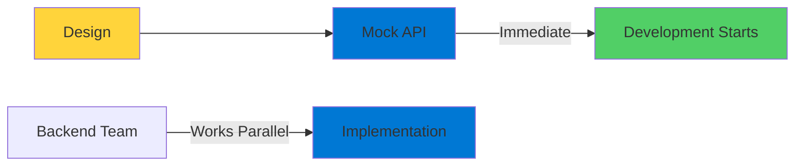

# API Mocking

Design and Publish Before Implementation

<div class="abs-bottom-10 left-10">
  <carbon-api-1 class="text-8xl text-purple-400 opacity-80" />
</div>

---
layout: center
---

# Welcome

<v-click>

<div class="text-xl mt-8">
Explore how Azure API Management<br/>helps you mock APIs before implementation
</div>

</v-click>

---
layout: section
---

# What is API Mocking?

---

# API Design Process

<v-click>

<div class="mt-8 text-center text-xl">
Three-way discussion
</div>

</v-click>

<v-click>

<div class="mt-12">

```mermaid
graph TB
    Architect[API Architect] --> Discussion{Design<br/>Discussion}
    Data[Data Owner] --> Discussion
    Consumer[API Consumer] --> Discussion
    style Discussion fill:#0078d4
    style Architect fill=#51cf66
    style Data fill:#ffd43b
    style Consumer fill:#ff6b6b
```

</div>

</v-click>

---

# Design Ensures

<v-click>

<div class="mt-8 flex items-center gap-4">
  <carbon-code-reference class="text-4xl text-blue-400" />
  <span class="text-lg">API adheres to best practices</span>
</div>

</v-click>

<v-click>

<div class="mt-6 flex items-center gap-4">
  <carbon-user-activity class="text-4xl text-green-400" />
  <span class="text-lg">Consumers get the information they need</span>
</div>

</v-click>

<v-click>

<div class="mt-6 flex items-center gap-4">
  <carbon-data-check class="text-4xl text-purple-400" />
  <span class="text-lg">Required data is actually available</span>
</div>

</v-click>

---

# The Problem

<v-click>

<div class="mt-8">



</div>

</v-click>

<v-click>

<div class="mt-12 text-center text-2xl text-red-400">
Time between design and delivery can be quite long
</div>

</v-click>

<v-click>

<div class="mt-12">
  <carbon-time class="text-8xl text-orange-400" />
</div>

</v-click>

---
layout: section
---

# Why Mock APIs?

---

# Mock API Benefits

<v-click>

<div class="mt-8 text-center text-xl">
A mock API is a real API service that:
</div>

</v-click>

<v-click>

<div class="mt-10 flex items-center gap-4">
  <carbon-checkmark-outline class="text-4xl text-green-400" />
  <span class="text-lg">Has all agreed-upon operations</span>
</div>

</v-click>

<v-click>

<div class="mt-6 flex items-center gap-4">
  <carbon-data-1 class="text-4xl text-blue-400" />
  <span class="text-lg">Returns dummy data (not real data)</span>
</div>

</v-click>

<v-click>

<div class="mt-6 flex items-center gap-4">
  <carbon-code class="text-4xl text-purple-400" />
  <span class="text-lg">Allows immediate development</span>
</div>

</v-click>

<v-click>

<div class="mt-6 flex items-center gap-4">
  <carbon-forward class="text-4xl text-orange-400" />
  <span class="text-lg">Prevents delays</span>
</div>

</v-click>

---

# Parallel Development

<v-click>

<div class="mt-8">



</div>

</v-click>

<v-click>

<div class="mt-8 text-center text-xl text-green-400">
Teams work in parallel!
</div>

</v-click>

<v-click>

<div class="mt-4 text-center text-lg opacity-70">
Frontend develops while backend implements
</div>

</v-click>

---
layout: section
---

# Azure API Management

---

# APIM Capabilities

<v-click>

<div class="mt-6 flex items-center gap-4">
  <carbon-api class="text-4xl text-blue-400" />
  <span class="text-lg">Create consistent, modern API gateways</span>
</div>

</v-click>

<v-click>

<div class="mt-6 flex items-center gap-4">
  <carbon-security class="text-4xl text-red-400" />
  <span class="text-lg">Secure and protect your APIs</span>
</div>

</v-click>

<v-click>

<div class="mt-6 flex items-center gap-4">
  <carbon-chart-line class="text-4xl text-green-400" />
  <span class="text-lg">Analyze API usage and health</span>
</div>

</v-click>

<v-click>

<div class="mt-6 flex items-center gap-4">
  <carbon-api-1 class="text-4xl text-purple-400" />
  <span class="text-lg">Design and publish mock APIs</span>
</div>

</v-click>

---
layout: section
---

# Lab Overview

---

# What We'll Build

<v-click>

<div class="mt-6 flex items-start gap-4">
  <div class="text-3xl text-blue-400 mt-1">1</div>
  <div>
    <carbon-api class="text-3xl inline-block" />
    <span class="ml-3 text-lg">Design a new API for managing student data</span>
  </div>
</div>

</v-click>

<v-click>

<div class="mt-6 flex items-start gap-4">
  <div class="text-3xl text-green-400 mt-1">2</div>
  <div>
    <carbon-data-class class="text-3xl inline-block" />
    <span class="ml-3 text-lg">Create data definitions for API objects</span>
  </div>
</div>

</v-click>

<v-click>

<div class="mt-6 flex items-start gap-4">
  <div class="text-3xl text-purple-400 mt-1">3</div>
  <div>
    <carbon-document-add class="text-3xl inline-block" />
    <span class="ml-3 text-lg">Add mocked operations with dummy responses</span>
  </div>
</div>

</v-click>

<v-click>

<div class="mt-6 flex items-start gap-4">
  <div class="text-3xl text-orange-400 mt-1">4</div>
  <div>
    <carbon-deploy class="text-3xl inline-block" />
    <span class="ml-3 text-lg">Publish the API and test with tools</span>
  </div>
</div>

</v-click>

<v-click>

<div class="mt-6 flex items-start gap-4">
  <div class="text-3xl text-red-400 mt-1">5</div>
  <div>
    <carbon-checkmark class="text-3xl inline-block" />
    <span class="ml-3 text-lg">Validate against expectations using Postman</span>
  </div>
</div>

</v-click>

---

# Student Data API

<v-click>

<div class="mt-8">



</div>

</v-click>

<v-click>

<div class="mt-8 text-center text-xl">
Full CRUD operations for student management
</div>

</v-click>

---

# Mock Responses

<v-click>

<div class="mt-8">

```json
{
  "id": "12345",
  "name": "Alice Johnson",
  "email": "alice@university.edu",
  "major": "Computer Science",
  "gpa": 3.8
}
```

</div>

</v-click>

<v-click>

<div class="mt-8 text-center text-xl text-purple-400">
Dummy data that looks real
</div>

</v-click>

<v-click>

<div class="mt-6 text-center text-lg opacity-70">
Allows development teams to program immediately
</div>

</v-click>

---

# The Outcome

<v-click>

<div class="mt-12 text-center text-2xl text-green-400">
Quickly design and publish mock API
</div>

</v-click>

<v-click>

<div class="mt-12">



</div>

</v-click>

<v-click>

<div class="mt-8 text-center text-xl">
Teams start immediately, no waiting!
</div>

</v-click>

---
layout: center
class: text-center
---

<div>

<v-click>

<carbon-play-outline class="text-8xl text-green-400 inline-block" />

</v-click>

<v-click>

<div class="text-4xl mt-8 font-bold">
Let's Get Started!
</div>

</v-click>

<v-click>

<div class="text-xl mt-6 opacity-70">
Design and publish our mock student API
</div>

</v-click>

</div>
