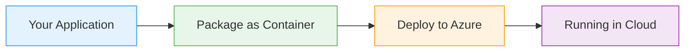

# API Management: Mocking New APIs

  <iconify-icon icon="carbon:api" style="font-size: 4rem;" />

---

---
layout: center
class: text-center
---

# Welcome

Welcome to this lab on API Management and mocking new APIs

  <iconify-icon icon="carbon:rocket" style="font-size: 3rem; color: #0078d4;" />

---

---
layout: center
---

# What is API Mocking?

When designing new APIs, there's often a three-way discussion between the API architect, the data owner, and the API consumer. This collaborative appr...

---

---
layout: center
---

# Why Mock APIs?

A mock API is a real API service that:

---

---
layout: center
---

# Azure API Management

Azure API Management is a fully managed service that enables you to:

---

---
layout: center
---

# Lab Overview

In this lab, we'll use Azure API Management to:

