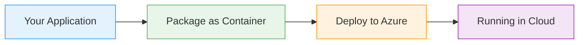

# API Management: Request and Response Policies

  <iconify-icon icon="carbon:api" style="font-size: 4rem;" />

---

---
layout: center
---

# API Management: Request and Response Policies - Introduction

Welcome to this lab on API Management policies for requests and responses.

---

---
layout: center
---

# What Are APIM Policies?

Policies are the plug-in features in API Management that let you change the behavior of API operations without modifying the backend code....

---

---
layout: center
---

# What We've Done So Far

In previous labs, we've already used a few policies - for caching and sending mocked responses. But there are other policies you should always look to add because they increase the security of your AP

---

---
layout: center
---

# Today's Lab

In this lab, we'll present a public API through APIM, using policies to enhance security.

---

---
layout: center
---

# The Backend: SWAPI

We'll be working with SWAPI - the Star Wars API. This is a public REST API popular with developers that returns information about characters, places, and other data types from the Star Wars films.

