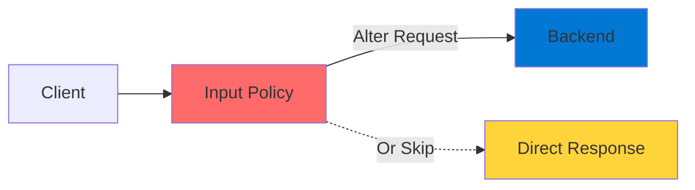
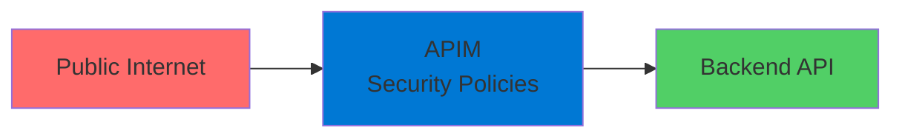
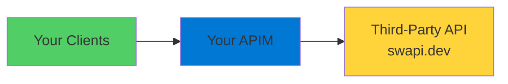

# APIM Policies

Request and Response Transformation

<div class="abs-bottom-10 left-10">
  <carbon-settings-adjust class="text-8xl text-purple-400 opacity-80" />
</div>

---
layout: center
---

# Welcome

<v-click>

<div class="text-xl mt-8">
Explore API Management policies<br/>for requests and responses
</div>

</v-click>

---
layout: section
---

# What Are APIM Policies?

---

# Policies Overview

<v-click>

<div class="mt-4">
  <carbon-plug class="text-6xl text-purple-400" />
</div>

</v-click>

<v-click>

<div class="mt-8 text-xl text-center">
Plug-in features in API Management
</div>

</v-click>

<v-click>

<div class="mt-12 text-center text-lg">
Change API behavior without modifying backend code
</div>

</v-click>

<v-click>

<div class="mt-12">

```mermaid
graph LR
    Request[Request] --> Policy[APIM Policies]
    Policy --> Backend[Backend]
    Backend --> Policy2[APIM Policies]
    Policy2 --> Response[Response]
    style Policy fill:#ff6b6b
    style Backend fill:#0078d4
    style Policy2 fill=#51cf66
```

</div>

</v-click>

---

# Two Main Types

<v-click>

<div class="mt-8 flex items-start gap-4">
  <div class="text-4xl text-red-400 mt-1">1</div>
  <div>
    <carbon-arrow-right class="text-4xl inline-block text-red-400" />
    <div class="ml-3 mt-2">
      <div class="text-xl font-bold">Input Policies (Inbound)</div>
      <div class="text-sm mt-2 opacity-70">Fire before backend gets called</div>
      <div class="text-sm opacity-70">Can alter request or avoid backend call</div>
    </div>
  </div>
</div>

</v-click>

<v-click>

<div class="mt-10 flex items-start gap-4">
  <div class="text-4xl text-green-400 mt-1">2</div>
  <div>
    <carbon-arrow-left class="text-4xl inline-block text-green-400" />
    <div class="ml-3 mt-2">
      <div class="text-xl font-bold">Output Policies (Outbound)</div>
      <div class="text-sm mt-2 opacity-70">Fire after backend returns</div>
      <div class="text-sm opacity-70">Can alter response before client receives it</div>
    </div>
  </div>
</div>

</v-click>

---

# Input Policy Flow

<v-click>

<div class="mt-8">



</div>

</v-click>

<v-click>

<div class="mt-12 text-center text-xl">
Intercept and modify requests
</div>

</v-click>

<v-click>

<div class="mt-6 text-center text-lg opacity-70">
Or bypass backend entirely
</div>

</v-click>

---

# Output Policy Flow

<v-click>

<div class="mt-8">

```mermaid
graph LR
    Backend[Backend] --> Outbound[Output Policy]
    Outbound -->|Alter Response| Client[Client]
    style Backend fill:#0078d4
    style Outbound fill:#51cf66
    style Client fill=#ffd43b
```

</div>

</v-click>

<v-click>

<div class="mt-12 text-center text-xl">
Transform responses before delivery
</div>

</v-click>

---
layout: section
---

# What We've Done Before

---

# Previous Policy Usage

<v-click>

<div class="mt-8 flex items-center gap-4">
  <carbon-data-storage class="text-4xl text-green-400" />
  <span class="text-lg">Caching responses</span>
</div>

</v-click>

<v-click>

<div class="mt-8 flex items-center gap-4">
  <carbon-api-1 class="text-4xl text-purple-400" />
  <span class="text-lg">Sending mocked responses</span>
</div>

</v-click>

<v-click>

<div class="mt-12 text-center text-xl">
But there are more policies to explore...
</div>

</v-click>

---
layout: section
---

# Today's Lab

---

# Security-Focused Policies

<v-click>

<div class="mt-8 text-center text-xl">
Present a public API through APIM<br/>using policies to enhance security
</div>

</v-click>

<v-click>

<div class="mt-12">



</div>

</v-click>

---

# What We'll Do

<v-click>

<div class="mt-6 flex items-center gap-4">
  <carbon-search class="text-4xl text-blue-400" />
  <span class="text-lg">Explore backend API and identify security concerns</span>
</div>

</v-click>

<v-click>

<div class="mt-6 flex items-center gap-4">
  <carbon-api class="text-4xl text-green-400" />
  <span class="text-lg">Create API in APIM to front the backend</span>
</div>

</v-click>

<v-click>

<div class="mt-6 flex items-center gap-4">
  <carbon-data-1 class="text-4xl text-purple-400" />
  <span class="text-lg">Apply header manipulation policies</span>
</div>

</v-click>

<v-click>

<div class="mt-6 flex items-center gap-4">
  <carbon-data-storage class="text-4xl text-orange-400" />
  <span class="text-lg">Implement caching policies</span>
</div>

</v-click>

<v-click>

<div class="mt-6 flex items-center gap-4">
  <carbon-edit class="text-4xl text-red-400" />
  <span class="text-lg">Use find-and-replace to modify response bodies</span>
</div>

</v-click>

---
layout: section
---

# The Backend: SWAPI

---

# Star Wars API

<v-click>

<div class="mt-4">
  <carbon-star-filled class="text-6xl text-yellow-400" />
</div>

</v-click>

<v-click>

<div class="mt-8 text-xl text-center">
SWAPI - The Star Wars API
</div>

</v-click>

<v-click>

<div class="mt-8 text-center text-lg">
<code class="text-blue-400">swapi.dev</code>
</div>

</v-click>

<v-click>

<div class="mt-12 text-lg">
Public REST API that returns:
</div>

</v-click>

<v-click>

<div class="mt-6 flex items-center gap-4">
  <carbon-user-avatar class="text-3xl text-blue-400" />
  <span>Character information</span>
</div>

</v-click>

<v-click>

<div class="mt-4 flex items-center gap-4">
  <carbon-location class="text-3xl text-green-400" />
  <span>Planets and places</span>
</div>

</v-click>

<v-click>

<div class="mt-4 flex items-center gap-4">
  <carbon-catalog class="text-3xl text-purple-400" />
  <span>Other Star Wars data</span>
</div>

</v-click>

---

# Fronting Third-Party APIs

<v-click>

<div class="mt-8">



</div>

</v-click>

<v-click>

<div class="mt-12 text-center text-xl">
Yes, you can do this with APIM!
</div>

</v-click>

<v-click>

<div class="mt-6 text-center text-lg opacity-70">
As long as the third-party's usage policy allows it
</div>

</v-click>

---

# Why Front Third-Party APIs?

<v-click>

<div class="mt-8 flex items-center gap-4">
  <carbon-security class="text-4xl text-red-400" />
  <span class="text-lg">Add security and access control</span>
</div>

</v-click>

<v-click>

<div class="mt-6 flex items-center gap-4">
  <carbon-data-storage class="text-4xl text-green-400" />
  <span class="text-lg">Implement caching to reduce calls</span>
</div>

</v-click>

<v-click>

<div class="mt-6 flex items-center gap-4">
  <carbon-edit class="text-4xl text-blue-400" />
  <span class="text-lg">Transform responses to fit your needs</span>
</div>

</v-click>

<v-click>

<div class="mt-6 flex items-center gap-4">
  <carbon-chart-line class="text-4xl text-purple-400" />
  <span class="text-lg">Monitor and analyze usage</span>
</div>

</v-click>

<v-click>

<div class="mt-6 flex items-center gap-4">
  <carbon-migrate class="text-4xl text-orange-400" />
  <span class="text-lg">Easily switch backends if needed</span>
</div>

</v-click>

---

# Policy Examples

<v-click>

<div class="mt-8 text-center text-2xl">
Header Manipulation
</div>

</v-click>

<v-click>

<div class="mt-6">

```xml
<set-header name="X-Powered-By" exists-action="delete"/>
<set-header name="X-API-Version" exists-action="override">
  <value>v2.0</value>
</set-header>
```

</div>

</v-click>

<v-click>

<div class="mt-8 text-center text-lg opacity-70">
Remove sensitive headers, add custom ones
</div>

</v-click>

---

# Policy Examples

<v-click>

<div class="mt-8 text-center text-2xl">
Response Body Transformation
</div>

</v-click>

<v-click>

<div class="mt-6">

```xml
<find-and-replace from="swapi.dev" to="myapi.com"/>
```

</div>

</v-click>

<v-click>

<div class="mt-8 text-center text-lg opacity-70">
Replace text in response bodies
</div>

</v-click>

---
layout: center
class: text-center
---

<div>

<v-click>

<carbon-play-outline class="text-8xl text-green-400 inline-block" />

</v-click>

<v-click>

<div class="text-4xl mt-8 font-bold">
Let's Get Started!
</div>

</v-click>

<v-click>

<div class="text-xl mt-6 opacity-70">
Explore the backend and apply security policies
</div>

</v-click>

</div>
