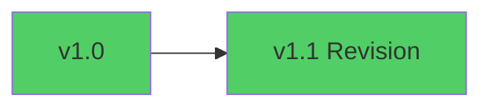
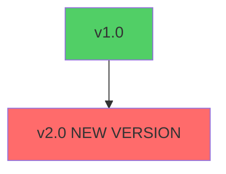
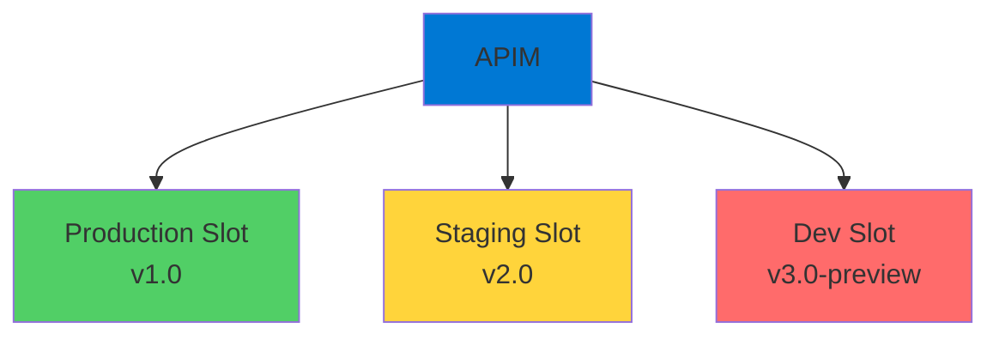
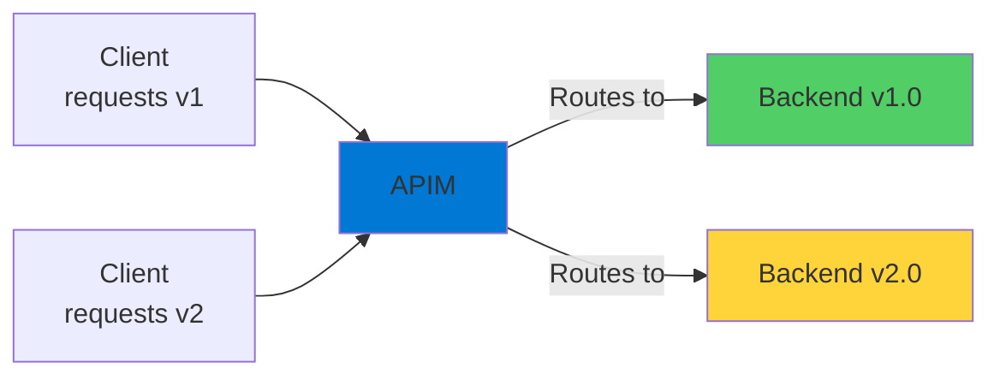
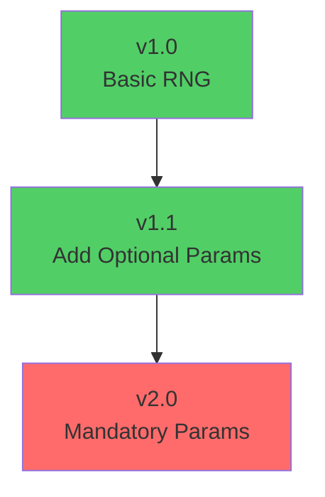
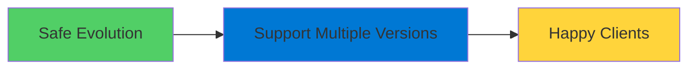

# API Versioning

Managing Changes with Backward Compatibility

<div class="abs-bottom-10 left-10">
  <carbon-version class="text-8xl text-blue-400 opacity-80" />
</div>

---
layout: center
---

# Welcome

<v-click>

<div class="text-xl mt-8">
Explore API versioning and revisions<br/>in Azure API Management
</div>

</v-click>

---
layout: section
---

# Why API Versioning Matters

---

# APIs as Contracts

<v-click>

<div class="mt-4">
  <carbon-document-tasks class="text-6xl text-blue-400" />
</div>

</v-click>

<v-click>

<div class="mt-8 text-xl text-center">
APIs are explicitly defined contracts
</div>

</v-click>

<v-click>

<div class="mt-12">

```mermaid
graph LR
    API[Your API<br/>Contract] --> Client1[Client App 1]
    API --> Client2[Client App 2]
    API --> Client3[Client App 3]
    style API fill:#0078d4
    style Client1 fill:#51cf66
    style Client2 fill:#51cf66
    style Client3 fill=#51cf66
```

</div>

</v-click>

<v-click>

<div class="mt-8 text-center text-lg opacity-70">
Clients build applications against that contract
</div>

</v-click>

---

# The Challenge

<v-click>

<div class="mt-12 text-center text-2xl">
What happens when you need to make changes?
</div>

</v-click>

<v-click>

<div class="mt-12">
  <carbon-warning class="text-8xl text-orange-400" />
</div>

</v-click>

<v-click>

<div class="mt-12 text-center text-xl text-red-400">
Breaking changes could break existing clients
</div>

</v-click>

---

# The Solution: Versioning

<v-click>

<div class="mt-8">

```mermaid
graph TB
    Versioning[Versioning Scheme] --> V1[API v1.0]
    Versioning --> V2[API v2.0]
    V1 --> Old[Old Clients]
    V2 --> New[New Clients]
    style Versioning fill:#0078d4
    style V1 fill:#51cf66
    style V2 fill:#ffd43b
    style Old fill:#51cf66
    style New fill=#ffd43b
```

</div>

</v-click>

<v-click>

<div class="mt-8 text-center text-xl text-green-400">
Support multiple versions simultaneously
</div>

</v-click>

<v-click>

<div class="mt-6 text-center text-lg opacity-70">
Give clients time to migrate at their own pace
</div>

</v-click>

---
layout: section
---

# Revisions vs Versions

---

# Two Types of Changes

<v-click>

<div class="mt-8 flex items-start gap-4">
  <div class="text-4xl text-green-400 mt-1">1</div>
  <div>
    <carbon-renew class="text-4xl inline-block text-green-400" />
    <div class="ml-3 mt-2">
      <div class="text-xl font-bold">Revisions</div>
      <div class="text-sm mt-2 opacity-70">Non-breaking changes</div>
    </div>
  </div>
</div>

</v-click>

<v-click>

<div class="mt-10 flex items-start gap-4">
  <div class="text-4xl text-red-400 mt-1">2</div>
  <div>
    <carbon-version class="text-4xl inline-block text-red-400" />
    <div class="ml-3 mt-2">
      <div class="text-xl font-bold">Versions</div>
      <div class="text-sm mt-2 opacity-70">Breaking changes</div>
    </div>
  </div>
</div>

</v-click>

---

# Revisions: Non-Breaking

<v-click>

<div class="mt-4">
  <carbon-renew class="text-6xl text-green-400" />
</div>

</v-click>

<v-click>

<div class="mt-8 text-xl text-center">
Add optional parameters to existing operations
</div>

</v-click>

<v-click>

<div class="mt-12">

```javascript
// Original API
GET /api/random

// Revision - add optional parameters
GET /api/random?min=1&max=100
```

</div>

</v-click>

<v-click>

<div class="mt-8 text-center text-lg text-green-400">
Consumers don't need to update their code
</div>

</v-click>

<v-click>

<div class="mt-4 text-center text-sm opacity-70">
Defaults used if new parameters aren't provided
</div>

</v-click>

---

# Versions: Breaking Changes

<v-click>

<div class="mt-4">
  <carbon-version class="text-6xl text-red-400" />
</div>

</v-click>

<v-click>

<div class="mt-8 text-xl text-center text-red-400">
Require a new API version
</div>

</v-click>

<v-click>

<div class="mt-12 text-lg">
Breaking changes include:
</div>

</v-click>

<v-click>

<div class="mt-6 flex items-center gap-4">
  <carbon-warning class="text-3xl text-red-400" />
  <span>Making optional parameters mandatory</span>
</div>

</v-click>

<v-click>

<div class="mt-4 flex items-center gap-4">
  <carbon-warning class="text-3xl text-red-400" />
  <span>Changing response structures</span>
</div>

</v-click>

<v-click>

<div class="mt-4 flex items-center gap-4">
  <carbon-warning class="text-3xl text-red-400" />
  <span>Removing operations or fields</span>
</div>

</v-click>

---

# Revision Example

<v-click>

<div class="mt-8">



</div>

</v-click>

<v-click>

<div class="mt-8">

```javascript
// v1.0
GET /api/random
// Returns: { "number": 42 }

// v1.1 (revision)
GET /api/random?min=10&max=50
// Still works: GET /api/random
// Returns: { "number": 33 }
```

</div>

</v-click>

<v-click>

<div class="mt-6 text-center text-lg text-green-400">
Backward compatible!
</div>

</v-click>

---

# Version Example

<v-click>

<div class="mt-8">



</div>

</v-click>

<v-click>

<div class="mt-8">

```javascript
// v1.0
GET /api/v1/random
// Optional params

// v2.0 (breaking change)
GET /api/v2/random?min=required&max=required
// Mandatory params - breaks v1 clients!
```

</div>

</v-click>

<v-click>

<div class="mt-6 text-center text-lg text-red-400">
Not backward compatible
</div>

</v-click>

---
layout: section
---

# Deployment Slots

---

# The Power of Deployment Slots

<v-click>

<div class="mt-4">
  <carbon-deployment-pattern class="text-6xl text-purple-400" />
</div>

</v-click>

<v-click>

<div class="mt-8 text-xl text-center">
APIM versioning + App Service deployment slots
</div>

</v-click>

<v-click>

<div class="mt-12">



</div>

</v-click>

<v-click>

<div class="mt-8 text-center text-lg">
Run multiple versions of application code simultaneously
</div>

</v-click>

---

# Routing Based on Version

<v-click>

<div class="mt-8">



</div>

</v-click>

<v-click>

<div class="mt-12 text-center text-xl text-green-400">
APIM routes to correct backend based on version
</div>

</v-click>

---

# Tremendous Flexibility

<v-click>

<div class="mt-6 flex items-center gap-4">
  <carbon-test-tool class="text-4xl text-blue-400" />
  <span class="text-lg">Test new versions in isolation</span>
</div>

</v-click>

<v-click>

<div class="mt-6 flex items-center gap-4">
  <carbon-deployment-pattern class="text-4xl text-green-400" />
  <span class="text-lg">Perform blue-green deployments</span>
</div>

</v-click>

<v-click>

<div class="mt-6 flex items-center gap-4">
  <carbon-network-4 class="text-4xl text-purple-400" />
  <span class="text-lg">Gradually migrate traffic between versions</span>
</div>

</v-click>

<v-click>

<div class="mt-6 flex items-center gap-4">
  <carbon-rollback class="text-4xl text-orange-400" />
  <span class="text-lg">Quick rollback if issues arise</span>
</div>

</v-click>

---
layout: section
---

# What We'll Build

---

# Random Number Generator API

<v-click>

<div class="mt-8 text-center text-xl">
Start with v1.0
</div>

</v-click>

<v-click>

<div class="mt-8">



</div>

</v-click>

---

# Lab Steps

<v-click>

<div class="mt-6 flex items-start gap-4">
  <div class="text-3xl text-blue-400 mt-1">1</div>
  <div>
    <carbon-version class="text-3xl inline-block" />
    <span class="ml-3 text-lg">Create v1.0 of Random Number API</span>
  </div>
</div>

</v-click>

<v-click>

<div class="mt-6 flex items-start gap-4">
  <div class="text-3xl text-green-400 mt-1">2</div>
  <div>
    <carbon-renew class="text-3xl inline-block" />
    <span class="ml-3 text-lg">Add revision v1.1 with optional parameters</span>
  </div>
</div>

</v-click>

<v-click>

<div class="mt-6 flex items-start gap-4">
  <div class="text-3xl text-red-400 mt-1">3</div>
  <div>
    <carbon-version class="text-3xl inline-block" />
    <span class="ml-3 text-lg">Publish v2.0 with breaking changes</span>
  </div>
</div>

</v-click>

<v-click>

<div class="mt-6 flex items-start gap-4">
  <div class="text-3xl text-purple-400 mt-1">4</div>
  <div>
    <carbon-deployment-pattern class="text-3xl inline-block" />
    <span class="ml-3 text-lg">Use deployment slots for all versions</span>
  </div>
</div>

</v-click>

---

# The Outcome

<v-click>

<div class="mt-12 text-center text-2xl text-green-400">
Evolve APIs safely and professionally
</div>

</v-click>

<v-click>

<div class="mt-12">



</div>

</v-click>

<v-click>

<div class="mt-12 text-center text-xl">
Using Azure API Management
</div>

</v-click>

---
layout: center
class: text-center
---

<div>

<v-click>

<carbon-play-outline class="text-8xl text-green-400 inline-block" />

</v-click>

<v-click>

<div class="text-4xl mt-8 font-bold">
Let's Get Started!
</div>

</v-click>

<v-click>

<div class="text-xl mt-6 opacity-70">
Build our versioned Random Number API
</div>

</v-click>

</div>
