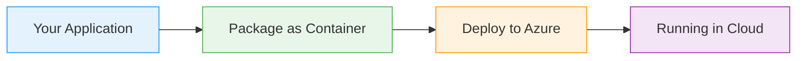
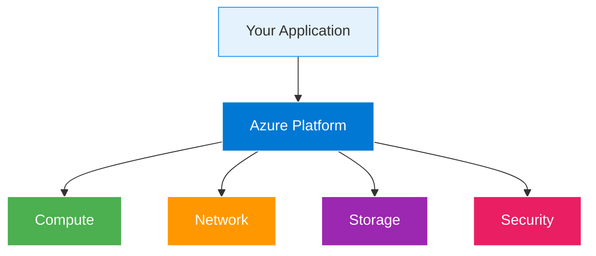

# API Management

  <iconify-icon icon="carbon:api" style="font-size: 4rem;" />

---

---
layout: center
class: text-center
---

# Welcome

Welcome to this lab on Azure API Management, or APIM as we commonly call it

  <iconify-icon icon="carbon:rocket" style="font-size: 3rem; color: #0078d4;" />

---

---
layout: center
---

# What is API Management?

So, what exactly is API Management? Think of it as a full-service solution for delivering HTTP APIs to your consumers - whether that's a public API av...

---

---
layout: center
---

# Why API Management is Powerful

Now, APIM is a very powerful service with lots more features beyond these core capabilities. But before we dive deep, there's something important you need to know: creating an instance of the API Mana

---

---
layout: two-cols
---

# Understanding APIM Architecture

::right::

<h3>Azure Manages</h3>
<ul>

</ul>

<h3>You Control</h3>
<ul>

</ul>

---

---
layout: center
---

# Core Concepts

There are three core concepts you need to understand in APIM:

---

---
layout: center
---

# APIM Service Tiers

Now, let's talk about the different service tiers available for API Management. Understanding these is crucial for choosing the right tier for your needs.

---

---
layout: center
---

# Backend API Deployment

Here's something really important to understand: APIM isn't a hosting service for your APIs. You still need to deploy your actual API logic to another service inside or outside of Azure.

---

---
layout: center
---

# The Power of Policies

One of the most powerful features of APIM is its policy system. Policies allow you to add inbound and outbound processing to wrap the actual logic of your API.

---

---
layout: center
---

# Developer Portal

The Developer Portal is another standout feature. It provides a self-service experience for your API consumers. They can browse your APIs, read documentation, sign up for access, get subscription keys

---

---
layout: center
---

# OpenAPI Integration

APIM has excellent support for the OpenAPI specification, formerly known as Swagger. If your backend API already publishes an OpenAPI spec, you can import it directly into APIM. This automatically cre

---

---
layout: center
---

# Production-Grade Features Out of the Box

Let me emphasize something important: APIM gives you production-grade features that would take weeks or months to build yourself.

---

---
layout: center
---

# Conclusion

In the upcoming exercises, we'll work through creating an APIM instance, deploying a backend API, importing it into APIM, configuring policies, publishing the API through the Developer Portal, and tes

