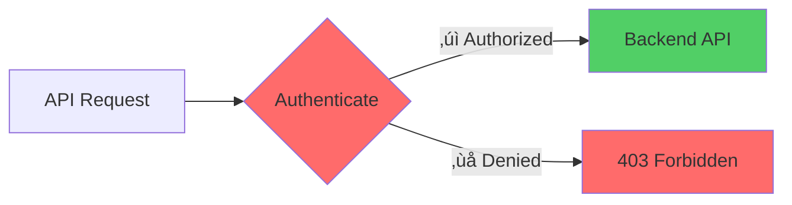

# Azure API Management

Full-Service Platform for HTTP APIs

  <carbon-api class="text-8xl text-blue-400 opacity-80" />

---
layout: center
---

# Welcome to APIM

<v-click>

Explore Azure's most powerful service for managing and publishing HTTP APIs

</v-click>

---
layout: section
---

# What is API Management?

---

# APIM Overview

<v-click>

  <carbon-api class="text-6xl text-blue-400" />

</v-click>

<v-click>

Full-service solution for delivering HTTP APIs

</v-click>

<v-click>

  

    <carbon-globe class="text-5xl text-green-400" />
    
Public APIs

  

  

    <carbon-enterprise class="text-5xl text-blue-400" />
    
Partner APIs

  

</v-click>

---

# Four Core Features

<v-click>

  
1

  

    <carbon-api class="text-3xl inline-block" />
    API Designer - Describe and version operations
  

</v-click>

<v-click>

  
2

  

    <carbon-network-4 class="text-3xl inline-block" />
    Gateway - Route and modify traffic
  

</v-click>

<v-click>

  
3

  

    <carbon-portal class="text-3xl inline-block" />
    Developer Portal - Self-service onboarding
  

</v-click>

<v-click>

  
4

  

    <carbon-security class="text-3xl inline-block" />
    Security - Restrict API access
  

</v-click>

---

# Feature 1: API Designer

<v-click>

  <carbon-api class="text-6xl text-blue-400" />

</v-click>

<v-click>

Centralized place to manage API definitions

</v-click>

<v-click>

</v-click>

<v-click>

Describe operations and manage versions

</v-click>

---

# Feature 2: Gateway

<v-click>

  <carbon-network-4 class="text-6xl text-green-400" />

</v-click>

<v-click>

Routes incoming traffic to backend hosts

</v-click>

<v-click>

</v-click>

<v-click>

Can modify requests and responses

</v-click>

<v-click>

Incredible flexibility in handling API traffic

</v-click>

---

# Feature 3: Developer Portal

<v-click>

  <carbon-portal class="text-6xl text-purple-400" />

</v-click>

<v-click>

Self-service for API consumers

</v-click>

<v-click>

</v-click>

<v-click>

Dramatically reduces administrative overhead

</v-click>

---

# Feature 4: Security

<v-click>

  <carbon-security class="text-6xl text-red-400" />

</v-click>

<v-click>

Integrated security features

</v-click>

<v-click>

</v-click>

<v-click>

Restrict access to authorized users only

</v-click>

---

# Important Note

<v-click>

  <carbon-time class="text-8xl text-orange-400" />

</v-click>

<v-click>

Creating an APIM instance can take 60 minutes or more

</v-click>

<v-click>

💡 Kick off creation process in advance!

</v-click>

---
layout: section
---

# APIM Architecture

---

# Key URLs

<v-click>

  <carbon-network-4 class="text-4xl text-green-400" />
  

    
Gateway URL

    
Where API consumers call

  

</v-click>

<v-click>

  <carbon-settings-adjust class="text-4xl text-blue-400" />
  

    
Management URL

    
Programmatic configuration via REST

  

</v-click>

<v-click>

  <carbon-portal class="text-4xl text-purple-400" />
  

    
Developer Portal URL

    
Where consumers discover and sign up

  

</v-click>

---

# Gateway: Where the Magic Happens

<v-click>

</v-click>

<v-click>

All the magic happens at the gateway

</v-click>

---
layout: section
---

# Core Concepts

---

# Three Core Concepts

<v-click>

  
1

  

    <carbon-api class="text-3xl inline-block" />
    

      
APIs

      
Collection of operations - can host multiple

    

  

</v-click>

<v-click>

  
2

  

    <carbon-product class="text-3xl inline-block" />
    

      
Products

      
Business units - pricing tiers, access levels

    

  

</v-click>

<v-click>

  
3

  

    <carbon-user-multiple class="text-3xl inline-block" />
    

      
Subscriptions

      
Users signed up - unique keys for access

    

  

</v-click>

---

# APIs

<v-click>

</v-click>

<v-click>

Host multiple APIs in one APIM resource

</v-click>

---

# Products

<v-click>

</v-click>

<v-click>

Products = Pricing tiers or access levels

</v-click>

---

# Subscriptions

<v-click>

</v-click>

<v-click>

Each subscription gets unique key

</v-click>

<v-click>

Identifies consumer and controls access

</v-click>

---
layout: section
---

# APIM Service Tiers

---

# Developer Tier

<v-click>

  <carbon-code class="text-6xl text-green-400" />

</v-click>

<v-click>

  

    <carbon-currency-dollar class="text-5xl text-green-400" />
    
~$0.07/hour

  

  

    <carbon-warning class="text-5xl text-red-400" />
    
No SLA

  

</v-click>

<v-click>

Perfect for exploration and development

</v-click>

<v-click>

Never use for production!

</v-click>

---

# Production Tiers

<v-click>

  

    <carbon-cloud class="text-5xl text-blue-400" />
    
Consumption

    
✓ Serverless

    
✓ Pay per call

    
✓ Auto-scaling

  

  

    <carbon-enterprise class="text-5xl text-green-400" />
    
Basic & Standard

    
✓ SLA included

    
✓ More capacity

    
✓ Production-ready

  

</v-click>

<v-click>

  <carbon-data-center class="text-5xl text-purple-400" />
  
Premium

  
✓ Multi-region deployment

  
✓ VNet integration

  
✓ High capacity

  
✓ Enterprise scenarios

</v-click>

---
layout: section
---

# Backend API Deployment

---

# Important Understanding

<v-click>

  <carbon-warning class="text-8xl text-orange-400" />

</v-click>

<v-click>

APIM is NOT a hosting service

</v-click>

<v-click>

You still need to deploy your API logic to another service

</v-click>

---

# APIM as Facade

<v-click>

</v-click>

<v-click>

APIM works as a facade or proxy

</v-click>

<v-click>

Add backend as backend service in APIM

</v-click>

---

# Backend Options

<v-click>

  <carbon-application-web class="text-4xl text-blue-400" />
  Azure Web App

</v-click>

<v-click>

  <carbon-function class="text-4xl text-green-400" />
  Function App

</v-click>

<v-click>

  <carbon-flow class="text-4xl text-purple-400" />
  Logic App

</v-click>

<v-click>

  <carbon-url class="text-4xl text-orange-400" />
  Custom URL (Azure, on-prem, other cloud)

</v-click>

<v-click>

Deploy anywhere, proxy through APIM

</v-click>

---
layout: section
---

# The Power of Policies

---

# APIM Policies

<v-click>

  <carbon-settings-adjust class="text-6xl text-purple-400" />

</v-click>

<v-click>

Add inbound and outbound processing

</v-click>

<v-click>

</v-click>

<v-click>

Wrap actual API logic with processing

</v-click>

---

# Policy Examples

<v-click>

  <carbon-data-storage class="text-3xl text-green-400" />
  Cache responses to reduce backend load

</v-click>

<v-click>

  <carbon-location class="text-3xl text-blue-400" />
  Filter requests based on IP address

</v-click>

<v-click>

  <carbon-data-enrichment class="text-3xl text-purple-400" />
  Transform request and response payloads

</v-click>

<v-click>

  <carbon-data-1 class="text-3xl text-orange-400" />
  Add headers, validate tokens

</v-click>

<v-click>

  <carbon-meter-alt class="text-3xl text-red-400" />
  Enforce rate limits

</v-click>

---

# The Best Part

<v-click>

Production-grade features

</v-click>

<v-click>

Without writing any code in your backend API

</v-click>

<v-click>

</v-click>

---
layout: section
---

# Developer Portal

---

# Self-Service Experience

<v-click>

  <carbon-search class="text-4xl text-blue-400" />
  Browse APIs

</v-click>

<v-click>

  <carbon-document class="text-4xl text-green-400" />
  Read documentation

</v-click>

<v-click>

  <carbon-user-follow class="text-4xl text-purple-400" />
  Sign up for access

</v-click>

<v-click>

  <carbon-password class="text-4xl text-orange-400" />
  Get subscription keys

</v-click>

<v-click>

  <carbon-play class="text-4xl text-red-400" />
  Test APIs in browser

</v-click>

---

# Fully Customizable

<v-click>

  <carbon-paint-brush class="text-4xl text-blue-400" />
  Add company branding

</v-click>

<v-click>

  <carbon-color-palette class="text-4xl text-green-400" />
  Customize look and feel

</v-click>

<v-click>

  <carbon-user-identification class="text-4xl text-purple-400" />
  Configure authentication options

</v-click>

<v-click>

Hosted and managed by APIM service

</v-click>

<v-click>

No additional infrastructure to maintain

</v-click>

---
layout: section
---

# OpenAPI Integration

---

# OpenAPI Support

<v-click>

  <carbon-api class="text-6xl text-green-400" />

</v-click>

<v-click>

Excellent support for OpenAPI specification

</v-click>

<v-click>

(Formerly known as Swagger)

</v-click>

<v-click>

</v-click>

---

# Import Benefits

<v-click>

If backend publishes OpenAPI spec...

</v-click>

<v-click>

  <carbon-download class="text-4xl text-blue-400" />
  Import directly into APIM

</v-click>

<v-click>

  <carbon-magic-wand class="text-4xl text-purple-400" />
  Automatically creates operations

</v-click>

<v-click>

  <carbon-document class="text-4xl text-green-400" />
  Imports parameters and documentation

</v-click>

<v-click>

Saves tons of manual work!

</v-click>

---
layout: section
---

# Production-Grade Features

---

# Out of the Box

<v-click>

  <carbon-meter-alt class="text-3xl text-blue-400 mt-1" />
  

    
Rate limiting and quotas

    
Protect backends from overload

  

</v-click>

<v-click>

  <carbon-data-storage class="text-3xl text-green-400 mt-1" />
  

    
Response caching

    
Improve performance, reduce load

  

</v-click>

<v-click>

  <carbon-password class="text-3xl text-purple-400 mt-1" />
  

    
Subscription key management

    
Automatic generation and rotation

  

</v-click>

<v-click>

  <carbon-location class="text-3xl text-orange-400 mt-1" />
  

    
IP filtering

    
Geographic restrictions

  

</v-click>

<v-click>

  <carbon-data-enrichment class="text-3xl text-red-400 mt-1" />
  

    
CORS, request transformation

    
All configuration, no code

  

</v-click>

---

# The Power

<v-click>

Features that would take weeks or months to build yourself

</v-click>

<v-click>

All built-in

</v-click>

<v-click>

</v-click>

<v-click>

Just configuration - no code required

</v-click>

---
layout: section
---

# What's Next

---

# Lab Exercises

<v-click>

  <carbon-add class="text-3xl text-blue-400 mt-1" />
  Creating an APIM instance

</v-click>

<v-click>

  <carbon-deploy class="text-3xl text-green-400 mt-1" />
  Deploying a backend API

</v-click>

<v-click>

  <carbon-download class="text-3xl text-purple-400 mt-1" />
  Importing API into APIM

</v-click>

<v-click>

  <carbon-settings-adjust class="text-3xl text-orange-400 mt-1" />
  Configuring policies

</v-click>

<v-click>

  <carbon-portal class="text-3xl text-red-400 mt-1" />
  Publishing through Developer Portal

</v-click>

<v-click>

  <carbon-play class="text-3xl text-blue-500 mt-1" />
  Testing as API consumer

</v-click>

---
layout: center
class: text-center
---

<v-click>

<carbon-coffee class="text-8xl text-brown-400 inline-block" />

</v-click>

<v-click>

Remember: Start APIM creation early!

</v-click>

<v-click>

Grab a coffee while it provisions (60+ minutes)

</v-click>

<v-click>

<carbon-play-outline class="text-6xl text-green-400 inline-block" />

</v-click>

<v-click>

Then let's dive into hands-on work!

</v-click>

