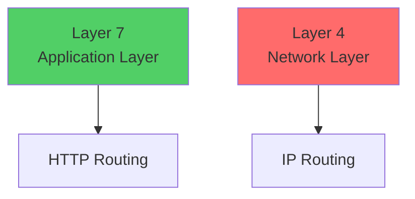
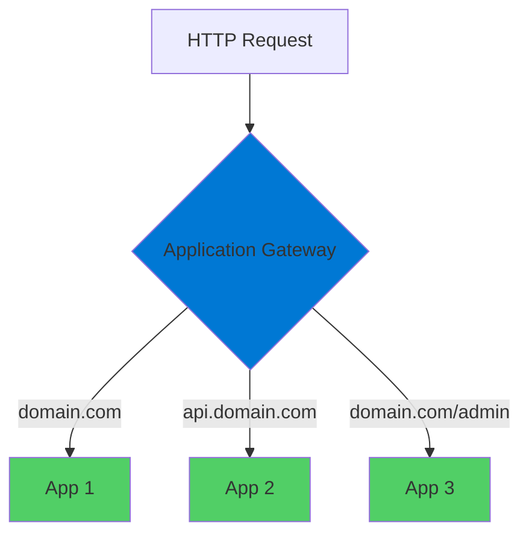
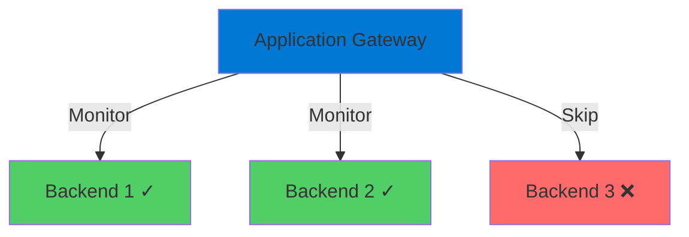
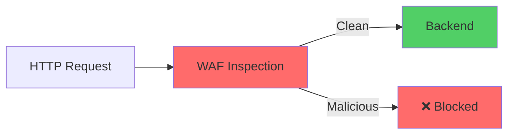
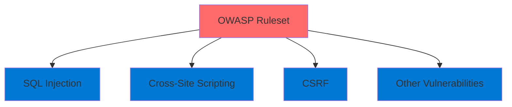
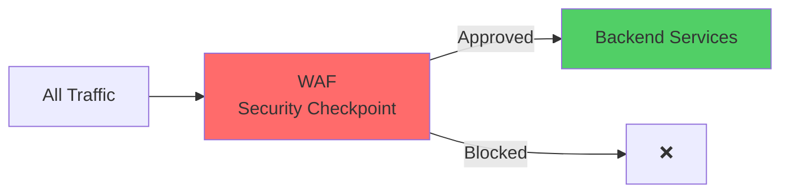

# Application Gateway

Layer 7 Load Balancer with Web Application Firewall

<div class="abs-bottom-10 left-10">
  <carbon-network-4 class="text-8xl text-blue-400 opacity-80" />
</div>

---
layout: center
---

# Welcome

<!--
METADATA:
sentence: Application Gateway with Web Application Firewall - Introduction Opening Welcome to this lab on Azure Application Gateway with Web Application Firewall.
search_anchor: Application Gateway with Web Application
-->
<v-click>

<div class="text-xl mt-8">
Explore Azure Application Gateway<br/>with Web Application Firewall
</div>

</v-click>

<!--
METADATA:
sentence: In this session, we'll explore one of Azure's most powerful traffic management and security tools.
search_anchor: this session, we'll explore one
-->
<v-click>

<div class="text-lg mt-6 opacity-70">
Traffic management and security
</div>

</v-click>

---
layout: section
---

# What is Application Gateway?

---

# Layer 7 Load Balancer

<v-click>

<div class="mt-4">
  <carbon-network-4 class="text-6xl text-blue-400" />
</div>

</v-click>

<!--
METADATA:
sentence: Application Gateway is Azure's layer 7 load balancer.
search_anchor: Application Gateway is Azure's layer
-->
<v-click>

<div class="mt-8 text-xl text-center">
Azure's layer 7 load balancer
</div>

</v-click>

<v-click>

<div class="mt-12">



</div>

</v-click>

<!--
METADATA:
sentence: What is Application Gateway?
search_anchor: What is Application Gateway
-->
<v-click>

<div class="mt-8 text-center text-lg">
Operates at application layer, not network layer
</div>

</v-click>

---

# Intelligent Routing

<!--
METADATA:
sentence: Unlike traditional load balancers that work at the network layer, Application Gateway operates at the application layer, routing traffic based on HTTP request attributes.
search_anchor: Unlike traditional load balancers that
-->
<v-click>

<div class="mt-8 text-center text-xl">
Routes traffic based on HTTP request attributes
</div>

</v-click>

<v-click>

<div class="mt-12">



</div>

</v-click>

<!--
METADATA:
sentence: This means it can make intelligent routing decisions based on the domain name and URL path in incoming requests.
search_anchor: This means it can make
-->
<v-click>

<div class="mt-8 text-center text-lg opacity-70">
Domain name and URL path-based routing
</div>

</v-click>

---

# Health Monitoring

<v-click>

<div class="mt-8">



</div>

</v-click>

<!--
METADATA:
sentence: Application Gateway continuously monitors backend services to ensure they're healthy, distributing traffic only to healthy instances.
search_anchor: Application Gateway continuously monitors backend
-->
<v-click>

<div class="mt-12 text-center text-xl">
Continuously monitors backend health
</div>

</v-click>

<!--
METADATA:
sentence: Application Gateway continuously monitors backend services to ensure they're healthy, distributing traffic only to healthy instances.
search_anchor: Application Gateway continuously monitors backend
-->
<v-click>

<div class="mt-6 text-center text-lg opacity-70">
Traffic only goes to healthy instances
</div>

</v-click>

<!--
METADATA:
sentence: This provides both high availability and optimal performance for your web applications.
search_anchor: This provides both high availability
-->
<v-click>

<div class="mt-8 text-center text-lg text-green-400">
High availability + Optimal performance
</div>

</v-click>

---
layout: section
---

# Web Application Firewall

---

# WAF Overview

<v-click>

<div class="mt-4">
  <carbon-security class="text-6xl text-red-400" />
</div>

</v-click>

<!--
METADATA:
sentence: Web Application Firewall Overview Web Application Firewall, or WAF, is an optional but powerful security feature of Application Gateway.
search_anchor: Web Application Firewall Overview Web
-->
<v-click>

<div class="mt-8 text-xl text-center">
Optional but powerful security feature
</div>

</v-click>

<v-click>

<div class="mt-12">



</div>

</v-click>

<!--
METADATA:
sentence: WAF inspects both the headers and body of HTTP requests, looking for malicious payloads that could indicate an attack.
search_anchor: WAF inspects both the headers
-->
<v-click>

<div class="mt-8 text-center text-lg">
Inspects headers and body for malicious payloads
</div>

</v-click>

---

# The Key Benefit

<!--
METADATA:
sentence: The key benefit here is that attacks can be prevented at the WAF layer, so they never reach your backend services.
search_anchor: key benefit here is that
-->
<v-click>

<div class="mt-12 text-center text-2xl">
Attacks prevented at WAF layer
</div>

</v-click>

<v-click>

<div class="mt-12">

```mermaid
graph TB
    Attack[Attack Request] --> WAF[WAF]
    WAF -->|Blocked| Stop[❌ Stopped]
    Backend[Backend Services] -.->|Never Reached| Safe[✓ Safe]
    style Attack fill:#ff6b6b
    style WAF fill=#0078d4
    style Stop fill:#ff6b6b
    style Backend fill:#51cf66
```

</div>

</v-click>

<!--
METADATA:
sentence: This provides a critical security boundary for your applications.
search_anchor: This provides a critical security
-->
<v-click>

<div class="mt-12 text-center text-xl text-green-400">
Critical security boundary for applications
</div>

</v-click>

---
layout: section
---

# Lab Objectives

---

# What We'll Build

<!--
METADATA:
sentence: The Application Gateway includes the WAF component for security inspection.
search_anchor: Application Gateway includes the WAF
-->
<v-click>

<div class="mt-6 flex items-start gap-4">
  <div class="text-3xl text-blue-400 mt-1">1</div>
  <div>
    <carbon-add class="text-3xl inline-block" />
    <span class="ml-3 text-lg">Deploy App Gateway with WAF and OWASP ruleset</span>
  </div>
</div>

</v-click>

<!--
METADATA:
sentence: Second, we'll configure Application Gateway to front multiple web applications running in Azure Container Instances, demonstrating multi-site routing capabilities.
search_anchor: Second, we'll configure Application Gateway
-->
<v-click>

<div class="mt-6 flex items-start gap-4">
  <div class="text-3xl text-green-400 mt-1">2</div>
  <div>
    <carbon-network-4 class="text-3xl inline-block" />
    <span class="ml-3 text-lg">Configure multi-site routing to ACI containers</span>
  </div>
</div>

</v-click>

<!--
METADATA:
sentence: Third, we'll test the WAF functionality by simulating common attack patterns like SQL injection, and observe how WAF blocks these malicious requests.
search_anchor: Third, we'll test the WAF
-->
<v-click>

<div class="mt-6 flex items-start gap-4">
  <div class="text-3xl text-red-400 mt-1">3</div>
  <div>
    <carbon-security class="text-3xl inline-block" />
    <span class="ml-3 text-lg">Test WAF by simulating attack patterns</span>
  </div>
</div>

</v-click>

---
layout: section
---

# Key Concepts

---

# Layer 7 Load Balancing

<!--
METADATA:
sentence: This means it can make intelligent routing decisions based on the domain name and URL path in incoming requests.
search_anchor: This means it can make
-->
<v-click>

<div class="mt-8 text-center text-xl">
Routing decisions based on application-level data
</div>

</v-click>

<!--
METADATA:
sentence: Key Concepts Before we begin, let's clarify some important concepts: Layer 7 load balancing means routing decisions are made based on application-level data like HTTP headers, cookies, and URL paths.
search_anchor: Key Concepts Before we begin
-->
<v-click>

<div class="mt-12 grid grid-cols-3 gap-6">
  <div class="text-center">
    <carbon-data-1 class="text-5xl text-blue-400" />
    <div class="text-sm mt-3">HTTP Headers</div>
  </div>
  <div class="text-center">
    <carbon-cookie class="text-5xl text-green-400" />
    <div class="text-sm mt-3">Cookies</div>
  </div>
  <div class="text-center">
    <carbon-url class="text-5xl text-purple-400" />
    <div class="text-sm mt-3">URL Paths</div>
  </div>
</div>

</v-click>

<!--
METADATA:
sentence: This is much more flexible than traditional network-level load balancing.
search_anchor: This is much more flexible
-->
<v-click>

<div class="mt-12 text-center text-xl text-green-400">
Much more flexible than network-level load balancing
</div>

</v-click>

---

# OWASP Ruleset

<v-click>

<div class="mt-4">
  <carbon-shield class="text-6xl text-red-400" />
</div>

</v-click>

<!--
METADATA:
sentence: What is Application Gateway?
search_anchor: What is Application Gateway
-->
<v-click>

<div class="mt-8 text-xl text-center">
Open Web Application Security Project
</div>

</v-click>

<!--
METADATA:
sentence: The OWASP ruleset we'll be using comes from the Open Web Application Security Project, the organization behind the famous OWASP Top 10 security risks.
search_anchor: OWASP ruleset we'll be using
-->
<v-click>

<div class="mt-12 text-lg text-center">
Organization behind OWASP Top 10 security risks
</div>

</v-click>

<v-click>

<div class="mt-12">



</div>

</v-click>

---

# WAF Modes

<!--
METADATA:
sentence: WAF operates in two modes: Detection mode logs suspicious requests but allows them through, while Prevention mode actively blocks attacks.
search_anchor: WAF operates in two modes
-->
<v-click>

<div class="mt-8 flex items-start gap-4">
  <carbon-view class="text-5xl text-blue-400 mt-1" />
  <div>
    <div class="text-xl font-bold">Detection Mode</div>
    <div class="text-sm mt-2 opacity-70">Logs suspicious requests</div>
    <div class="text-sm opacity-70">But allows them through</div>
  </div>
</div>

</v-click>

<!--
METADATA:
sentence: We'll use Prevention mode to stop threats before they reach our applications.
search_anchor: We'll use Prevention mode to
-->
<v-click>

<div class="mt-10 flex items-start gap-4">
  <carbon-locked class="text-5xl text-red-400 mt-1" />
  <div>
    <div class="text-xl font-bold">Prevention Mode</div>
    <div class="text-sm mt-2 opacity-70">Actively blocks attacks</div>
    <div class="text-sm opacity-70">Stops threats before they reach apps</div>
  </div>
</div>

</v-click>

<!--
METADATA:
sentence: We'll use Prevention mode to stop threats before they reach our applications.
search_anchor: We'll use Prevention mode to
-->
<v-click>

<div class="mt-12 text-center text-xl text-green-400">
We'll use Prevention mode
</div>

</v-click>

---
layout: section
---

# Architecture Overview

---

# What We're Building

<v-click>

<div class="mt-8">

```mermaid
graph TB
    Internet[Internet<br/>Public IP + DNS] --> AppGW[Application Gateway<br/>+ WAF]
    AppGW --> ACI1[ACI Container 1]
    AppGW --> ACI2[ACI Container 2]
    AppGW --> ACI3[ACI Container 3]
    style Internet fill:#ffd43b
    style AppGW fill:#0078d4
    style ACI1 fill=#51cf66
    style ACI2 fill:#51cf66
    style ACI3 fill:#51cf66
```

</div>

</v-click>

---

# Traffic Flow

<!--
METADATA:
sentence: Architecture Overview Let's visualize what we're building: At the front, we'll have a public IP address with a DNS name that clients will connect to.
search_anchor: Architecture Overview Let's visualize what
-->
<v-click>

<div class="mt-6 flex items-start gap-4">
  <div class="text-3xl text-yellow-400 mt-1">1</div>
  <div>
    <carbon-network-3 class="text-3xl inline-block" />
    <span class="ml-3 text-lg">Public IP + DNS name for client connections</span>
  </div>
</div>

</v-click>

<!--
METADATA:
sentence: What is Application Gateway?
search_anchor: What is Application Gateway
-->
<v-click>

<div class="mt-6 flex items-start gap-4">
  <div class="text-3xl text-blue-400 mt-1">2</div>
  <div>
    <carbon-network-4 class="text-3xl inline-block" />
    <span class="ml-3 text-lg">Application Gateway in dedicated subnet</span>
  </div>
</div>

</v-click>

<!--
METADATA:
sentence: All traffic flows through the WAF first, providing a security checkpoint before reaching any backend service.
search_anchor: All traffic flows through the
-->
<v-click>

<div class="mt-6 flex items-start gap-4">
  <div class="text-3xl text-red-400 mt-1">3</div>
  <div>
    <carbon-security class="text-3xl inline-block" />
    <span class="ml-3 text-lg">WAF inspects all traffic first</span>
  </div>
</div>

</v-click>

<!--
METADATA:
sentence: The Application Gateway will route requests to the appropriate container based on the domain name in the request.
search_anchor: Application Gateway will route requests
-->
<v-click>

<div class="mt-6 flex items-start gap-4">
  <div class="text-3xl text-green-400 mt-1">4</div>
  <div>
    <carbon-container-software class="text-3xl inline-block" />
    <span class="ml-3 text-lg">Routes to appropriate ACI container by domain</span>
  </div>
</div>

</v-click>

---

# Security Checkpoint

<v-click>

<div class="mt-12">



</div>

</v-click>

<!--
METADATA:
sentence: All traffic flows through the WAF first, providing a security checkpoint before reaching any backend service.
search_anchor: All traffic flows through the
-->
<v-click>

<div class="mt-12 text-center text-2xl text-green-400">
Security boundary before any backend service
</div>

</v-click>

---
layout: section
---

# Prerequisites

---

# What You'll Need

<!--
METADATA:
sentence: Prerequisites For this lab, you'll need: An active Azure subscription with permissions to create resources.
search_anchor: Prerequisites For this lab, you'll
-->
<v-click>

<div class="mt-6 flex items-center gap-4">
  <carbon-cloud-services class="text-4xl text-blue-400" />
  <span class="text-lg">Active Azure subscription with resource permissions</span>
</div>

</v-click>

<!--
METADATA:
sentence: The Azure CLI installed and authenticated to your subscription.
search_anchor: Azure CLI installed and authenticated
-->
<v-click>

<div class="mt-6 flex items-center gap-4">
  <carbon-command-line class="text-4xl text-green-400" />
  <span class="text-lg">Azure CLI installed and authenticated</span>
</div>

</v-click>

<!--
METADATA:
sentence: Basic familiarity with networking concepts like IP addresses and DNS.
search_anchor: Basic familiarity with networking concepts
-->
<v-click>

<div class="mt-6 flex items-center gap-4">
  <carbon-network-3 class="text-4xl text-purple-400" />
  <span class="text-lg">Basic networking concepts (IP, DNS)</span>
</div>

</v-click>

<!--
METADATA:
sentence: Docker Desktop if you want to run the optional GoTestWAF security testing tool.
search_anchor: Docker Desktop if you want
-->
<v-click>

<div class="mt-6 flex items-center gap-4">
  <carbon-docker class="text-4xl text-orange-400" />
  <span class="text-lg">Docker Desktop (optional - for GoTestWAF tool)</span>
</div>

</v-click>

---
layout: section
---

# What You'll Learn

---

# Learning Outcomes

<!--
METADATA:
sentence: What is Application Gateway?
search_anchor: What is Application Gateway
-->
<v-click>

<div class="mt-4 flex items-start gap-3">
  <carbon-add class="text-3xl text-blue-400 mt-1" />
  <span>Create and configure Application Gateway with WAF</span>
</div>

</v-click>

<!--
METADATA:
sentence: What You'll Learn By the end of this lab, you'll understand how to create and configure Azure Application Gateway with WAF, how to set up multi-site routing to different backend pools, how to test and validate WAF security rules, and how to troubleshoot common issues like 502 Bad Gateway errors.
search_anchor: What You'll Learn By the
-->
<v-click>

<div class="mt-4 flex items-start gap-3">
  <carbon-network-4 class="text-3xl text-green-400 mt-1" />
  <span>Set up multi-site routing to different backend pools</span>
</div>

</v-click>

<!--
METADATA:
sentence: The Application Gateway includes the WAF component for security inspection.
search_anchor: Application Gateway includes the WAF
-->
<v-click>

<div class="mt-4 flex items-start gap-3">
  <carbon-security class="text-3xl text-red-400 mt-1" />
  <span>Test and validate WAF security rules</span>
</div>

</v-click>

<!--
METADATA:
sentence: These rules protect against common web vulnerabilities.
search_anchor: These rules protect against common
-->
<v-click>

<div class="mt-4 flex items-start gap-3">
  <carbon-search class="text-3xl text-purple-400 mt-1" />
  <span>Troubleshoot common issues (502 errors, etc.)</span>
</div>

</v-click>

---
layout: center
class: text-center
---

<div>

<v-click>

<carbon-play-outline class="text-8xl text-green-400 inline-block" />

</v-click>

<!--
METADATA:
sentence: Let's get started with creating our Application Gateway infrastructure.
search_anchor: Let's get started with creating
-->
<v-click>

<div class="text-4xl mt-8 font-bold">
Let's Get Started!
</div>

</v-click>

<!--
METADATA:
sentence: Let's get started with creating our Application Gateway infrastructure.
search_anchor: Let's get started with creating
-->
<v-click>

<div class="text-xl mt-6 opacity-70">
Creating our Application Gateway infrastructure
</div>

</v-click>

</div>
