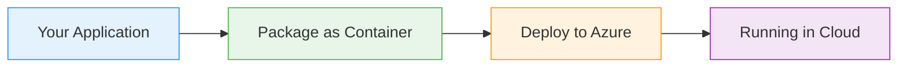
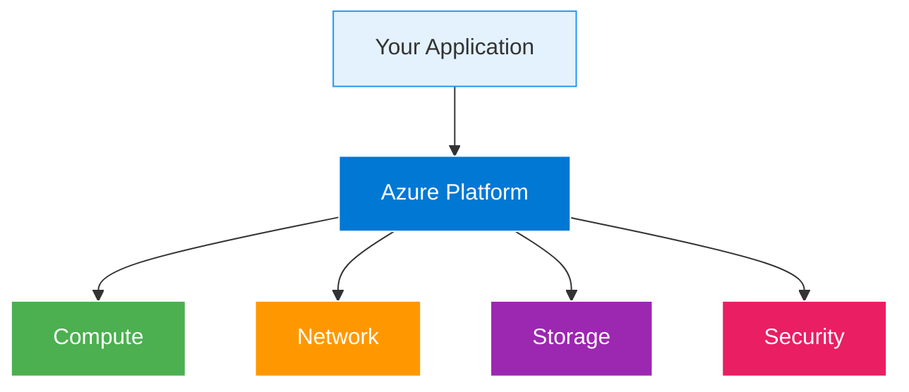

# Application Gateway with Web Application Firewall

  <iconify-icon icon="vscode-icons:file-type-azure" style="font-size: 4rem;" />

---

---
layout: center
class: text-center
---

# Welcome

Welcome to this lab on Azure Application Gateway with Web Application Firewall

  <iconify-icon icon="carbon:rocket" style="font-size: 3rem; color: #0078d4;" />

---

---
layout: center
---

# What is Application Gateway?

Application Gateway is Azure's layer 7 load balancer. Unlike traditional load balancers that work at the network layer, Application Gateway operates a...

---

---
layout: center
---

# Web Application Firewall Overview

Web Application Firewall, or WAF, is an optional but powerful security feature of Application Gateway. WAF inspects both the headers and body of HTTP requests, looking for malicious payloads that coul

---

---
layout: center
---

# Lab Objectives

In this lab, we'll accomplish three main objectives:

---

---
layout: center
---

# Key Concepts

---

---
layout: two-cols
---

# Architecture Overview

::right::

<h3>Azure Manages</h3>
<ul>

</ul>

<h3>You Control</h3>
<ul>

</ul>

---

---
layout: center
---

# What You'll Learn

<iconify-icon icon="mdi:check-circle" class="text-blue-500" /> site routing to different backend pools, how to test and validate WAF security rules, and how to troubleshoot common issues like 502 Bad Gateway errors.

