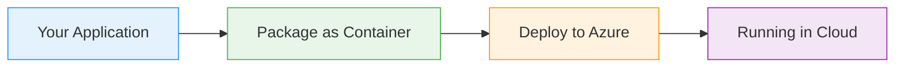
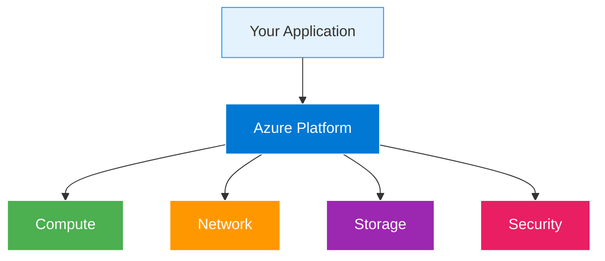

# Application Insights

  <iconify-icon icon="carbon:chart-line" style="font-size: 4rem;" />

---

---
layout: center
class: text-center
---

# Welcome

Welcome to this module on Application Insights

  <iconify-icon icon="carbon:rocket" style="font-size: 3rem; color: #0078d4;" />

---

---
layout: center
---

# What is Application Insights?

Application Insights is a comprehensive monitoring solution that combines the ingestion of log and metric data with a rich user interface for searchin...

---

---
layout: two-cols
---

# Architecture Overview

::right::

<h3>Azure Manages</h3>
<ul>

</ul>

<h3>You Control</h3>
<ul>

</ul>

---

---
layout: center
---

# Key Features

Application Insights provides several powerful features:

---

---
layout: center
---

# Integration Options

There are two main ways to integrate Application Insights with your applications:

---

---
layout: center
---

# What You'll Learn

<iconify-icon icon="mdi:check-circle" class="text-blue-500" /> instrumentation for web applications, and explore the monitoring features that help you understand application health and troubleshoot issues.

