# Application Insights

Comprehensive Application Monitoring

<div class="abs-bottom-10 left-10">
  <carbon-chart-line class="text-8xl text-green-400 opacity-80" />
</div>

---
layout: center
---

# Welcome

<!--
METADATA:
sentence: In this session, we'll explore one of Azure's most powerful monitoring tools for understanding application health and performance.
search_anchor: this session, we'll explore one
-->
<v-click>

<div class="text-xl mt-8">
Explore Azure's most powerful monitoring tool<br/>for application health and performance
</div>

</v-click>

---
layout: section
---

# What is Application Insights?

---

# Comprehensive Monitoring

<v-click>

<div class="mt-4">
  <carbon-chart-line class="text-6xl text-green-400" />
</div>

</v-click>

<!--
METADATA:
sentence: Application Insights is a comprehensive monitoring solution that combines the ingestion of log and metric data with a rich user interface for searching and exploring that data.
search_anchor: Application Insights is a comprehensive
-->
<v-click>

<div class="mt-8 text-xl text-center">
Log and metric ingestion + rich UI
</div>

</v-click>

<!--
METADATA:
sentence: What is Application Insights?
search_anchor: What is Application Insights
-->
<v-click>

<div class="mt-12 flex justify-center gap-12">
  <div class="text-center">
    <carbon-document class="text-6xl text-blue-400" />
    <div class="text-sm mt-3">Logs</div>
  </div>
  <div class="text-center">
    <carbon-chart-line class="text-6xl text-green-400" />
    <div class="text-sm mt-3">Metrics</div>
  </div>
  <div class="text-center">
    <carbon-search class="text-6xl text-purple-400" />
    <div class="text-sm mt-3">Analysis UI</div>
  </div>
</div>

</v-click>

---

# Your Application's Flight Recorder

<v-click>

<div class="mt-8">


</div>

</v-click>

<!--
METADATA:
sentence: Think of it as your application's flight recorder - it captures everything happening in your app so you can troubleshoot issues and optimize performance.
search_anchor: Think of it as your
-->
<v-click>

<div class="mt-12 text-center text-xl">
Captures everything happening in your app
</div>

</v-click>

---

# Client Library

<!--
METADATA:
sentence: You can add Application Insights support to any application by using the client library.
search_anchor: You can add Application Insights
-->
<v-click>

<div class="mt-8 text-center text-xl">
Add support to any application
</div>

</v-click>

<v-click>

<div class="mt-12">

```csharp
services.AddApplicationInsightsTelemetry();
```

</div>

</v-click>

<!--
METADATA:
sentence: You can add Application Insights support to any application by using the client library.
search_anchor: You can add Application Insights
-->
<v-click>

<div class="mt-8 text-center text-lg opacity-70">
Using the client library
</div>

</v-click>

---

# Automatic Instrumentation

<v-click>

<div class="mt-4">
  <carbon-magic-wand class="text-6xl text-purple-400" />
</div>

</v-click>

<!--
METADATA:
sentence: But what makes it even more powerful is that Platform as a Service offerings like Web Apps and Function Apps support automatic instrumentation.
search_anchor: But what makes it even
-->
<v-click>

<div class="mt-8 text-xl text-center">
PaaS offerings support auto-instrumentation
</div>

</v-click>

<!--
METADATA:
sentence: What is Application Insights?
search_anchor: What is Application Insights
-->
<v-click>

<div class="mt-12 flex justify-center gap-12">
  <div class="text-center">
    <carbon-application-web class="text-5xl text-blue-400" />
    <div class="text-sm mt-3">Web Apps</div>
  </div>
  <div class="text-center">
    <carbon-function class="text-5xl text-green-400" />
    <div class="text-sm mt-3">Function Apps</div>
  </div>
</div>

</v-click>

<!--
METADATA:
sentence: Azure automatically injects the monitoring code and starts collecting telemetry.
search_anchor: Azure automatically injects the monitoring
-->
<v-click>

<div class="mt-12 text-center text-xl text-green-400">
No code changes required!
</div>

</v-click>

---
layout: section
---

# Architecture Overview

---

# Monitoring Ecosystem

<v-click>

<div class="mt-8">


</v-click>

<!--
METADATA:
sentence: Architecture Overview Let's talk about how Application Insights fits into the Azure monitoring ecosystem.
search_anchor: Architecture Overview Let's talk about
-->
<v-click>

<div class="mt-8 text-center text-lg opacity-70">
Flexible architecture for different viewing needs
</div>

</v-click>

---

# Data Flow

<!--
METADATA:
sentence: Applications send their data to Application Insights as the central collector.
search_anchor: Applications send their data to
-->
<v-click>

<div class="mt-6 flex items-start gap-4">
  <div class="text-3xl text-green-400 mt-1">1</div>
  <div>
    <carbon-application class="text-3xl inline-block" />
    <span class="ml-3 text-lg">Applications send telemetry</span>
  </div>
</div>

</v-click>

<!--
METADATA:
sentence: Applications send their data to Application Insights as the central collector.
search_anchor: Applications send their data to
-->
<v-click>

<div class="mt-6 flex items-start gap-4">
  <div class="text-3xl text-blue-400 mt-1">2</div>
  <div>
    <carbon-chart-line class="text-3xl inline-block" />
    <span class="ml-3 text-lg">App Insights collects as central collector</span>
  </div>
</div>

</v-click>

<!--
METADATA:
sentence: Each Application Insights instance is linked to a Log Analytics service, which is where the data is actually stored.
search_anchor: Each Application Insights instance is
-->
<v-click>

<div class="mt-6 flex items-start gap-4">
  <div class="text-3xl text-purple-400 mt-1">3</div>
  <div>
    <carbon-data-storage class="text-3xl inline-block" />
    <span class="ml-3 text-lg">Log Analytics stores the data</span>
  </div>
</div>

</v-click>

<!--
METADATA:
sentence: What You'll Learn In this lab, we'll explore both integration approaches.
search_anchor: What You'll Learn In this
-->
<v-click>

<div class="mt-6 flex items-start gap-4">
  <div class="text-3xl text-orange-400 mt-1">4</div>
  <div>
    <carbon-dashboard class="text-3xl inline-block" />
    <span class="ml-3 text-lg">Multiple UIs for different needs</span>
  </div>
</div>

</v-click>

---

# Same Data, Multiple Views

<!--
METADATA:
sentence: What is Application Insights?
search_anchor: What is Application Insights
-->
<v-click>

<div class="mt-8 flex items-center gap-4">
  <carbon-search class="text-4xl text-blue-400" />
  <span class="text-lg">Troubleshoot in Application Insights interface</span>
</div>

</v-click>

<!--
METADATA:
sentence: What You'll Learn In this lab, we'll explore both integration approaches.
search_anchor: What You'll Learn In this
-->
<v-click>

<div class="mt-6 flex items-center gap-4">
  <carbon-code class="text-4xl text-green-400" />
  <span class="text-lg">Build complex queries in Log Analytics</span>
</div>

</v-click>

<!--
METADATA:
sentence: What You'll Learn In this lab, we'll explore both integration approaches.
search_anchor: What You'll Learn In this
-->
<v-click>

<div class="mt-6 flex items-center gap-4">
  <carbon-dashboard class="text-4xl text-purple-400" />
  <span class="text-lg">Surface KPIs in Azure Dashboards</span>
</div>

</v-click>

<!--
METADATA:
sentence: Azure automatically injects the monitoring code and starts collecting telemetry.
search_anchor: Azure automatically injects the monitoring
-->
<v-click>

<div class="mt-12 text-center text-xl text-green-400">
All from the same underlying dataset
</div>

</v-click>

---
layout: section
---

# Key Features

---

# Live Metrics

<v-click>

<div class="mt-4">
  <carbon-chart-line-smooth class="text-6xl text-green-400" />
</div>

</v-click>

<!--
METADATA:
sentence: Key Features Application Insights provides several powerful features: Live Metrics - Get real-time visibility into your application's performance as requests flow through your system.
search_anchor: Key Features Application Insights provides
-->
<v-click>

<div class="mt-8 text-xl text-center">
Real-time visibility into performance
</div>

</v-click>

<v-click>

<div class="mt-12">


</div>

</v-click>

<!--
METADATA:
sentence: Key Features Application Insights provides several powerful features: Live Metrics - Get real-time visibility into your application's performance as requests flow through your system.
search_anchor: Key Features Application Insights provides
-->
<v-click>

<div class="mt-8 text-center text-lg opacity-70">
See requests flow through your system
</div>

</v-click>

---

# Application Map

<v-click>

<div class="mt-4">
  <carbon-network-3 class="text-6xl text-blue-400" />
</div>

</v-click>

<!--
METADATA:
sentence: Application Map - Visualize the dependencies between your application components and see where bottlenecks or failures are occurring.
search_anchor: Application Map - Visualize the
-->
<v-click>

<div class="mt-8 text-xl text-center">
Visualize component dependencies
</div>

</v-click>

<v-click>

<div class="mt-12">


</v-click>

<!--
METADATA:
sentence: Application Map - Visualize the dependencies between your application components and see where bottlenecks or failures are occurring.
search_anchor: Application Map - Visualize the
-->
<v-click>

<div class="mt-8 text-center text-lg">
See where bottlenecks or failures occur
</div>

</v-click>

---

# Failures Analysis

<v-click>

<div class="mt-4">
  <carbon-warning class="text-6xl text-red-400" />
</div>

</v-click>

<!--
METADATA:
sentence: Failures Analysis - Dive deep into exceptions and failed requests with detailed diagnostic information.
search_anchor: Failures Analysis - Dive deep
-->
<v-click>

<div class="mt-8 text-xl text-center">
Deep dive into exceptions and failures
</div>

</v-click>

<!--
METADATA:
sentence: Failures Analysis - Dive deep into exceptions and failed requests with detailed diagnostic information.
search_anchor: Failures Analysis - Dive deep
-->
<v-click>

<div class="mt-12 flex justify-center gap-12">
  <div class="text-center">
    <carbon-error class="text-5xl text-red-400" />
    <div class="text-sm mt-3">Exceptions</div>
  </div>
  <div class="text-center">
    <carbon-warning-alt class="text-5xl text-orange-400" />
    <div class="text-sm mt-3">Failed Requests</div>
  </div>
  <div class="text-center">
    <carbon-information class="text-5xl text-blue-400" />
    <div class="text-sm mt-3">Diagnostics</div>
  </div>
</div>

</v-click>

<!--
METADATA:
sentence: Failures Analysis - Dive deep into exceptions and failed requests with detailed diagnostic information.
search_anchor: Failures Analysis - Dive deep
-->
<v-click>

<div class="mt-12 text-center text-lg opacity-70">
Detailed diagnostic information
</div>

</v-click>

---

# Performance Monitoring

<v-click>

<div class="mt-4">
  <carbon-meter-alt class="text-6xl text-purple-400" />
</div>

</v-click>

<v-click>

<div class="mt-8">
Track:
</div>

</v-click>

<!--
METADATA:
sentence: Performance Monitoring - Track response times, dependency calls, and identify performance bottlenecks.
search_anchor: Performance Monitoring - Track response
-->
<v-click>

<div class="mt-6 flex items-center gap-4">
  <carbon-time class="text-3xl text-blue-400" />
  <span>Response times</span>
</div>

</v-click>

<!--
METADATA:
sentence: Performance Monitoring - Track response times, dependency calls, and identify performance bottlenecks.
search_anchor: Performance Monitoring - Track response
-->
<v-click>

<div class="mt-4 flex items-center gap-4">
  <carbon-network-3 class="text-3xl text-green-400" />
  <span>Dependency calls</span>
</div>

</v-click>

<!--
METADATA:
sentence: Performance Monitoring - Track response times, dependency calls, and identify performance bottlenecks.
search_anchor: Performance Monitoring - Track response
-->
<v-click>

<div class="mt-4 flex items-center gap-4">
  <carbon-warning class="text-3xl text-orange-400" />
  <span>Performance bottlenecks</span>
</div>

</v-click>

---

# User Flows

<v-click>

<div class="mt-4">
  <carbon-user-activity class="text-6xl text-green-400" />
</div>

</v-click>

<!--
METADATA:
sentence: User Flows - Understand how users navigate through your application and where they encounter issues.
search_anchor: User Flows - Understand how
-->
<v-click>

<div class="mt-8 text-xl text-center">
Understand user navigation

```mermaid
graph LR
    Home[Home Page] --> Products[Products]
    Products --> Cart[Cart]
    Cart --> Checkout[Checkout]
    Cart -.->|Drop-off| Exit[❌ Exit]
    style Home fill:#51cf66
    style Products fill:#51cf66
    style Cart fill:#ffd43b
    style Checkout fill:#51cf66
    style Exit fill:#ff6b6b
```

</div>

</v-click>

<v-click>

<div class="mt-12">



</div>

</v-click>

<!--
METADATA:
sentence: User Flows - Understand how users navigate through your application and where they encounter issues.
search_anchor: User Flows - Understand how
-->
<v-click>

<div class="mt-8 text-center text-lg opacity-70">
Where users encounter issues
</div>

</v-click>

---
layout: section
---

# Integration Options

---

# Two Main Approaches

<!--
METADATA:
sentence: Integration Options There are two main ways to integrate Application Insights with your applications: SDK Integration - For maximum control, you can use the Application Insights SDK to explicitly track custom events, operations, and dependencies.
search_anchor: Integration Options There are two
-->
<v-click>

<div class="mt-8 flex items-start gap-4">
  <div class="text-4xl text-blue-400 mt-1">1</div>
  <div>
    <carbon-code class="text-4xl inline-block" />
    <div class="ml-3 mt-2">
      <div class="text-xl font-bold">SDK Integration</div>
      <div class="text-sm mt-2 opacity-70">Maximum control</div>
      <div class="text-sm opacity-70">Custom events and operations</div>
    </div>
  </div>
</div>

</v-click>

<!--
METADATA:
sentence: Azure automatically injects the monitoring code and starts collecting telemetry.
search_anchor: Azure automatically injects the monitoring
-->
<v-click>

<div class="mt-10 flex items-start gap-4">
  <div class="text-4xl text-purple-400 mt-1">2</div>
  <div>
    <carbon-magic-wand class="text-4xl inline-block" />
    <div class="ml-3 mt-2">
      <div class="text-xl font-bold">Auto-instrumentation</div>
      <div class="text-sm mt-2 opacity-70">No code changes</div>
      <div class="text-sm opacity-70">Azure injects monitoring automatically</div>
    </div>
  </div>
</div>

</v-click>

---

# SDK Integration

<v-click>

<div class="mt-8">

```csharp
// Fine-grained control
services.AddApplicationInsightsTelemetry();

telemetryClient.TrackEvent("UserCheckout");
telemetryClient.TrackMetric("CartValue", cartTotal);
telemetryClient.TrackDependency("PaymentGateway", ...);
```

</div>

</v-click>

<!--
METADATA:
sentence: This gives you fine-grained control over what telemetry is collected.
search_anchor: This gives you fine-grained control
-->
<v-click>

<div class="mt-8 text-center text-xl text-green-400">
Maximum control over telemetry
</div>

</v-click>

---

# Auto-instrumentation

<!--
METADATA:
sentence: Auto-instrumentation - For standard web applications running in Azure App Service, you can enable Application Insights without any code changes.
search_anchor: Auto-instrumentation - For standard web
-->
<v-click>

<div class="mt-8 text-center text-2xl">
For Azure App Service
</div>

</v-click>

<v-click>

<div class="mt-12">

```mermaid
graph LR
    Code[Your Code] --> Azure[Azure App Service]
    Azure -->|Auto-Injects| Monitoring[Monitoring Code]
    Monitoring --> AppInsights[Application Insights]
    style Code fill:#51cf66
    style Azure fill=#0078d4
    style Monitoring fill:#ffd43b
    style AppInsights fill:#0078d4
```

</div>

</v-click>

<!--
METADATA:
sentence: Azure automatically injects the monitoring code and starts collecting telemetry.
search_anchor: Azure automatically injects the monitoring
-->
<v-click>

<div class="mt-12 text-center text-xl text-green-400">
Zero code changes required
</div>

</v-click>

---
layout: section
---

# What You'll Learn

---

# Lab Objectives

<!--
METADATA:
sentence: What is Application Insights?
search_anchor: What is Application Insights
-->
<v-click>

<div class="mt-6 flex items-start gap-4">
  <carbon-code class="text-3xl text-blue-400 mt-1" />
  <span class="text-lg">Deploy applications with custom App Insights code</span>
</div>

</v-click>

<!--
METADATA:
sentence: Auto-instrumentation - For standard web applications running in Azure App Service, you can enable Application Insights without any code changes.
search_anchor: Auto-instrumentation - For standard web
-->
<v-click>

<div class="mt-6 flex items-start gap-4">
  <carbon-magic-wand class="text-3xl text-purple-400 mt-1" />
  <span class="text-lg">Enable auto-instrumentation for web applications</span>
</div>

</v-click>

<!--
METADATA:
sentence: Azure automatically injects the monitoring code and starts collecting telemetry.
search_anchor: Azure automatically injects the monitoring
-->
<v-click>

<div class="mt-6 flex items-start gap-4">
  <carbon-chart-line class="text-3xl text-green-400 mt-1" />
  <span class="text-lg">Explore monitoring features</span>
</div>

</v-click>

<!--
METADATA:
sentence: What is Application Insights?
search_anchor: What is Application Insights
-->
<v-click>

<div class="mt-6 flex items-start gap-4">
  <carbon-search class="text-3xl text-orange-400 mt-1" />
  <span class="text-lg">Understand application health and troubleshooting</span>
</div>

</v-click>

---
layout: center
class: text-center
---

<div>

<v-click>

<carbon-play-outline class="text-8xl text-green-400 inline-block" />

</v-click>

<!--
METADATA:
sentence: Azure automatically injects the monitoring code and starts collecting telemetry.
search_anchor: Azure automatically injects the monitoring
-->
<v-click>

<div class="text-4xl mt-8 font-bold">
Let's Get Started!
</div>

</v-click>

<!--
METADATA:
sentence: What You'll Learn In this lab, we'll explore both integration approaches.
search_anchor: What You'll Learn In this
-->
<v-click>

<div class="text-xl mt-6 opacity-70">
Explore both integration approaches
</div>

</v-click>

</div>
