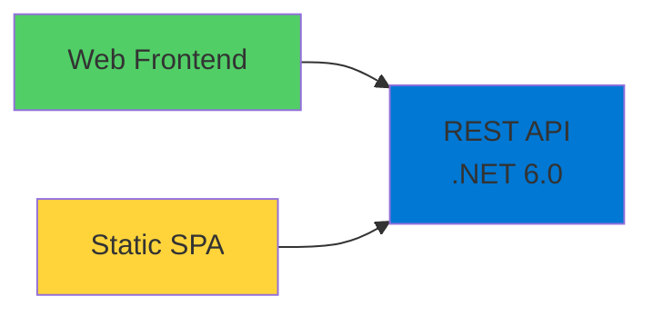
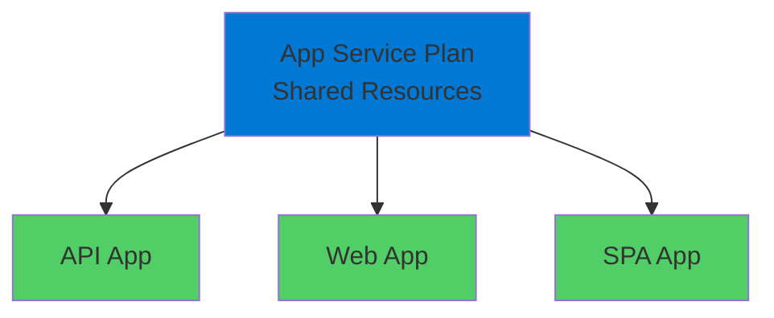
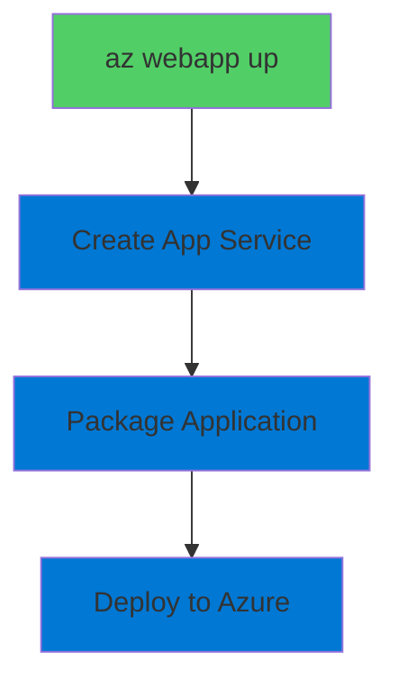

# App Service for Distributed Apps

Deploying Multiple Applications to Shared Infrastructure

  <carbon-network-3 class="text-8xl text-blue-400 opacity-80" />

---
layout: center
---

# Welcome

<!--
METADATA:
sentence: In this session, we'll explore how to deploy and configure multiple applications within a single App Service Plan, demonstrating a cost-effective approach to running distributed systems in Azure.
search_anchor: this session, we'll explore how
-->
<v-click>

Explore distributed application deployment Cost-effective multi-app hosting in Azure

</v-click>

---
layout: section
---

# Lab Overview

---

# What You'll Learn

<!--
METADATA:
sentence: In this session, we'll explore how to deploy and configure multiple applications within a single App Service Plan, demonstrating a cost-effective approach to running distributed systems in Azure.
search_anchor: this session, we'll explore how
-->
<v-click>

  <carbon-apps class="text-4xl text-blue-400" />
  Deploy multiple apps to single App Service Plan

</v-click>

<!--
METADATA:
sentence: App Service for Distributed Apps - Introduction Welcome Welcome to this lab on using Azure App Service for distributed applications.
search_anchor: App Service for Distributed Apps
-->
<v-click>

  <carbon-settings class="text-4xl text-green-400" />
  Configure app settings for component communication

</v-click>

<!--
METADATA:
sentence: Configuration Management App Service provides a centralized way to manage application configuration through environment variables and application settings.
search_anchor: Configuration Management App Service provides
-->
<v-click>

  <carbon-data-connected class="text-4xl text-purple-400" />
  Manage environment-specific values

</v-click>

<!--
METADATA:
sentence: Key Concepts App Service Plans An App Service Plan defines the compute resources for your web apps.
search_anchor: Key Concepts App Service Plans
-->
<v-click>

  <carbon-scale class="text-4xl text-orange-400" />
  Scale App Service Plans and understand SKU limits

</v-click>

<!--
METADATA:
sentence: Key Concepts App Service Plans An App Service Plan defines the compute resources for your web apps.
search_anchor: Key Concepts App Service Plans
-->
<v-click>

  <carbon-security class="text-4xl text-red-400" />
  Configure CORS policies for cross-origin requests

</v-click>

---
layout: section
---

# Application Scenario

---

# Distributed Random Number Generator

<!--
METADATA:
sentence: Key Concepts App Service Plans An App Service Plan defines the compute resources for your web apps.
search_anchor: Key Concepts App Service Plans
-->
<v-click>

Three components working together

</v-click>

<v-click>

</v-click>

<!--
METADATA:
sentence: Key Concepts App Service Plans An App Service Plan defines the compute resources for your web apps.
search_anchor: Key Concepts App Service Plans
-->
<v-click>

Typical microservices architecture pattern

</v-click>

---
layout: section
---

# Key Concepts

---

# App Service Plans

<v-click>

  <carbon-plan class="text-6xl text-blue-400" />

</v-click>

<!--
METADATA:
sentence: Key Concepts App Service Plans An App Service Plan defines the compute resources for your web apps.
search_anchor: Key Concepts App Service Plans
-->
<v-click>

Define compute resources for web apps

</v-click>

<v-click>

</v-click>

<!--
METADATA:
sentence: One plan can host multiple App Services, allowing you to optimize costs by sharing infrastructure across multiple application components.
search_anchor: One plan can host multiple
-->
<v-click>

One plan can host multiple services

</v-click>

<!--
METADATA:
sentence: One plan can host multiple App Services, allowing you to optimize costs by sharing infrastructure across multiple application components.
search_anchor: One plan can host multiple
-->
<v-click>

Optimize costs by sharing infrastructure

</v-click>

---

# Configuration Management

<v-click>

  <carbon-settings-adjust class="text-6xl text-green-400" />

</v-click>

<!--
METADATA:
sentence: Configuration Management App Service provides a centralized way to manage application configuration through environment variables and application settings.
search_anchor: Configuration Management App Service provides
-->
<v-click>

Centralized configuration through environment variables

</v-click>

<!--
METADATA:
sentence: These settings are injected into your application at runtime, making it easy to deploy the same code across different environments with different configurations.
search_anchor: These settings are injected into
-->
<v-click>

  

    <carbon-code class="text-6xl text-blue-400" />
    
Same Code

  

  

    <carbon-arrow-right class="text-6xl text-gray-400" />
  

  

    <carbon-earth class="text-6xl text-green-400" />
    
Different Environments

  

</v-click>

<!--
METADATA:
sentence: These settings are injected into your application at runtime, making it easy to deploy the same code across different environments with different configurations.
search_anchor: These settings are injected into
-->
<v-click>

Settings injected at runtime

</v-click>

<!--
METADATA:
sentence: Configuration Management App Service provides a centralized way to manage application configuration through environment variables and application settings.
search_anchor: Configuration Management App Service provides
-->
<v-click>

Deploy once, configure per environment

</v-click>

---

# Deployment with az webapp up

<!--
METADATA:
sentence: One plan can host multiple App Services, allowing you to optimize costs by sharing infrastructure across multiple application components.
search_anchor: One plan can host multiple
-->
<v-click>

Convenient shortcut combining multiple steps

</v-click>

<v-click>

</v-click>

<!--
METADATA:
sentence: In this session, we'll explore how to deploy and configure multiple applications within a single App Service Plan, demonstrating a cost-effective approach to running distributed systems in Azure.
search_anchor: this session, we'll explore how
-->
<v-click>

All in a single command

</v-click>

---
layout: section
---

# Prerequisites

---

# What You Need

<!--
METADATA:
sentence: Configuration Management App Service provides a centralized way to manage application configuration through environment variables and application settings.
search_anchor: Configuration Management App Service provides
-->
<v-click>

  <carbon-command-line class="text-4xl text-blue-400" />
  Azure CLI installed and configured

</v-click>

<!--
METADATA:
sentence: App Service for Distributed Apps - Introduction Welcome Welcome to this lab on using Azure App Service for distributed applications.
search_anchor: App Service for Distributed Apps
-->
<v-click>

  <carbon-cloud-services class="text-4xl text-green-400" />
  Active Azure subscription

</v-click>

<!--
METADATA:
sentence: Key Concepts App Service Plans An App Service Plan defines the compute resources for your web apps.
search_anchor: Key Concepts App Service Plans
-->
<v-click>

  <carbon-api class="text-4xl text-purple-400" />
  Basic understanding of REST APIs

</v-click>

<!--
METADATA:
sentence: These settings are injected into your application at runtime, making it easy to deploy the same code across different environments with different configurations.
search_anchor: These settings are injected into
-->
<v-click>

  <carbon-terminal class="text-4xl text-orange-400" />
  Familiarity with command-line tools

</v-click>

---
layout: section
---

# What You'll Build

---

# The Outcome

<!--
METADATA:
sentence: App Service for Distributed Apps - Introduction Welcome Welcome to this lab on using Azure App Service for distributed applications.
search_anchor: App Service for Distributed Apps
-->
<v-click>

  <carbon-api class="text-4xl text-blue-400" />
  REST API deployed to Azure App Service

</v-click>

<!--
METADATA:
sentence: These settings are injected into your application at runtime, making it easy to deploy the same code across different environments with different configurations.
search_anchor: These settings are injected into
-->
<v-click>

  <carbon-application-web class="text-4xl text-green-400" />
  Web application consuming the API

</v-click>

<!--
METADATA:
sentence: One plan can host multiple App Services, allowing you to optimize costs by sharing infrastructure across multiple application components.
search_anchor: One plan can host multiple
-->
<v-click>

  <carbon-settings class="text-4xl text-purple-400" />
  Proper configuration connecting components

</v-click>

<!--
METADATA:
sentence: App Service for Distributed Apps - Introduction Welcome Welcome to this lab on using Azure App Service for distributed applications.
search_anchor: App Service for Distributed Apps
-->
<v-click>

  <carbon-scale class="text-4xl text-orange-400" />
  Understanding of App Service scaling

</v-click>

<!--
METADATA:
sentence: App Service for Distributed Apps - Introduction Welcome Welcome to this lab on using Azure App Service for distributed applications.
search_anchor: App Service for Distributed Apps
-->
<v-click>

  <carbon-security class="text-4xl text-red-400" />
  CORS configuration for secure API access

</v-click>

---
layout: center
class: text-center
---

<v-click>

<carbon-play-outline class="text-8xl text-green-400 inline-block" />

</v-click>

<!--
METADATA:
sentence: Key Concepts App Service Plans An App Service Plan defines the compute resources for your web apps.
search_anchor: Key Concepts App Service Plans
-->
<v-click>

Let's Get Started!

</v-click>

<!--
METADATA:
sentence: App Service for Distributed Apps - Introduction Welcome Welcome to this lab on using Azure App Service for distributed applications.
search_anchor: App Service for Distributed Apps
-->
<v-click>

Build your distributed application on App Service

</v-click>

