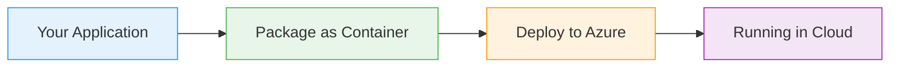

# App Service CI/CD

  <iconify-icon icon="vscode-icons:file-type-azure" style="font-size: 4rem;" />

---

---
layout: center
class: text-center
---

# Welcome

Welcome to this lab on Azure App Service Continuous Integration and Continuous Deployment

  <iconify-icon icon="carbon:rocket" style="font-size: 3rem; color: #0078d4;" />

---

---
layout: center
---

# What is App Service CI/CD?

Azure App Service provides two powerful features for continuous deployment:...

---

---
layout: center
---

# Lab Overview

In this lab, we'll be working with a random number API. We'll:

---

---
layout: center
class: text-center
---

# Prerequisites

<iconify-icon icon="mdi:checkbox-marked-circle" class="text-blue-500" /> An active Azure subscription

<iconify-icon icon="mdi:checkbox-marked-circle" class="text-blue-500" /> A GitHub account with a fork of the lab repository

<iconify-icon icon="mdi:checkbox-marked-circle" class="text-blue-500" /> Azure CLI installed and configured

<iconify-icon icon="mdi:checkbox-marked-circle" class="text-blue-500" /> Basic understanding of Git and GitHub workflows

  <iconify-icon icon="carbon:rocket" style="font-size: 3rem; color: #0078d4;" />

---

---
layout: center
---

# Why This Matters

Continuous Integration and Deployment are essential practices in modern software development. They:

---

---
layout: center
---

# Let's Get Started

We'll begin by setting up our Azure resources and configuring the initial deployment from GitHub. Then we'll progressively enhance our deployment pipeline with automation and staging environments.

