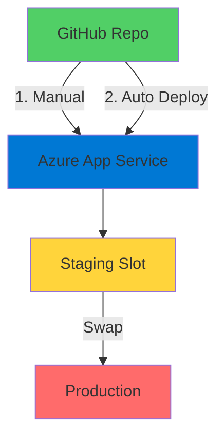
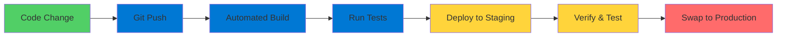

# App Service CI/CD

Continuous Integration and Deployment

  <carbon-deployment-pattern class="text-8xl text-blue-400 opacity-80" />

---
layout: center
---

# Welcome

<v-click>

Automate deployments to Azure App Service Using GitHub and deployment slots

</v-click>

---
layout: section
---

# What is App Service CI/CD?

---

# Two Powerful Features

<v-click>

  <carbon-logo-github class="text-5xl text-blue-400 mt-1" />
  

    
Deployments

    
Automatically triggered on Git push

    
Eliminates manual deployment steps

  

</v-click>

<v-click>

  <carbon-test-tool class="text-5xl text-green-400 mt-1" />
  

    
Deployment Slots

    
Deploy to staging before production

    
Test thoroughly, then promote

  

</v-click>

<v-click>

Ensures application always up to date

</v-click>

<v-click>

Reduces risk and ensures quality

</v-click>

---
layout: section
---

# Lab Overview

---

# Working with Random Number API

<v-click>

.NET Core API demonstrating CI/CD concepts

</v-click>

<v-click>

</v-click>

---

# What We'll Do

<v-click>

  
1

  

    <carbon-logo-github class="text-3xl inline-block" />
    Deploy from your own GitHub repository
  

</v-click>

<v-click>

  
2

  

    <carbon-deploy class="text-3xl inline-block" />
    Set up manual deployment first
  

</v-click>

<v-click>

  
3

  

    <carbon-continuous-deployment class="text-3xl inline-block" />
    Configure continuous deployment
  

</v-click>

<v-click>

  
4

  

    <carbon-test-tool class="text-3xl inline-block" />
    Create staging slot for testing
  

</v-click>

<v-click>

  
5

  

    <carbon-swap-horizontal class="text-3xl inline-block" />
    Swap slots to promote to production
  

</v-click>

---
layout: section
---

# Prerequisites

---

# What You Need

<v-click>

  <carbon-cloud-services class="text-4xl text-blue-400" />
  Active Azure subscription

</v-click>

<v-click>

  <carbon-logo-github class="text-4xl text-purple-400" />
  GitHub account with fork of lab repository

</v-click>

<v-click>

  <carbon-command-line class="text-4xl text-green-400" />
  Azure CLI installed and configured

</v-click>

<v-click>

  <carbon-version-major class="text-4xl text-orange-400" />
  Basic understanding of Git and GitHub workflows

</v-click>

---
layout: section
---

# Why This Matters

---

# Essential Modern Practices

<v-click>

  <carbon-checkmark-outline class="text-4xl text-blue-400" />
  Reduce manual errors in deployment

</v-click>

<v-click>

  <carbon-flash class="text-4xl text-green-400" />
  Enable faster iteration and feedback cycles

</v-click>

<v-click>

  <carbon-repeat class="text-4xl text-purple-400" />
  Provide consistent, repeatable process

</v-click>

<v-click>

  <carbon-security class="text-4xl text-orange-400" />
  Safe testing before production release

</v-click>

<v-click>

Critical knowledge for AZ-204 exam

</v-click>

---

# CI/CD Pipeline Flow

<v-click>

</v-click>

<v-click>

Progressively enhance deployment pipeline

</v-click>

---
layout: center
class: text-center
---

<v-click>

<carbon-play-outline class="text-8xl text-green-400 inline-block" />

</v-click>

<v-click>

Let's Get Started!

</v-click>

<v-click>

Build your CI/CD pipeline

</v-click>

