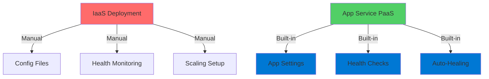
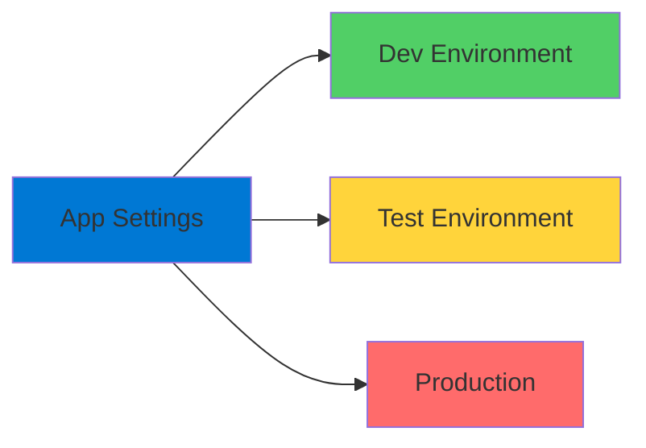
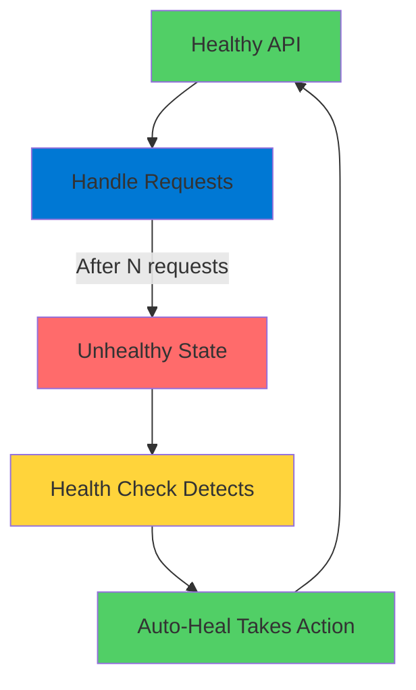
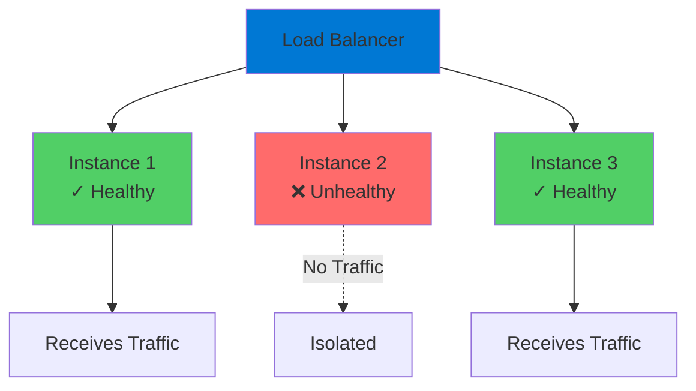

# App Service Configuration

Enterprise-Grade Platform Features

<div class="abs-bottom-10 left-10">
  <carbon-settings-adjust class="text-8xl text-blue-400 opacity-80" />
</div>

---
layout: center
---

# Welcome

<v-click>

<div class="text-xl mt-8">
Explore App Service configuration and administration<br/>Enterprise capabilities out of the box
</div>

</v-click>

---
layout: section
---

# PaaS vs IaaS Management

---

# The PaaS Advantage

<v-click>

<div class="mt-8 text-center text-xl">
App Service provides features that require significant effort in IaaS
</div>

</v-click>

<v-click>

<div class="mt-12">



</div>

</v-click>

<v-click>

<div class="mt-8 text-center text-xl text-green-400">
No server logins or manual file editing
</div>

</v-click>

---
layout: section
---

# Configuration Management

---

# Environment-Specific Settings

<v-click>

<div class="mt-4">
  <carbon-settings class="text-6xl text-blue-400" />
</div>

</v-click>

<v-click>

<div class="mt-8 text-xl text-center">
Different settings for different environments
</div>

</v-click>

<v-click>

<div class="mt-12">



</div>

</v-click>

<v-click>

<div class="mt-12 text-center text-xl text-green-400">
Managed through Azure portal or CLI
</div>

</v-click>

<v-click>

<div class="mt-4 text-center text-lg opacity-70">
No code changes required
</div>

</v-click>

---
layout: section
---

# Lab Overview

---

# Deliberate Failure Scenario

<v-click>

<div class="mt-8 text-center text-xl">
Random number generator REST API
</div>

</v-click>

<v-click>

<div class="mt-12 text-center text-lg">
Configure it to fail, then handle gracefully
</div>

</v-click>

<v-click>

<div class="mt-12">



</div>

</v-click>

<v-click>

<div class="mt-8 text-center text-lg opacity-70">
Simulates real-world failure scenarios
</div>

</v-click>

---

# What We'll Cover

<v-click>

<div class="mt-6 flex items-start gap-4">
  <div class="text-3xl text-blue-400 mt-1">1</div>
  <div>
    <carbon-settings class="text-3xl inline-block" />
    <span class="ml-3 text-lg">Deploy app with failure-inducing settings</span>
  </div>
</div>

</v-click>

<v-click>

<div class="mt-6 flex items-start gap-4">
  <div class="text-3xl text-green-400 mt-1">2</div>
  <div>
    <carbon-health-cross class="text-3xl inline-block" />
    <span class="ml-3 text-lg">Implement App Service health checks</span>
  </div>
</div>

</v-click>

<v-click>

<div class="mt-6 flex items-start gap-4">
  <div class="text-3xl text-purple-400 mt-1">3</div>
  <div>
    <carbon-scale class="text-3xl inline-block" />
    <span class="ml-3 text-lg">Scale to multiple instances</span>
  </div>
</div>

</v-click>

<v-click>

<div class="mt-6 flex items-start gap-4">
  <div class="text-3xl text-orange-400 mt-1">4</div>
  <div>
    <carbon-restart class="text-3xl inline-block" />
    <span class="ml-3 text-lg">Configure auto-heal capabilities</span>
  </div>
</div>

</v-click>

---
layout: section
---

# Key Concepts

---

# App Settings

<v-click>

<div class="mt-4">
  <carbon-parameter class="text-6xl text-green-400" />
</div>

</v-click>

<v-click>

<div class="mt-8 text-xl text-center">
Environment variables that override defaults
</div>

</v-click>

<v-click>

<div class="mt-12 flex justify-center gap-12">
  <div class="text-center">
    <carbon-code class="text-6xl text-blue-400" />
    <div class="text-sm mt-3">Application Code</div>
    <div class="text-xs mt-2 opacity-70">Default values</div>
  </div>
  <div class="text-center">
    <carbon-settings class="text-6xl text-green-400" />
    <div class="text-sm mt-3">App Settings</div>
    <div class="text-xs mt-2 opacity-70">Runtime overrides</div>
  </div>
</div>

</v-click>

<v-click>

<div class="mt-12 text-center text-xl text-green-400">
Perfect for managing environments
</div>

</v-click>

<v-click>

<div class="mt-4 text-center text-lg opacity-70">
No code changes needed
</div>

</v-click>

---

# Health Checks

<v-click>

<div class="mt-4">
  <carbon-health-cross class="text-6xl text-red-400" />
</div>

</v-click>

<v-click>

<div class="mt-8 text-xl text-center">
Endpoints that return health status
</div>

</v-click>

<v-click>

<div class="mt-12">

```mermaid
graph LR
    Azure[Azure Monitor] -->|Poll| Health[/health Endpoint]
    Health -->|200 OK| Healthy[✓ Healthy]
    Health -->|500 Error| Unhealthy[❌ Unhealthy]
    Unhealthy --> Action[Take Action]
    style Azure fill:#0078d4
    style Health fill:#ffd43b
    style Healthy fill:#51cf66
    style Unhealthy fill:#ff6b6b
    style Action fill:#ff6b6b
```

</div>

</v-click>

<v-click>

<div class="mt-8 text-center text-lg">
App Service polls and takes action on errors
</div>

</v-click>

---

# Auto-Healing

<v-click>

<div class="mt-4">
  <carbon-restart class="text-6xl text-orange-400" />
</div>

</v-click>

<v-click>

<div class="mt-8 text-xl text-center">
Automatically restart failed instances
</div>

</v-click>

<v-click>

<div class="mt-12 text-center text-lg">
Based on rules you define:
</div>

</v-click>

<v-click>

<div class="mt-8 grid grid-cols-3 gap-8">
  <div class="text-center">
    <carbon-warning class="text-5xl text-red-400" />
    <div class="text-sm mt-3">HTTP Errors</div>
  </div>
  <div class="text-center">
    <carbon-time class="text-5xl text-orange-400" />
    <div class="text-sm mt-3">Slow Responses</div>
  </div>
  <div class="text-center">
    <carbon-data-base class="text-5xl text-purple-400" />
    <div class="text-sm mt-3">Memory Thresholds</div>
  </div>
</div>

</v-click>

<v-click>

<div class="mt-12 text-center text-xl text-green-400">
No manual intervention required
</div>

</v-click>

---

# Instance Management

<v-click>

<div class="mt-4">
  <carbon-network-4 class="text-6xl text-blue-400" />
</div>

</v-click>

<v-click>

<div class="mt-8 text-xl text-center">
Multiple instances with load balancing
</div>

</v-click>

<v-click>

<div class="mt-12">



</div>

</v-click>

<v-click>

<div class="mt-8 text-center text-xl text-green-400">
Traffic routed only to healthy instances
</div>

</v-click>

---
layout: center
class: text-center
---

<div>

<v-click>

<carbon-play-outline class="text-8xl text-green-400 inline-block" />

</v-click>

<v-click>

<div class="text-4xl mt-8 font-bold">
Let's Get Started!
</div>

</v-click>

<v-click>

<div class="text-xl mt-6 opacity-70">
See health monitoring and auto-healing in action
</div>

</v-click>

</div>
