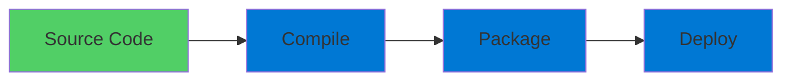
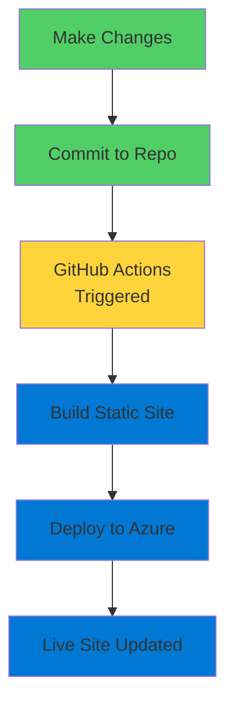

# Azure Static Web Apps

Modern Hosting for Static Content

  <carbon-document class="text-8xl text-blue-400 opacity-80" />

---
layout: center
---

# Welcome

<!--
METADATA:
sentence: App Service for Static Web Apps - Introduction Welcome to this lab on Azure Static Web Apps and App Service for static content.
search_anchor: App Service for Static Web
-->
<v-click>

Explore Azure Static Web Apps and App Service For static content hosting

</v-click>

---
layout: section
---

# The Context

---

# App Service Capabilities

<!--
METADATA:
sentence: What are Static Web Apps?
search_anchor: What are Static Web Apps
-->
<v-click>

App Service excels at complex web applications

</v-click>

<v-click>

</v-click>

<!--
METADATA:
sentence: In this lab, we'll explore two different approaches for hosting static web content in Azure.
search_anchor: this lab, we'll explore two
-->
<v-click>

But there's a simpler option for static content

</v-click>

<!--
METADATA:
sentence: Azure Static Web Apps is a service designed specifically for modern web applications that consist of static content - HTML, CSS, JavaScript - and optionally serverless API backends.
search_anchor: Azure Static Web Apps is
-->
<v-click>

HTML, CSS, JavaScript without backend processing

</v-click>

---
layout: section
---

# What are Static Web Apps?

---

# Purpose-Built Service

<v-click>

  <carbon-document class="text-6xl text-green-400" />

</v-click>

<!--
METADATA:
sentence: What are Static Web Apps?
search_anchor: What are Static Web Apps
-->
<v-click>

Designed for modern web applications

</v-click>

<!--
METADATA:
sentence: Azure Static Web Apps is a service designed specifically for modern web applications that consist of static content - HTML, CSS, JavaScript - and optionally serverless API backends.
search_anchor: Azure Static Web Apps is
-->
<v-click>

  

    <carbon-html class="text-6xl text-orange-400" />
    
HTML

  

  

    <carbon-data-structured class="text-6xl text-blue-400" />
    
CSS

  

  

    <carbon-script class="text-6xl text-yellow-400" />
    
JavaScript

  

</v-click>

<!--
METADATA:
sentence: Azure Static Web Apps is a service designed specifically for modern web applications that consist of static content - HTML, CSS, JavaScript - and optionally serverless API backends.
search_anchor: Azure Static Web Apps is
-->
<v-click>

Plus optional serverless API backends

</v-click>

---

# Deployment Model

<!--
METADATA:
sentence: Unlike traditional App Service deployments, Static Web Apps are deployed directly from a Git repository, with automated build and deployment workflows managed through GitHub Actions or Azure DevOps.
search_anchor: Unlike traditional App Service deployments
-->
<v-click>

Deploy directly from Git repository

</v-click>

<v-click>

</v-click>

<!--
METADATA:
sentence: Unlike traditional App Service deployments, Static Web Apps are deployed directly from a Git repository, with automated build and deployment workflows managed through GitHub Actions or Azure DevOps.
search_anchor: Unlike traditional App Service deployments
-->
<v-click>

Automated build and deployment workflows

</v-click>

<!--
METADATA:
sentence: Unlike traditional App Service deployments, Static Web Apps are deployed directly from a Git repository, with automated build and deployment workflows managed through GitHub Actions or Azure DevOps.
search_anchor: Unlike traditional App Service deployments
-->
<v-click>

Managed through GitHub Actions or Azure DevOps

</v-click>

---
layout: section
---

# What You'll Learn

---

# Lab Objectives

<!--
METADATA:
sentence: What are Static Web Apps?
search_anchor: What are Static Web Apps
-->
<v-click>

  
1

  

    <carbon-logo-github class="text-3xl inline-block" />
    Create Static Web App from GitHub
  

</v-click>

<!--
METADATA:
sentence: Continuous Deployment - You'll make changes to your content and see how GitHub Actions automatically deploy those changes to your live site.
search_anchor: Continuous Deployment - You'll make
-->
<v-click>

  
2

  

    <carbon-continuous-deployment class="text-3xl inline-block" />
    Experience continuous deployment
  

</v-click>

<!--
METADATA:
sentence: App Service for Static Web Apps - Introduction Welcome to this lab on Azure Static Web Apps and App Service for static content.
search_anchor: App Service for Static Web
-->
<v-click>

  
3

  

    <carbon-application-web class="text-3xl inline-block" />
    Compare with traditional App Service
  

</v-click>

<!--
METADATA:
sentence: Mixed Content Scenarios - You'll deploy a Node.js application that serves both static content and dynamic endpoints, exploring how to handle authentication and identity providers.
search_anchor: Mixed Content Scenarios - You'll
-->
<v-click>

  
4

  

    <carbon-hybrid-networking class="text-3xl inline-block" />
    Deploy mixed content scenarios
  

</v-click>

---
layout: section
---

# Prerequisites

---

# What You Need

<!--
METADATA:
sentence: What are Static Web Apps?
search_anchor: What are Static Web Apps
-->
<v-click>

  <carbon-cloud-services class="text-4xl text-blue-400" />
  Active Azure subscription

</v-click>

<!--
METADATA:
sentence: App Service for Static Web Apps - Introduction Welcome to this lab on Azure Static Web Apps and App Service for static content.
search_anchor: App Service for Static Web
-->
<v-click>

  <carbon-command-line class="text-4xl text-green-400" />
  Azure CLI installed and configured

</v-click>

<!--
METADATA:
sentence: In this lab, we'll explore two different approaches for hosting static web content in Azure.
search_anchor: this lab, we'll explore two
-->
<v-click>

  <carbon-logo-github class="text-4xl text-purple-400" />
  GitHub account (free accounts sufficient)

</v-click>

<!--
METADATA:
sentence: What are Static Web Apps?
search_anchor: What are Static Web Apps
-->
<v-click>

  <carbon-version-major class="text-4xl text-orange-400" />
  Git installed on local machine

</v-click>

---
layout: section
---

# Key Differences

---

# Static Web Apps vs App Service

<!--
METADATA:
sentence: What are Static Web Apps?
search_anchor: What are Static Web Apps
-->
<v-click>

Static Web Apps:

</v-click>

<!--
METADATA:
sentence: Unlike traditional App Service deployments, Static Web Apps are deployed directly from a Git repository, with automated build and deployment workflows managed through GitHub Actions or Azure DevOps.
search_anchor: Unlike traditional App Service deployments
-->
<v-click>

  <carbon-checkmark class="text-2xl text-green-400 mt-1" />
  

    
Deploy directly from Git repositories

  

</v-click>

<!--
METADATA:
sentence: What are Static Web Apps?
search_anchor: What are Static Web Apps
-->
<v-click>

  <carbon-checkmark class="text-2xl text-green-400 mt-1" />
  

    
Automatic build via GitHub Actions

  

</v-click>

<!--
METADATA:
sentence: What are Static Web Apps?
search_anchor: What are Static Web Apps
-->
<v-click>

  <carbon-checkmark class="text-2xl text-green-400 mt-1" />
  

    
Optimized for JAMstack applications

  

</v-click>

<!--
METADATA:
sentence: App Service for Static Web Apps - Introduction Welcome to this lab on Azure Static Web Apps and App Service for static content.
search_anchor: App Service for Static Web
-->
<v-click>

  <carbon-checkmark class="text-2xl text-green-400 mt-1" />
  

    
No App Service Plan required

  

</v-click>

<!--
METADATA:
sentence: What are Static Web Apps?
search_anchor: What are Static Web Apps
-->
<v-click>

  <carbon-checkmark class="text-2xl text-green-400 mt-1" />
  

    
Built-in staging from pull requests

  

</v-click>

---

# App Service with Static Content

<!--
METADATA:
sentence: App Service for Static Web Apps - Introduction Welcome to this lab on Azure Static Web Apps and App Service for static content.
search_anchor: App Service for Static Web
-->
<v-click>

App Service:

</v-click>

<!--
METADATA:
sentence: Continuous Deployment - You'll make changes to your content and see how GitHub Actions automatically deploy those changes to your live site.
search_anchor: Continuous Deployment - You'll make
-->
<v-click>

  <carbon-settings class="text-2xl text-blue-400 mt-1" />
  

    
More control over deployment methods

  

</v-click>

<!--
METADATA:
sentence: App Service for Static Web Apps - Introduction Welcome to this lab on Azure Static Web Apps and App Service for static content.
search_anchor: App Service for Static Web
-->
<v-click>

  <carbon-settings-adjust class="text-2xl text-blue-400 mt-1" />
  

    
Full range of App Service management options

  

</v-click>

<!--
METADATA:
sentence: App Service for Static Web Apps - Introduction Welcome to this lab on Azure Static Web Apps and App Service for static content.
search_anchor: App Service for Static Web
-->
<v-click>

  <carbon-hybrid-networking class="text-2xl text-blue-400 mt-1" />
  

    
Mix static and dynamic content flexibly

  

</v-click>

<!--
METADATA:
sentence: App Service for Static Web Apps - Introduction Welcome to this lab on Azure Static Web Apps and App Service for static content.
search_anchor: App Service for Static Web
-->
<v-click>

  <carbon-plan class="text-2xl text-blue-400 mt-1" />
  

    
Requires an App Service Plan

  

</v-click>

<!--
METADATA:
sentence: App Service for Static Web Apps - Introduction Welcome to this lab on Azure Static Web Apps and App Service for static content.
search_anchor: App Service for Static Web
-->
<v-click>

  <carbon-application-web class="text-2xl text-blue-400 mt-1" />
  

    
Familiar model if already using App Service

  

</v-click>

---

# Continuous Deployment Flow

<v-click>

</v-click>

<!--
METADATA:
sentence: Continuous Deployment - You'll make changes to your content and see how GitHub Actions automatically deploy those changes to your live site.
search_anchor: Continuous Deployment - You'll make
-->
<v-click>

Changes automatically deployed to live site

</v-click>

---
layout: center
class: text-center
---

<v-click>

<carbon-play-outline class="text-8xl text-green-400 inline-block" />

</v-click>

<!--
METADATA:
sentence: What are Static Web Apps?
search_anchor: What are Static Web Apps
-->
<v-click>

Let's Get Started!

</v-click>

<!--
METADATA:
sentence: In this lab, we'll explore two different approaches for hosting static web content in Azure.
search_anchor: this lab, we'll explore two
-->
<v-click>

See these differences in action

</v-click>

