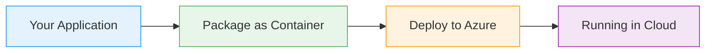
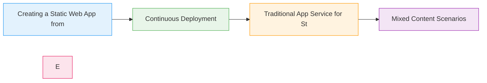

# App Service for Static Web Apps

  <iconify-icon icon="vscode-icons:file-type-azure" style="font-size: 4rem;" />

---

---
layout: center
---

# App Service for Static Web Apps - Introduction

Welcome to this lab on Azure Static Web Apps and App Service for static content.

---

---
layout: center
---

# What are Static Web Apps?

Azure Static Web Apps is a service designed specifically for modern web applications that consist of static content - HTML, CSS, JavaScript - and opti...

---

---
layout: center
---

# What You'll Learn

---

---
layout: center
class: text-center
---

# Prerequisites

<iconify-icon icon="mdi:checkbox-marked-circle" class="text-blue-500" /> An active Azure subscription

<iconify-icon icon="mdi:checkbox-marked-circle" class="text-blue-500" /> Azure CLI installed and configured

<iconify-icon icon="mdi:checkbox-marked-circle" class="text-blue-500" /> A GitHub account (free accounts are sufficient)

<iconify-icon icon="mdi:checkbox-marked-circle" class="text-blue-500" /> Git installed on your local machine

  <iconify-icon icon="carbon:rocket" style="font-size: 3rem; color: #0078d4;" />

---

---
layout: center
---

# Key Differences

Before we begin, let's understand the key differences:

