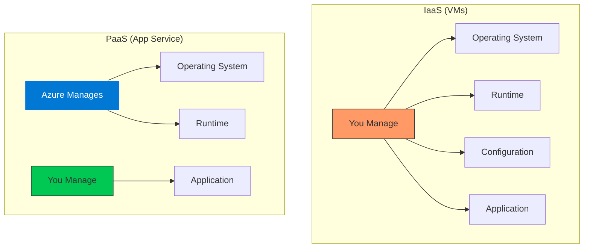

# PaaS vs IaaS

```mermaid
graph TB
    subgraph IaaS["IaaS (VMs)"]
        IYou[You Manage] --> IOS[Operating System]
        IYou --> IRuntime[Runtime]
        IYou --> IConfig[Configuration]
        IYou --> IApp[Application]
    end

    subgraph PaaS["PaaS (App Service)"]
        PAzure[Azure Manages] --> POS[Operating System]
        PAzure --> PRuntime[Runtime]
        PYou[You Manage] --> PApp[Application]
    end

    style IYou fill:#f96,stroke:#333
    style PAzure fill:#0078d4,stroke:#fff,color:#fff
    style PYou fill:#00c853,stroke:#333
```
