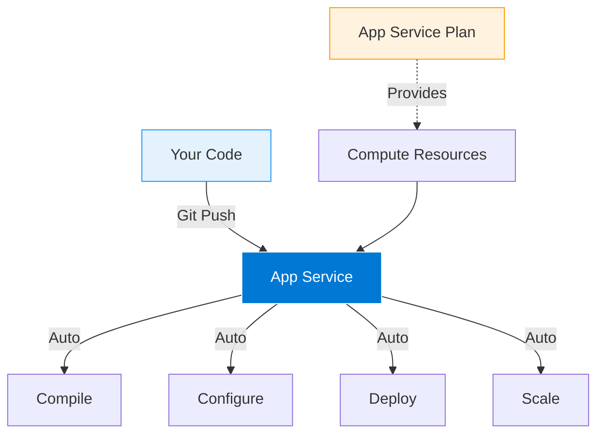

# App Service Architecture

```mermaid
graph TB
    Code[Your Code] -->|Git Push| AppSvc[App Service]

    AppSvc -->|Auto| Compile[Compile]
    AppSvc -->|Auto| Config[Configure]
    AppSvc -->|Auto| Deploy[Deploy]
    AppSvc -->|Auto| Scale[Scale]

    Plan[App Service Plan] -.Provides.-> Compute[Compute Resources]
    Compute --> AppSvc

    style Code fill:#e3f2fd,stroke:#2196f3
    style AppSvc fill:#0078d4,stroke:#fff,color:#fff
    style Plan fill:#fff3e0,stroke:#ff9800
```
