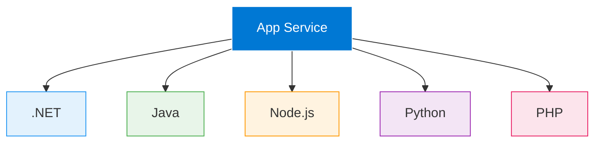

# Supported Platforms

```mermaid
graph TB
    AppSvc[App Service] --> NET[.NET]
    AppSvc --> Java[Java]
    AppSvc --> Node[Node.js]
    AppSvc --> Python[Python]
    AppSvc --> PHP[PHP]

    style AppSvc fill:#0078d4,stroke:#fff,color:#fff
    style NET fill:#e3f2fd,stroke:#2196f3
    style Java fill:#e8f5e9,stroke:#4caf50
    style Node fill:#fff3e0,stroke:#ff9800
    style Python fill:#f3e5f5,stroke:#9c27b0
    style PHP fill:#fce4ec,stroke:#e91e63
```

- Multi-language support
- Automatic runtime updates
- Focus on code, not infrastructure

