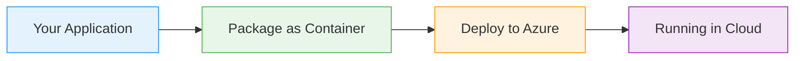

# App Service for Web Apps

  <iconify-icon icon="vscode-icons:file-type-azure" style="font-size: 4rem;" />

---

---
layout: center
class: text-center
---

# Welcome

Welcome to this lab on Azure App Service for Web Apps

  <iconify-icon icon="carbon:rocket" style="font-size: 3rem; color: #0078d4;" />

---

---
layout: center
---

# Understanding PaaS vs IaaS

Before we dive in, let's understand the difference between Infrastructure-as-a-Service and Platform-as-a-Service.

---

---
layout: center
---

# What is Azure App Service?

Azure App Service is one of Azure's most popular PaaS offerings. It's a fully managed platform for building, deploying, and scaling web applications. ...

---

---
layout: center
---

# What We'll Build Today

In this lab, you'll create an App Service deployment by pushing source code directly from your local machine. Azure will compile and configure the application for you automatically.

---

---
layout: center
class: text-center
---

# Lab Prerequisites

<iconify-icon icon="mdi:checkbox-marked-circle" class="text-blue-500" /> An active Azure subscription

<iconify-icon icon="mdi:checkbox-marked-circle" class="text-blue-500" /> Azure CLI installed and configured

<iconify-icon icon="mdi:checkbox-marked-circle" class="text-blue-500" /> Git installed on your local machine

<iconify-icon icon="mdi:checkbox-marked-circle" class="text-blue-500" /> Access to the course repository with the sample application code

  <iconify-icon icon="carbon:rocket" style="font-size: 3rem; color: #0078d4;" />

---

---
layout: center
---

# What to Expect

The entire deployment process will take just a few minutes. You'll see how Azure handles compilation, configuration, and deployment automatically. By the end, you'll have a live web application runnin

