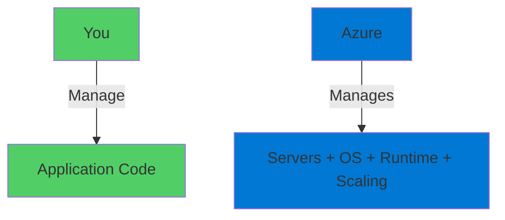
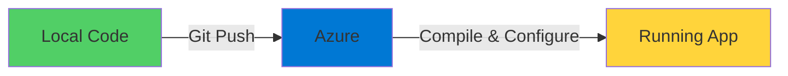
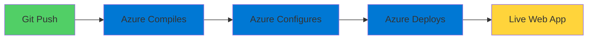

# Azure App Service

Platform-as-a-Service for Web Apps

  <carbon-application-web class="text-8xl text-blue-400 opacity-80" />

---
layout: center
---

# Welcome

<v-click>

Explore Azure App Service for Web Apps One of Azure's most popular PaaS offerings

</v-click>

---
layout: section
---

# Understanding PaaS vs IaaS

---

# IaaS: Infrastructure-as-a-Service

<v-click>

  <carbon-virtual-machine class="text-6xl text-blue-400" />

</v-click>

<v-click>

Complete Control

</v-click>

<v-click>

  <carbon-checkmark class="text-3xl text-green-400" />
  Access to host machine configuration

</v-click>

<v-click>

  <carbon-checkmark class="text-3xl text-green-400" />
  Control over OS, runtime, server config

</v-click>

<v-click>

Significant Management Overhead

</v-click>

<v-click>

  <carbon-warning class="text-3xl text-red-400" />
  Patching, updates, security, scaling

</v-click>

---

# PaaS: Platform-as-a-Service

<v-click>

  <carbon-application-web class="text-6xl text-green-400" />

</v-click>

<v-click>

Focus on Your Application

</v-click>

<v-click>

</v-click>

<v-click>

Azure handles infrastructure management

</v-click>

---

# The Trade-Off

<v-click>

  

    
IaaS

    <carbon-warning class="text-6xl text-red-400" />
    
More Control

    
More Management

  

  

    
PaaS

    <carbon-checkmark-outline class="text-6xl text-green-400" />
    
Less Control

    
Less Management

  

</v-click>

<v-click>

Application must fit within PaaS constraints

</v-click>

---
layout: section
---

# What is Azure App Service?

---

# Fully Managed Platform

<v-click>

  <carbon-application-web class="text-6xl text-blue-400" />

</v-click>

<v-click>

One of Azure's most popular PaaS offerings

</v-click>

<v-click>

Build, deploy, and scale web applications

</v-click>

---

# Supported Languages

<v-click>

  

    <carbon-logo-dotnet class="text-6xl text-purple-400" />
    
.NET

  

  

    <carbon-logo-java class="text-6xl text-red-400" />
    
Java

  

  

    <carbon-logo-nodejs class="text-6xl text-green-400" />
    
Node.js

  

  

    <carbon-logo-python class="text-6xl text-blue-400" />
    
Python

  

  

    <carbon-code class="text-6xl text-purple-400" />
    
PHP

  

  

    <carbon-application class="text-6xl text-orange-400" />
    
More...

  

</v-click>

---

# Key Features

<v-click>

  <carbon-scale class="text-4xl text-blue-400" />
  Built-in auto-scaling capabilities

</v-click>

<v-click>

  <carbon-deployment-pattern class="text-4xl text-green-400" />
  Continuous deployment from various sources

</v-click>

<v-click>

  <carbon-logo-github class="text-4xl text-purple-400" />
  Integration with Azure DevOps and GitHub

</v-click>

<v-click>

  <carbon-test-tool class="text-4xl text-orange-400" />
  Staging environments for testing

</v-click>

<v-click>

  <carbon-network-4 class="text-4xl text-red-400" />
  Built-in load balancing

</v-click>

<v-click>

  <carbon-locked class="text-4xl text-blue-500" />
  Automatic HTTPS

</v-click>

---
layout: section
---

# What We'll Build Today

---

# Lab Overview

<v-click>

Push source code directly from local machine

</v-click>

<v-click>

</v-click>

<v-click>

Azure handles everything automatically

</v-click>

---

# What We'll Do

<v-click>

  
1

  

    <carbon-add class="text-3xl inline-block" />
    Create an App Service Plan
  

</v-click>

<v-click>

  
2

  

    <carbon-application-web class="text-3xl inline-block" />
    Create a Web App for Git deployment
  

</v-click>

<v-click>

  
3

  

    <carbon-deploy class="text-3xl inline-block" />
    Deploy ASP.NET app by pushing code
  

</v-click>

<v-click>

  
4

  

    <carbon-settings-adjust class="text-3xl inline-block" />
    Configure application settings
  

</v-click>

<v-click>

  
5

  

    <carbon-search class="text-3xl inline-block" />
    Explore deployment and runtime environment
  

</v-click>

---
layout: section
---

# Lab Prerequisites

---

# What You'll Need

<v-click>

  <carbon-cloud-services class="text-4xl text-blue-400" />
  Active Azure subscription

</v-click>

<v-click>

  <carbon-command-line class="text-4xl text-green-400" />
  Azure CLI installed and configured

</v-click>

<v-click>

  <carbon-version-major class="text-4xl text-purple-400" />
  Git installed on local machine

</v-click>

<v-click>

  <carbon-folder class="text-4xl text-orange-400" />
  Access to course repository with sample code

</v-click>

---
layout: section
---

# What to Expect

---

# The Deployment Experience

<v-click>

Entire process takes just a few minutes

</v-click>

<v-click>

</v-click>

<v-click>

Azure handles everything automatically

</v-click>

---

# The Outcome

<v-click>

Live web application running on Azure

</v-click>

<v-click>

  

    <carbon-close class="text-6xl text-red-400" />
    
No VMs

  

  

    <carbon-close class="text-6xl text-red-400" />
    
No Infrastructure

  

  

    <carbon-checkmark-outline class="text-6xl text-green-400" />
    
Just Your App

  

</v-click>

---
layout: center
class: text-center
---

<v-click>

<carbon-play-outline class="text-8xl text-green-400 inline-block" />

</v-click>

<v-click>

Let's Get Started!

</v-click>

<v-click>

Deploy your first App Service web application

</v-click>

